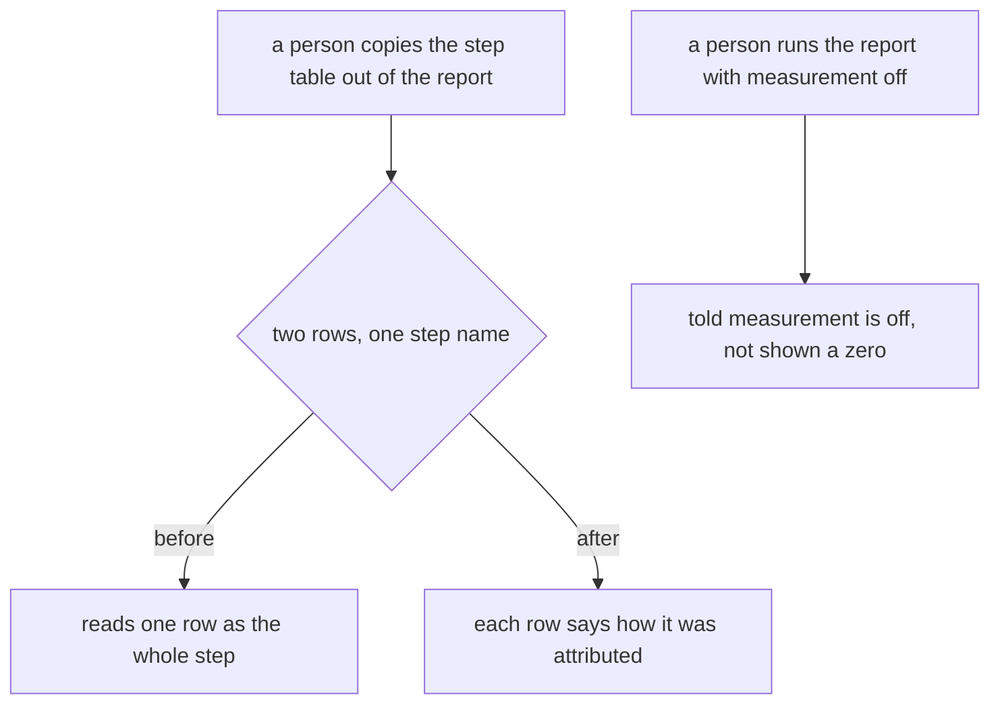
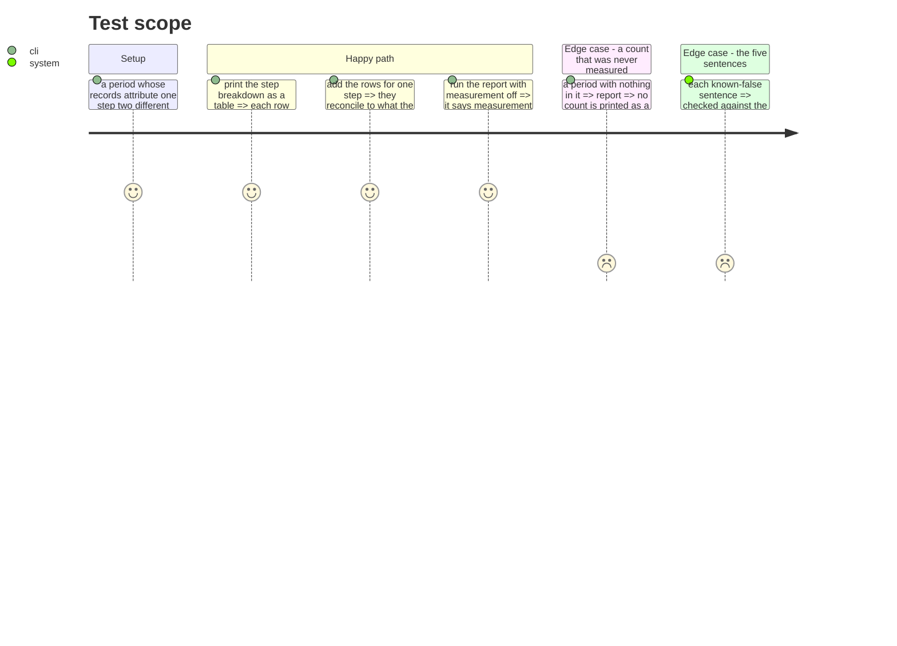

# Instruction: the sentences become true

## Architecture projection

```txt
.
├── README.md                                                    ✏️
├── aidd_docs/runs/README.md                                     ✏️
├── aidd_docs/product/metrics-contract.md                        ✏️
├── aidd_docs/product/cost-report-contract.md                    ✏️
├── plugins/aidd-telemetry
│   ├── README.md                                                ✏️
│   ├── CATALOG.md                                               ✏️ generated
│   └── skills/01-cost/{SKILL.md,actions/03-report.md}           ✏️
├── docs/prompts-documentation.md                                ✏️ generated
└── cli/src/application/display
    ├── cost-report-artefact.ts                                  ✏️
    └── cost-report-display.ts                                   ✏️
```

## User Journey



## Test Scope



## Tasks to do

### `1)` A table read on its own cannot mislead

> `--axis` exists to produce something a person pastes elsewhere, and it drops the one column that made two rows for one step intelligible.

1. Carry the attribution on every row of the step breakdown in the artefact, so two rows naming one step are distinguishable without the terminal.
2. Check every other axis for the same fault: any axis whose rows are keyed on more than the column it prints has it.
3. Keep the artefact's own rule that it carries figures and not computed shares.

### `2)` A report says whether it is measuring

1. When measurement is off for the project, the report says so rather than reporting an empty period.
2. Print no count as a literal zero where nothing was measured, the way the requests figure already refuses to.

### `3)` The five sentences

> Each one is named in the spec's Done-when. Verify by running or grepping, never by reading alone.

1. The root README's "nothing leaves your machine": true once phase 2 lands. Check the surrounding claims are also true now, and correct the ones that are not.
2. The plugin README's account of what is sent, and its list of open issues, several of which are closed by this work.
3. `aidd_docs/runs/README.md` lists four kinds of journal line; the hook writes seven. The missing ones include the line carrying the skill name.
4. The cost skill promises to answer "what do we owe". With the export route gone, no route carries an amount. Say what it does answer.
5. Sweep for the last mentions of the removed commands in every shipped document.

### `4)` Regenerate what is generated

1. Regenerate `plugins/aidd-telemetry/CATALOG.md` and `docs/prompts-documentation.md` through their own scripts, never by hand.
2. Update `metrics-contract.md` and `cost-report-contract.md` for the route that no longer writes, keeping their account of the stored record's `provenance` intact.

## Test acceptance criteria

| Task | Acceptance criteria                                                                          |
| ---- | ---------------------------------------------------------------------------------------------- |
| 1    | Two rows naming one step are distinguishable in the pasted table alone                          |
| 1    | The rows for one step reconcile to what the terminal prints for that step                       |
| 2    | A report run with measurement off says so                                                       |
| 2    | Nothing that was never measured is printed as a zero                                            |
| 3    | Each of the five named sentences is true when checked against the code                          |
| 3    | No shipped document names a removed command                                                     |
| 4    | The generated catalogue and prompt index match what their scripts produce                       |
