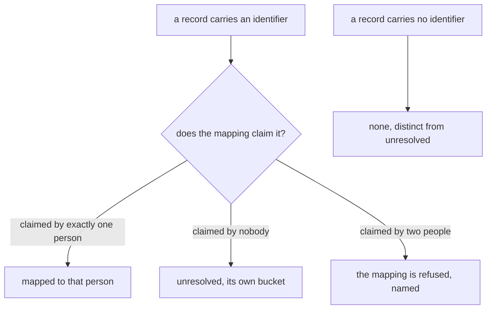
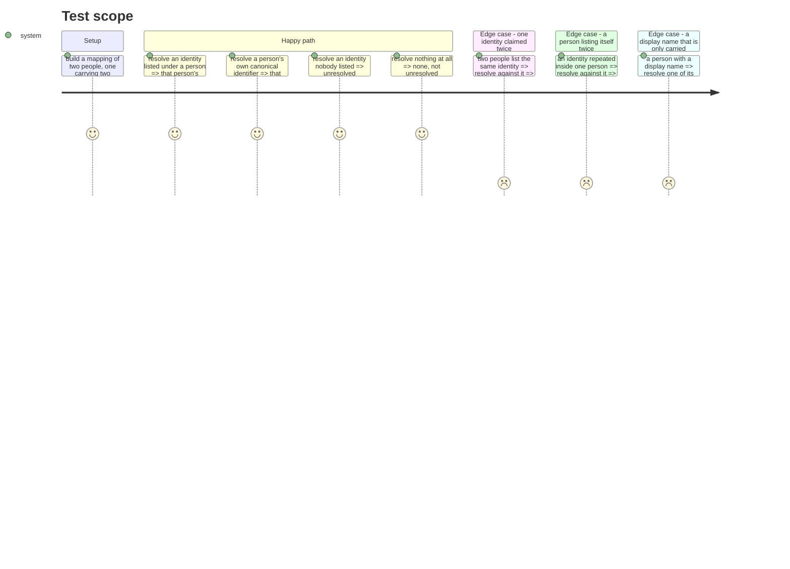

# Instruction: the mapping and what resolving means

## Architecture projection

```txt
.
└── cli
    ├── src/domain
    │   ├── models/person-mapping.ts                        ✅
    │   ├── ports/person-mapping-reader.ts                  ✅
    │   └── errors.ts                                       ✏️
    └── tests
        ├── domain/models/person-mapping.unit.test.ts       ✅
        └── helpers/ports/in-memory-person-mapping-reader.ts ✅
```

## User Journey



## Test Scope



## Tasks to do

### `1)` The mapping shape

> A person's own declaration about which identifiers are them, and nothing more.

1. Add `cli/src/domain/models/person-mapping.ts`.
2. Declare `PersonMappingEntry`: `personId: string`, `identities: readonly string[]`, `displayName?: string`.
3. Declare `PersonMapping`: `readonly entries: readonly PersonMappingEntry[]`.
4. Document in the file that `displayName` is carried and never produced: nothing here derives it, requires it, or decides whether identities are names or pseudonyms, which the decision issue owns.
5. Document that `identities` are opaque strings, so a per-tool pseudonymous identifier can join later with no shape change, and that none reaches a record today.

### `2)` Resolution, three-way

> The same reading `stepAttribution` already gives an unknown: never a zero, and it says its own strength.

1. Declare `PersonResolution = "mapped" | "unresolved" | "none"`.
2. Declare `ResolvedPerson`: `resolution`, `personId?`, `displayName?`, `identities: readonly string[]`.
3. Write `resolvePerson(mapping: PersonMapping | null, rawId: string | undefined): ResolvedPerson`.
4. `rawId` undefined or empty string returns `none` with no identities: nobody opted in is not a failure to resolve.
5. `rawId` matched by an entry's `personId` or by any of its `identities` returns `mapped`, carrying that entry's canonical `personId`, its `displayName` when present, and its full `identities` set including its `personId`, so a caller can show what produced the row.
6. `rawId` matched by nothing, and a `null` mapping, both return `unresolved` carrying `[rawId]`: the identity is still named, because the report has to show what it could not place.

### `3)` The mapping is refused rather than guessed at

> Silently picking one of two claimants is exactly the merge the contract forbids.

1. Add `AmbiguousPersonMappingError` to `cli/src/domain/errors.ts`, naming the identity and both claiming `personId`s.
2. Write `validatePersonMapping(mapping)`, throwing it when one identity is claimed by two different entries.
3. An identity repeated inside a single entry is not ambiguity: it resolves to that entry once.
4. Document that validation is separate from resolution so a caller decides what a refusal costs: the report keeps its figures and reports everything unresolved, the identity command errors.

### `4)` The port and its in-memory double

> One port, so the read path never knows where the mapping came from.

1. Add `cli/src/domain/ports/person-mapping-reader.ts`, one method `read(): Promise<PersonMapping | null>`, `null` meaning none declared.
2. Document that `read()` never throws for an absent mapping, and that an unreadable one is the adapter's own error to surface, not silence.
3. Add `cli/tests/helpers/ports/in-memory-person-mapping-reader.ts`, mirroring the existing in-memory person identity doubles.

## Test acceptance criteria

| Task | Acceptance criteria                                                                                              |
| ---- | ---------------------------------------------------------------------------------------------------------------- |
| 1    | A mapping entry can be built with no display name, and reading it back shows no display name rather than an empty one |
| 2    | An identity listed under a person, and that person's own identifier, resolve to the same canonical person          |
| 2    | A record with no identifier resolves to `none`, and one with an unlisted identifier resolves to `unresolved`, and the two are distinguishable |
| 2    | A resolved person carries back every identity behind it, including its canonical one                              |
| 3    | A mapping where two people claim one identity is refused by name, and neither claimant is ever returned            |
| 3    | The same identity written twice inside one person resolves to that person without a refusal                       |
| 4    | A reader that has no mapping answers `null`, and no caller treats that as a failure                               |
