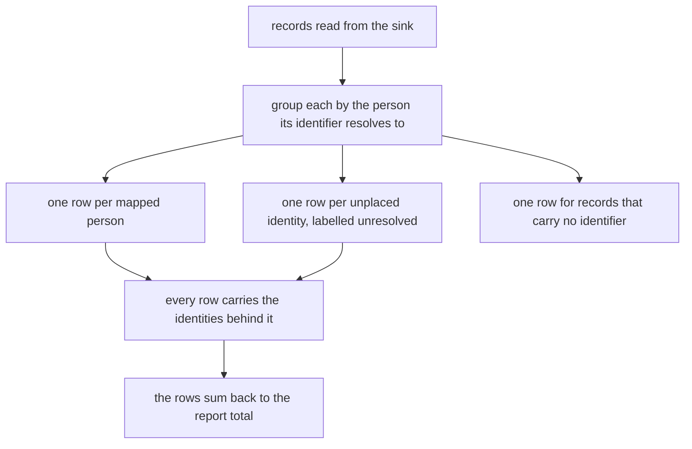
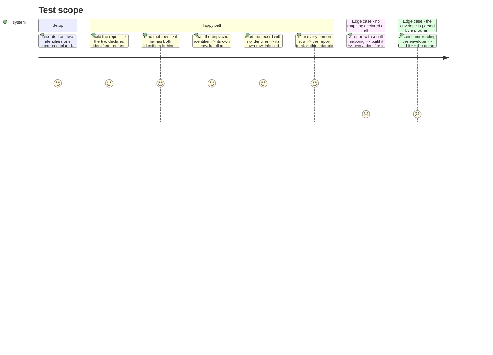

# Instruction: the person breakdown in the report

## Architecture projection

```txt
.
└── cli
    ├── src/domain/models
    │   ├── cost-report.ts                                  ✏️
    │   └── cost-report-envelope.ts                         ✏️
    └── tests/domain/models
        ├── cost-report-person.unit.test.ts                 ✅
        └── cost-report-envelope.unit.test.ts               ✏️
```

## User Journey



## Test Scope



## Tasks to do

### `1)` Group by resolved person

> Mirrors `projectKeyOf` and its unknown row, one dimension over.

1. In `cli/src/domain/models/cost-report.ts`, add a person grouping key beside the existing project and model keys.
2. Key a `mapped` record on its canonical `personId`; key an `unresolved` record on the raw identifier it carried, never on a shared bucket, so two unplaced people never merge into one row.
3. Key a record with no identifier on a symbol, the same technique `NO_KNOWN_PROJECT` uses, so it can never collide with a real identifier.
4. Pass the mapping into the report builder as an argument, not as a module-level read: the domain stays free of where a mapping lives.

### `2)` The row

> A row that cannot be traced back to its identities fails the contract's audit condition.

1. Declare `CostReportPersonRow`: `resolution`, `person?`, `displayName?`, `identities: readonly string[]`, `totals`.
2. Add `byPeople` to the report, sorted largest first the way `byProjects` is, with `unresolved` rows and the `none` row placed after the mapped ones so a reader sees people before gaps.
3. Write `personRows`, mirroring `projectRows`.

### `3)` The envelope

> The shape a program already parses has to carry it, or the audit condition is only true in a terminal.

1. Add `CostReportEnvelopePersonRow` and `by_person` to `cli/src/domain/models/cost-report-envelope.ts`.
2. Carry `resolution`, `person`, `display_name` and `identities` on the row, in the envelope's snake_case convention.
3. Raise `cost_report_version` and record why in the version comment, the same way the previous bumps are recorded.

## Test acceptance criteria

| Task | Acceptance criteria                                                                                    |
| ---- | ------------------------------------------------------------------------------------------------------ |
| 1    | Two identifiers one person declared produce one row, not two                                            |
| 1    | Two identifiers nobody declared produce two rows, never one merged bucket                               |
| 1    | Records carrying no identifier land in a row distinct from every unresolved one                         |
| 2    | Every person row lists the identifiers behind it, and a mapped row lists its canonical one among them   |
| 2    | Summing every person row's totals equals the report's own total                                         |
| 3    | An envelope built with no mapping carries every identifier as unresolved, with the figures unchanged    |
| 3    | The envelope's report version is higher than before, and the reason is written beside it                |
