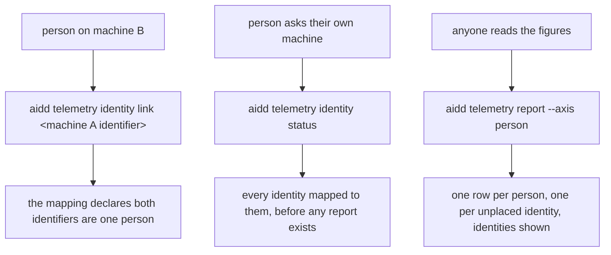
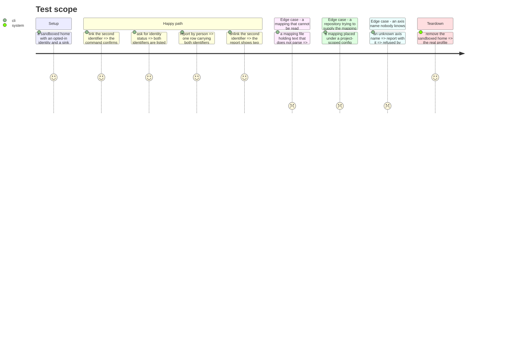

# Instruction: reading, declaring and rendering it

## Architecture projection

```txt
.
└── cli
    ├── src
    │   ├── infrastructure
    │   │   ├── adapters/person-mapping-adapter.ts          ✅
    │   │   └── deps.ts                                     ✏️
    │   ├── application
    │   │   ├── use-cases/telemetry/person-identity-use-case.ts ✏️
    │   │   ├── use-cases/telemetry/report-cost-use-case.ts     ✏️
    │   │   ├── display/cost-report-artefact.ts                 ✏️
    │   │   ├── display/telemetry-display.ts                    ✏️
    │   │   └── commands/telemetry.ts                           ✏️
    │   └── domain/ports/person-mapping-store.ts            ✅
    └── tests
        ├── infrastructure/adapters/person-mapping-location.unit.test.ts ✅
        ├── application/use-cases/telemetry/person-mapping-use-case.unit.test.ts ✅
        └── application/display/cost-report-artefact.unit.test.ts ✏️
```

## User Journey



## Test Scope



## Tasks to do

### `1)` The adapter and where the mapping lives

> Same profile, same refusal of a repository-settable path, separate file.

1. Add `cli/src/domain/ports/person-mapping-store.ts`, extending the reader with `filePath`, `readStrict()`, `link(identity)`, `unlink(identity)`, the same way `PersonIdentityStore` extends its reader.
2. Add `cli/src/infrastructure/adapters/person-mapping-adapter.ts`, resolving `<profile>/.config/aidd/person-mapping.json`, and `%APPDATA%/aidd/person-mapping.json` on Windows, reusing the identity adapter's own directory resolution rather than restating it.
3. Document at the top of the adapter why it refuses `AIDD_USER_CONFIG_DIR`, and why the mapping is not a field inside `identity.json`.
4. `read()` answers `null` for an absent or unreadable mapping; `readStrict()` throws on an unreadable or ambiguous one.
5. Wire the adapter in `cli/src/infrastructure/deps.ts` beside `personIdentityAdapter`.

### `2)` Declaring an identity is you

> A mapping no command can write is a file nobody will ever have. These verbs are the *means*: the deliverable
> this issue is judged on is the resolution behaviour of phase 2, not the size of this command surface.

1. Extend `PersonIdentityUseCase`, or add a use case beside it, with `link(identity)` and `unlink(identity)`.
2. `link` refuses when nobody opted in, naming `identity on` as the missing step, the way `name` already does.
3. `link` refuses an identity another person already claims, surfacing the ambiguity error rather than overwriting.
4. `link` of an identity already listed is reported as already listed, not as a second write.
5. `unlink` of an identity nobody listed is reported as nothing to remove, never as a failure.
6. Add `aidd telemetry identity link <identity>` and `unlink <identity>` to `cli/src/application/commands/telemetry.ts`.

### `3)` What a person can see about themselves

> The contract's ordering condition holds locally because nothing is uploaded. Say that in the code.

1. Extend `identity status` to print every identity mapped to this person, and where the mapping is read from.
2. Print the raw identifier and the canonical one distinctly, so a person can tell which is this machine's.
3. State in the use case's doc comment that the ordering condition is met by construction here: the mapping is read from the person's own profile and nothing leaves the machine, so no sequencing mechanism exists or is needed.
4. Decide `identity off` here, do not leave it to the code: `off` leaves the mapping standing, because its
   documented meaning is that new records carry no person, and destroying a person's own declaration is not
   part of that. It must not be silent about it — `off` prints that the mapping still lists this identifier and
   names `identity unlink` as the way to stop resolving past records to it, and `status` afterwards shows the
   identity as withdrawn while the mapping still stands.

### `4)` Rendering the axis

> Without it, the resolution has no observable output.

1. Add `person` to `ARTEFACT_AXES` in `cli/src/application/display/cost-report-artefact.ts`.
2. Write `personArtefact`: a `Person` column and a `Total` column, with the identities behind each row shown, mapped rows first.
3. Label every unresolved row so it reads as an identity nobody placed — the label repeats, once per unplaced
   identifier, because each is its own row; and label the single no-identifier row so it reads as nobody having
   opted in. The two labels must not be interchangeable, and neither may be written as though it were one bucket.
4. Add a caveat line when the mapping could not be read, alongside the existing unreadable-lines and undated-records caveats, so a partial resolution never looks complete.
5. Pass the mapping through `report-cost-use-case.ts` into the report builder.

## Test acceptance criteria

| Task | Acceptance criteria                                                                                        |
| ---- | ------------------------------------------------------------------------------------------------------------ |
| 1    | The mapping is read from the OS profile even when `AIDD_USER_CONFIG_DIR` points elsewhere                     |
| 1    | An absent mapping reads as none declared, and an unreadable one is surfaced rather than silently treated as none |
| 2    | Linking before opting in is refused, naming the step that is missing                                          |
| 2    | Linking an identity another person claims is refused, and the mapping is left as it was                       |
| 2    | Unlinking an identity nobody listed reports nothing to remove and exits successfully                          |
| 3    | Identity status lists every mapped identity, and says where the mapping was read from                         |
| 4    | `--axis person` prints one row per person with the identities behind it                                       |
| 4    | An unreadable mapping still prints every figure, with a caveat stating the resolution was lost                |
| 4    | An unknown axis is refused by name, and `person` appears among the ones offered                               |
| 4    | Two unplaced identifiers print two labelled rows, never one bucket                                            |
| 3    | Turning the identity off prints that the mapping still lists it, and names the command that removes it        |
