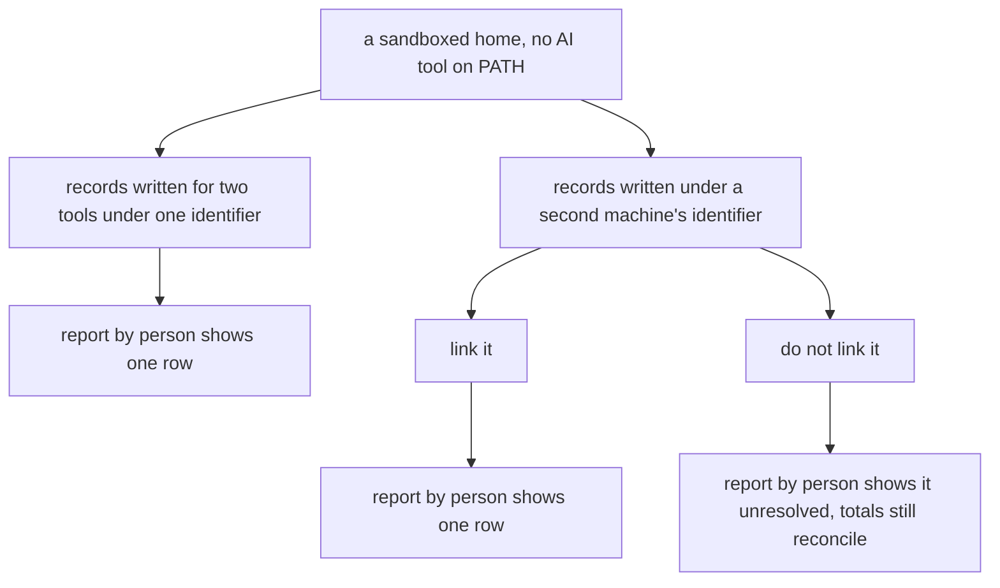
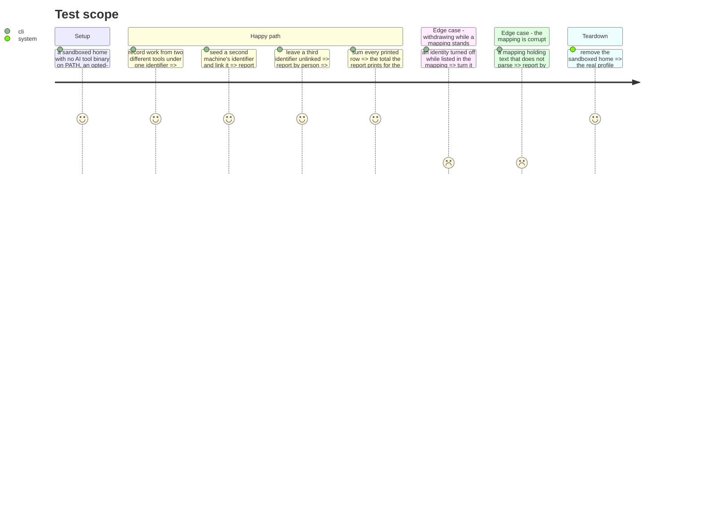

# Instruction: the journeys that prove the guarantees

## Architecture projection

```txt
.
└── cli/tests/e2e
    ├── telemetry-person-mapping.e2e.test.ts                ✅
    ├── telemetry-identity.e2e.test.ts                      ✏️
    └── helpers.ts                                          ✏️
```

## User Journey



## Test Scope



## Tasks to do

### `1)` The guard that keeps the two-tools case true

> Expected to already hold. Lock it, do not build it.

1. Seed a sink with records from two different tools carrying the same `person_id`.
2. Assert `--axis person` prints one row.
3. State in the test's own comment that this holds because the identity is machine-scoped and not tool-scoped, so the test exists to catch a change that would make it tool-scoped.

### `2)` The two-machines journey

> The case that fails today.

1. Seed a sink with records carrying a second, foreign `person_id`.
2. Assert that before linking, the report shows two rows and one is unresolved.
3. Link it through the CLI, assert the report shows one row carrying both identifiers.
4. Unlink it, assert the two rows return.

### `3)` Nothing is dropped and nothing is merged

> The contract's strongest condition, and the easiest to lose quietly.

1. Seed identifiers of all three kinds: mapped, unmapped, and absent.
2. Assert the printed rows' totals sum to the period total the same report prints.
3. Assert two unmapped identifiers stay two rows.

### `4)` A person sees themselves first

1. Assert `identity status` lists every mapped identity with no report having been run.
2. Add `personMappingFileIn(fakeHome)` to `cli/tests/e2e/helpers.ts`, beside `identityFileIn`, resolving the same way on every platform rather than hardcoding `.config`.

### `5)` The failure modes

1. Write a mapping that does not parse, assert every figure still prints and the caveat names the cause.
2. Place a mapping under a project-scoped config directory, assert it changes nothing.
3. Assert every test in this file passes with no AI tool binary on `PATH`.

## Test acceptance criteria

| Task | Acceptance criteria                                                                                    |
| ---- | -------------------------------------------------------------------------------------------------------- |
| 1    | Two tools under one identifier print one person row                                                      |
| 2    | A second machine's identifier prints unresolved before linking and merges into one row after              |
| 2    | Unlinking restores the two rows                                                                          |
| 3    | The person rows' totals sum to the period total the report prints                                        |
| 3    | Two unmapped identifiers never collapse into one row                                                     |
| 4    | Identity status lists the mapped identities without a report having been produced                        |
| 5    | A mapping that does not parse costs the resolution and not one figure, and the caveat says so             |
| 5    | A mapping placed where a repository could set it has no effect on the report                             |
| 5    | The whole file passes with no AI tool binary on `PATH`                                                   |
