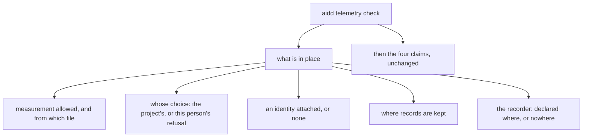
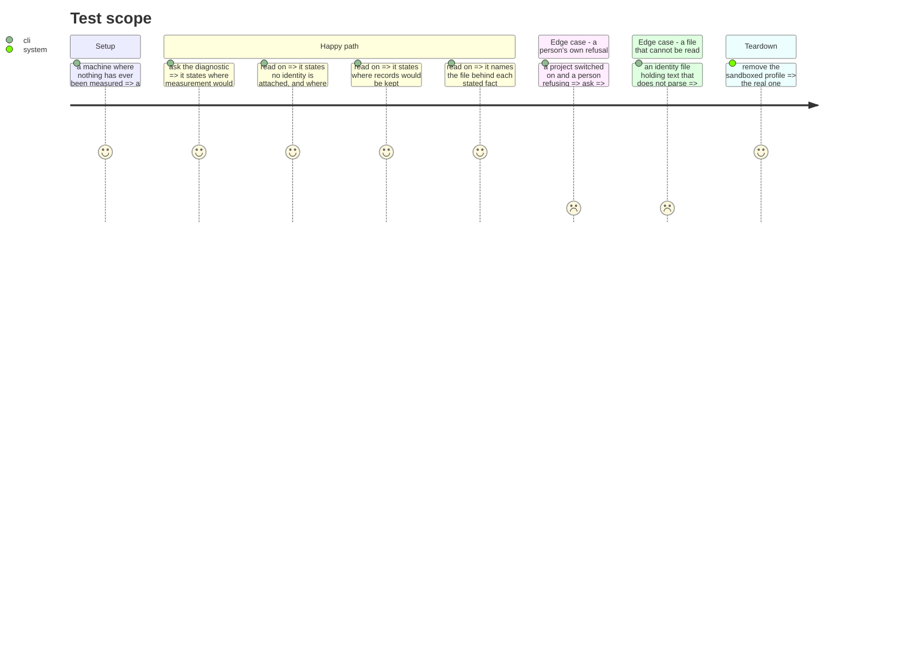

# Instruction: what is in place, before any verdict

## Architecture projection

```txt
.
└── cli
    ├── src
    │   ├── domain
    │   │   ├── models/telemetry-setup.ts                       ✅
    │   │   └── ports/telemetry-evidence-reader.ts              ✏️
    │   ├── infrastructure/adapters/telemetry-evidence-adapter.ts ✏️
    │   └── application
    │       ├── use-cases/telemetry/diagnose-telemetry-use-case.ts ✏️
    │       └── display/telemetry-check-display.ts              ✏️
    └── tests
        ├── domain/models/telemetry-setup.unit.test.ts          ✅
        └── e2e/telemetry-check.e2e.test.ts                     ✏️
```

## User Journey



## Test Scope



## Tasks to do

### `1)` What "in place" means

> One shape, so the display renders facts rather than assembling them.

1. Add `cli/src/domain/models/telemetry-setup.ts`, carrying: whether measurement is allowed, where that was decided (a project file, or this person's refusal), whether an identity is attached and from where, where records are kept, and where the recorder is declared.
2. Every fact carries the location it came from, because the point is that a person can go and change it.
3. Every fact can be "could not be read", distinct from absent: a damaged file is not a choice.
4. Carry no count and no figure of any kind — the report owns those, and a diagnostic that reports quantities becomes a second report that can disagree with the first.

### `2)` Reading it

1. Extend `TelemetryEvidenceReader` with what phase 1 needs beyond what it already reads, keeping its existing rule: a read that fails answers with the evidence that says so, and never throws.
2. In the adapter, resolve each location the way its owner already resolves it — reuse, never restate, or the diagnostic will disagree with the thing it describes.
3. Where the recorder is declared, read a declaration only. Record in the code that a declaration is not proof it will fire, citing `claude-cli-adapter.ts`'s measured case.

### `3)` Printing it

1. `telemetry-check-display.ts` prints what is in place first, then the claims, with the two visibly distinct.
2. State a person's refusal as theirs, and a project nobody switched on as that. Both mean nothing is recorded; only one is a choice this person made.
3. When measurement is off, keep printing what is in place — that is exactly when a person needs it, and today it is exactly when they get one line.

## Test acceptance criteria

| Task | Acceptance criteria                                                                            |
| ---- | ------------------------------------------------------------------------------------------------ |
| 1    | Every stated fact names the location it came from                                                 |
| 1    | Nothing stated is a count or a figure                                                             |
| 2    | A location that cannot be read says so, and every other stated fact still appears                 |
| 3    | A machine where nothing has ever been measured states what is in place, with no failure reported  |
| 3    | A person's own refusal reads as theirs, distinct from a project nobody switched on                |
| 3    | Measurement being off does not reduce the output to one line                                      |
