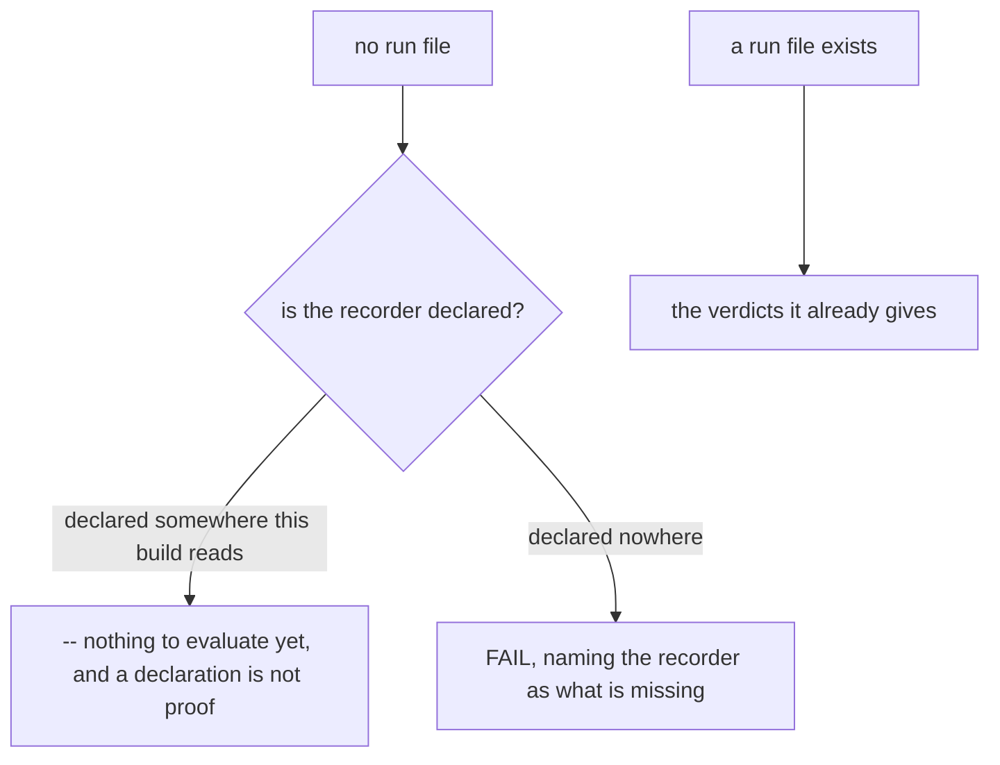
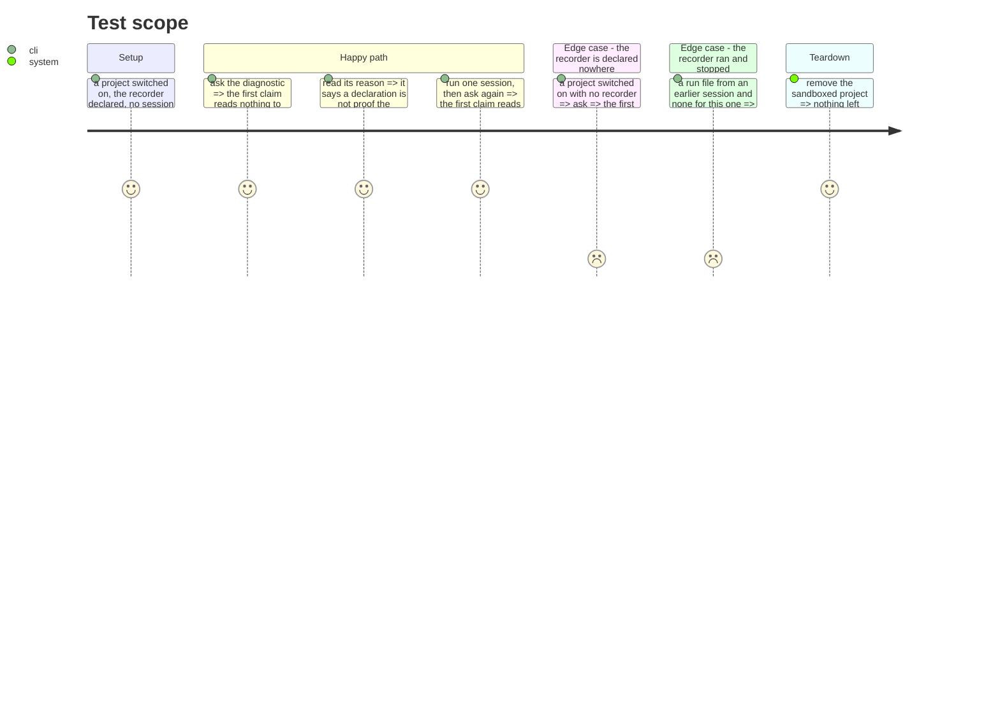

# Instruction: "not yet" stops being a failure

## Architecture projection

```txt
.
└── cli
    ├── src
    │   ├── domain/models/telemetry-claim.ts                    ✏️
    │   └── application/use-cases/telemetry/diagnose-telemetry-use-case.ts ✏️
    └── tests
        ├── domain/models/telemetry-claim.unit.test.ts          ✏️
        └── e2e/telemetry-check.e2e.test.ts                     ✏️
```

## User Journey



## Test Scope



## Tasks to do

### `1)` The absence gets its cause

> One absence, two causes. Reporting it as one of them is the fault this fixes.

1. Add the reasons the first claim now needs: a recorder declared but never observed firing, and a recorder declared nowhere.
2. In `diagnose-telemetry-use-case.ts`, decide between them by reading whether the recorder is declared — never by the absence of a run file, which is what both look like.
3. A declared recorder with no run file reads as nothing to evaluate, not a failure. Its detail says a declaration is not proof it will fire, and names the one measured case where a declaration is dropped.
4. A recorder declared nowhere reads as a failure, naming the recorder as what is missing.
5. Do not change the number of claims or their order. This alters what one concludes, not the set.

### `2)` The existing verdicts stay

1. Every case that already had a run file to read keeps the verdict it had.
2. The Codex hook-trust route keeps precedence where it already has it: a trust gate that explains the absence is a better answer than either of the two above.
3. Re-read the first claim's other details for anything that now over-claims.

## Test acceptance criteria

| Task | Acceptance criteria                                                                          |
| ---- | ---------------------------------------------------------------------------------------------- |
| 1    | A project switched on with the recorder declared and no session reports nothing to evaluate     |
| 1    | Its detail states that a declaration is not proof the recorder will fire                        |
| 1    | A project with the recorder declared nowhere reports a failure naming the recorder              |
| 1    | The claim count and order are unchanged                                                         |
| 2    | Every case that already had a run file keeps its previous verdict                               |
| 2    | An untrusted Codex hook still explains the absence ahead of either new reason                   |
