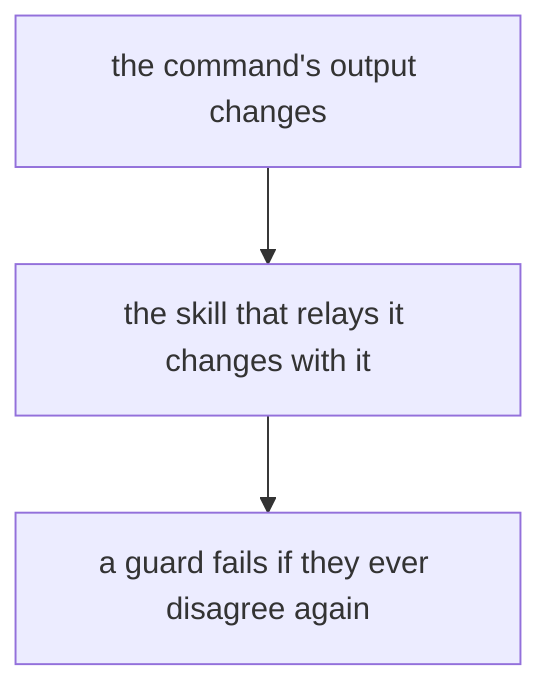
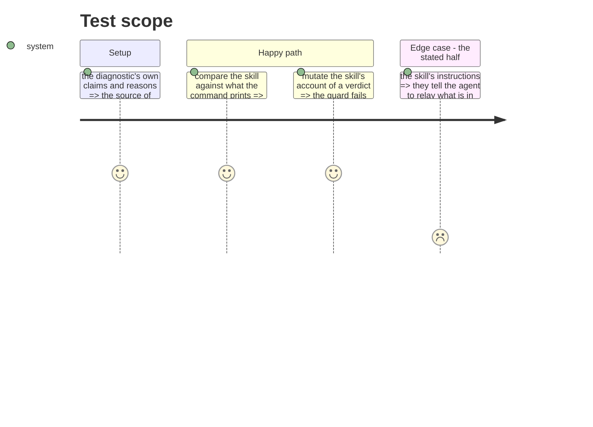

# Instruction: the consumers of the shape follow it

## Architecture projection

```txt
.
├── plugins/aidd-telemetry
│   ├── skills/02-check/SKILL.md                              ✏️
│   ├── skills/02-check/actions/02-diagnose.md                ✏️
│   └── CATALOG.md                                            ✏️ generated
├── docs/prompts-documentation.md                             ✏️ generated
└── cli/tests/domain/models/telemetry-claim.unit.test.ts      ✏️
```

## User Journey



## Test Scope



## Tasks to do

### `1)` The skill relays what the command now prints

> The consumer that went stale twice on this branch is the one to change in the same commit.

1. `02-check/actions/02-diagnose.md` states per-verdict behaviour in prose. Update it for the first claim's two new readings, and for the stated half the command now prints before its claims.
2. `02-check/SKILL.md` describes what the skill answers. It now answers what is in place as well as whether it records.
3. Sweep the plugin for any other account of what the diagnostic prints.

### `2)` The guard covers what changed

1. The claim-count guard already reads both files. Extend it, or add beside it, a check that fails if the skill's account of a verdict and the command's own reasons disagree.
2. Prove it by mutation: change one side, watch it fail, restore.

### `3)` Regenerate what is generated

1. Regenerate `CATALOG.md` and `docs/prompts-documentation.md` through their own scripts, never by hand. Both have pre-commit commands; confirm they ran.

## Test acceptance criteria

| Task | Acceptance criteria                                                                     |
| ---- | ----------------------------------------------------------------------------------------- |
| 1    | The skill's account of each verdict matches what the command prints                        |
| 1    | The skill tells the agent to relay what is in place, not only the claims                   |
| 2    | A guard fails when the skill and the command disagree about a verdict                      |
| 3    | The generated catalogue and prompt index match what their scripts produce                  |
