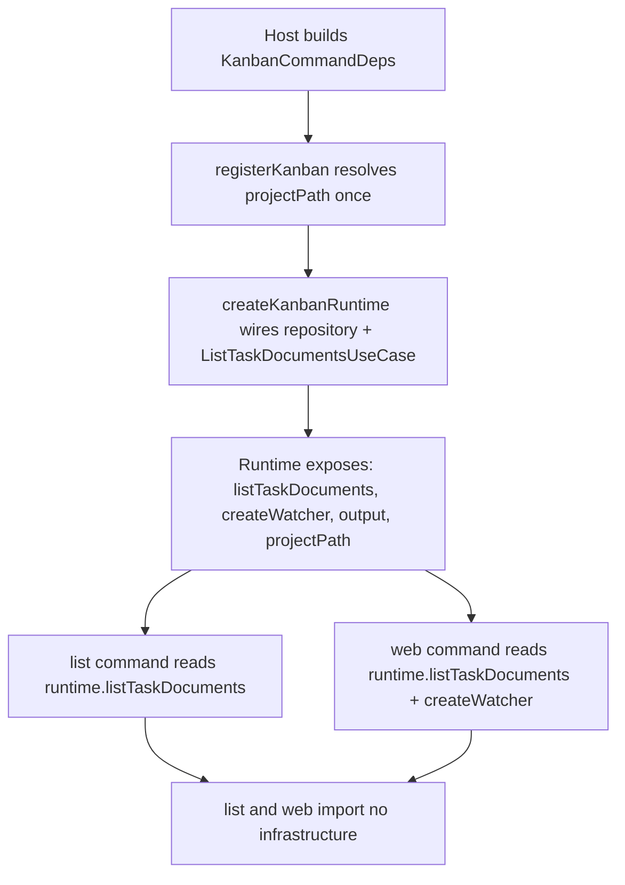
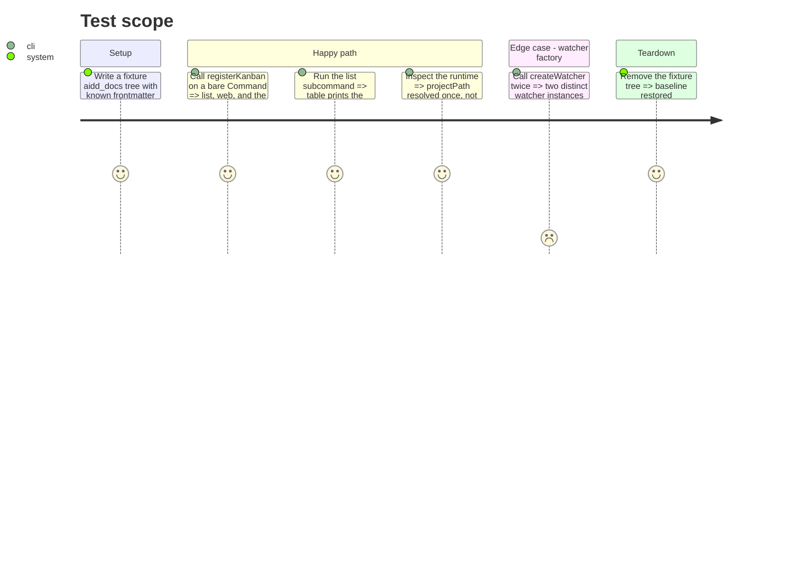

# Instruction: Composition root and the command layer

> Scope: the composition root, the single registration entrypoint, and the `list` / `web` command wiring. The ink view (`status-columns-view.tsx`, `interactive-command.ts`) is phase 2.

## Architecture projection

> Tree of the final files. ✅ create · ✏️ modify · ❌ delete

```txt
kanban/src/
├── composition/
│   └── kanban-runtime.ts            ✅ turns KanbanCommandDeps + projectPath into wired collaborators
├── presentation/
│   ├── register-kanban.ts           ✅ single entrypoint: builds the runtime, registers every subcommand
│   ├── kanban-deps.ts               ✏️ shape unchanged; consumed by register-kanban (and interactive-command.ts until phase 2)
│   └── commands/
│       ├── list-command.ts          ✏️ takes the runtime; drops `new FilesystemTaskDocumentRepository`
│       └── web-command.ts           ✏️ takes the runtime; drops both `new Filesystem*` (server call site untouched here — phase 4)
├── index.ts                         ✅ minimal public surface now (so the cli consumer keeps compiling); phase 6 tightens the gate around it
kanban/tests/
├── composition/kanban-runtime.test.ts   ✅ runtime lists the fixture docs; watcher factory yields a fresh instance
├── presentation/register-kanban.test.ts ✅ list + web + default action all register and run (mocks frontend-assets + ink render)
├── presentation/commands/list-command.test.ts  ✏️ built through register-kanban / injected use case
├── presentation/commands/interactive-command.test.ts ✏️ fix its registerListCommand call for the runtime signature (interactive itself stays phase 2)
└── presentation/commands/web-command.test.ts   ✅ new — file does not exist yet
cli/src/
└── application/commands/kanban.ts   ✏️ swap the 3 removed `registerXCommand` imports for one `registerKanban` from `kanban/src/index.js`; deps still built inline here (moves to deps.ts in phase 6)
```

> Phase 1 must keep the whole tree compiling: `cli/tsconfig.json` compiles `../kanban/src/**`, and `cli/src/application/commands/kanban.ts` imports the three `registerXCommand` functions this phase removes. Updating that one cli line is in-scope here; the deps relocation and the import-boundary gate are phase 6.

## Decision: how `projectPath` reaches the runtime

Today each command resolves the project path itself (`process.cwd()` based, inside `list` / `web` / `interactive`). This phase moves that resolution for **`list` and `web`** to one call site: `registerKanban(program, deps)` resolves `projectPath` once and passes it to `createKanbanRuntime({ deps, projectPath })`. `list` and `web` read `runtime.projectPath` only; they never touch `cwd` again. `interactive` keeps its own `process.cwd()` default until phase 2, where it is rewired onto the runtime alongside the ink view (the two are coupled through `docsDirectoryName`, so they move together). `KanbanCommandDeps` does **not** gain a `projectPath` field — the host still passes only config; path resolution is the feature's concern.

## User Journey



## Test Scope



## Tasks to do

### `1)` Create `composition/kanban-runtime.ts`

1. `interface CreateKanbanRuntimeInput { deps: KanbanCommandDeps; projectPath: string }`.
2. `interface KanbanRuntime { listTaskDocuments: ListTaskDocumentsUseCase; createWatcher: () => TaskDocumentWatcher; output: KanbanOutput; projectPath: string }`.
3. `createKanbanRuntime(input): KanbanRuntime` — instantiates `FilesystemTaskDocumentRepository(deps.docsDirectoryName)`, the use case, and closes over `createWatcher = () => new FilesystemTaskDocumentWatcher(deps.docsDirectoryName)`.
4. This is the **only** module under `kanban/src` allowed to import from `infrastructure/`.

### `2)` Create `presentation/register-kanban.ts`

1. `registerKanban(program: Command, deps: KanbanCommandDeps): void`.
2. Resolve `projectPath` once and carry it on the runtime for `list` and `web` (move the `process.cwd()` default out of those two commands). `interactive` keeps its own default until phase 2.
3. `const runtime = createKanbanRuntime({ deps, projectPath })`.
4. Register `list` and `web` via `registerXCommand(target, runtime, deps.onError)`; register the default `interactive` action via `registerInteractiveCommand(target, deps)` — its runtime rewiring is phase 2.

### `3)` Rewire `list-command.ts` and `web-command.ts`

1. Signature `(program, runtime, onError)`.
2. `list`: use `runtime.listTaskDocuments`, `runtime.projectPath`, `runtime.output`; delete the repository import. Board/DTO changes are later phases — keep current output shape.
3. `web`: use `runtime.listTaskDocuments`, `runtime.createWatcher()`, `runtime.projectPath`, `runtime.output`; delete both `Filesystem*` imports. Keep the existing `new KanbanWebServer({...})` call site verbatim — its move and the lifecycle fix are phase 4.

### `4)` Create `kanban/src/index.ts` and repoint the cli consumer

1. `index.ts`: `export { registerKanban } from "./presentation/register-kanban.js";` + `export type { KanbanCommandDeps, KanbanOutput } from "./presentation/kanban-deps.js";`
2. `cli/src/application/commands/kanban.ts`: replace the three `registerXCommand` imports with `import { registerKanban } from "../../../../kanban/src/index.js";`; keep the inline `deps` object; call `registerKanban(program, deps)`.

### `5)` Update tests

1. New `kanban-runtime.test.ts` and `register-kanban.test.ts`. `register-kanban.test.ts` must mock `../web/frontend-assets.js` (its module-load `readFileSync` throws ENOENT from source — phase 4 fixes this) and `ink`'s `render`, so wiring is asserted without starting a real server.
2. Rework `list-command.test.ts` and create `web-command.test.ts` (absent today) — build through `registerKanban` (with the mocks above) or inject a fake use case (`{ execute: async () => fixtureGroups }`) and fake watcher.
3. Fix the existing `interactive-command.test.ts`: update its `registerListCommand(program, deps)` call to `(program, runtime, onError)`. Do not rewire `interactive` itself — that is phase 2.
4. Add an import-boundary check (test or `package.json` script): no file under `presentation/` or `application/` imports `infrastructure/` except `composition/kanban-runtime.ts` and `presentation/components/status-columns-view.tsx` (phase 2 removes that last exception).

## Test acceptance criteria

| Task | Acceptance criteria                                                                                     |
| ---- | ------------------------------------------------------------------------------------------------------ |
| 1    | `createKanbanRuntime` returns a use case that lists the fixture documents and a factory yielding a fresh watcher per call |
| 2    | `registerKanban` on a bare `Command` exposes `list`, `web`, and the default action; `projectPath` is resolved once for `list` and `web` via the runtime (`interactive` still resolves its own until phase 2) |
| 3    | `list` and `web` contain no `new Filesystem*`; `list` output is byte-identical to pre-phase for the fixture |
| 4    | `pnpm --dir cli typecheck` passes: the cli consumer compiles against `kanban/src/index.js`               |
| 5    | The import-boundary check passes: only `composition/kanban-runtime.ts` and `presentation/components/status-columns-view.tsx` (phase 2 clears the latter) import `infrastructure/`; `pnpm --dir kanban test` green |
