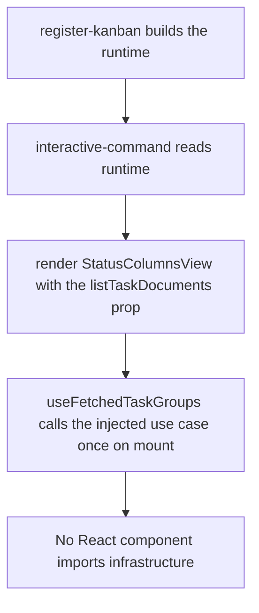
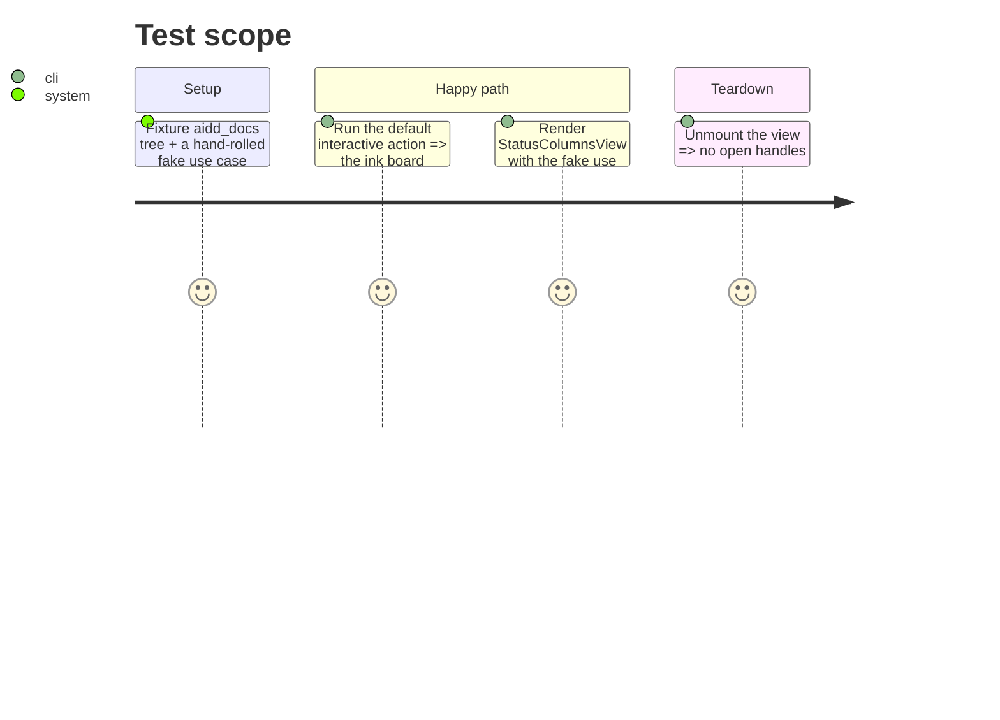

# Instruction: The ink view receives injected dependencies

> Scope: remove the adapter instantiated inside the React `useEffect`; the ink view receives the use case as a prop. Rendering behaviour is unchanged, the view stays fetch-once (no watcher — `interactive --live` is phase 7). The fixed-column rework is phase 3.

## Architecture projection

> Tree of the final files. ✅ create · ✏️ modify · ❌ delete

```txt
kanban/src/presentation/
├── register-kanban.ts               ✏️ register interactive as (target, runtime, deps.onError) — phase 1 passed (target, deps)
├── commands/
│   └── interactive-command.ts       ✏️ takes the runtime; passes runtime.listTaskDocuments as a prop; drops the process.cwd() default
└── components/
    └── status-columns-view.tsx      ✏️ use case arrives as a prop; no `new` in useEffect; drop docsDirectoryName prop
kanban/tests/presentation/
├── commands/interactive-command.test.ts   ✏️ built through register-kanban / injected fake use case
└── components/status-columns-view.test.tsx ✏️ inject a fake use case; assert the real filesystem is never touched
```

## User Journey



## Test Scope



## Tasks to do

### `1)` Rewire `status-columns-view.tsx`

1. Props gain `listTaskDocuments: ListTaskDocumentsUseCase`; drop `docsDirectoryName`.
2. `useFetchedTaskGroups` consumes the injected `listTaskDocuments`; delete the `new ListTaskDocumentsUseCase(new FilesystemTaskDocumentRepository(...))` line and the infrastructure imports.
3. The view stays fetch-once — no watcher subscription here (that is `interactive --live`, phase 7).
4. No change to the rendered output (columns, navigation, notices stay as they are — phase 3 removes the horizontal-scroll machinery).

### `2)` Rewire `interactive-command.ts`

1. Signature `(program, runtime, onError)`; update `register-kanban.ts` to register it as `registerInteractiveCommand(target, runtime, deps.onError)` (phase 1 still passed `deps`).
2. Replace the `.argument("[path]", "project path", process.cwd())` default with `runtime.projectPath` — `projectPath` is now resolved once for all three commands, closing the phase-1 deferral.
3. Pass `runtime.listTaskDocuments`, `runtime.projectPath`, and current `filters` as props to `StatusColumnsView`.

### `3)` Update tests

1. `status-columns-view.test.tsx`: render with a fake use case (`{ execute: async () => fixtureGroups }`); assert no real filesystem access.
2. `interactive-command.test.ts`: drive through `registerKanban`.
3. Extend the phase-1 import-boundary check to cover `components/`.

## Test acceptance criteria

| Task | Acceptance criteria                                                                              |
| ---- | ---------------------------------------------------------------------------------------------- |
| 1    | `status-columns-view.tsx` imports nothing from `infrastructure/`; given a fake use case it renders without reading disk |
| 2    | The default interactive action renders the same board as before this phase for the fixture project |
| 3    | `interactive` creates no `FSWatcher`; the view fetches once; `pnpm --dir kanban test` green |
| 4    | `projectPath` is resolved once in `register-kanban` for `list`, `web`, and `interactive`; no command keeps a `process.cwd()` default; the import-boundary check now also covers `presentation/components/` |
