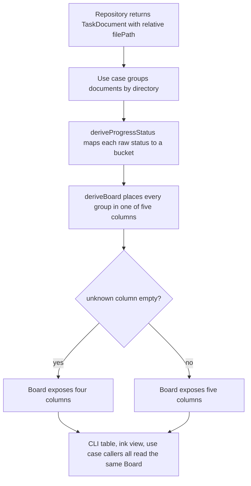
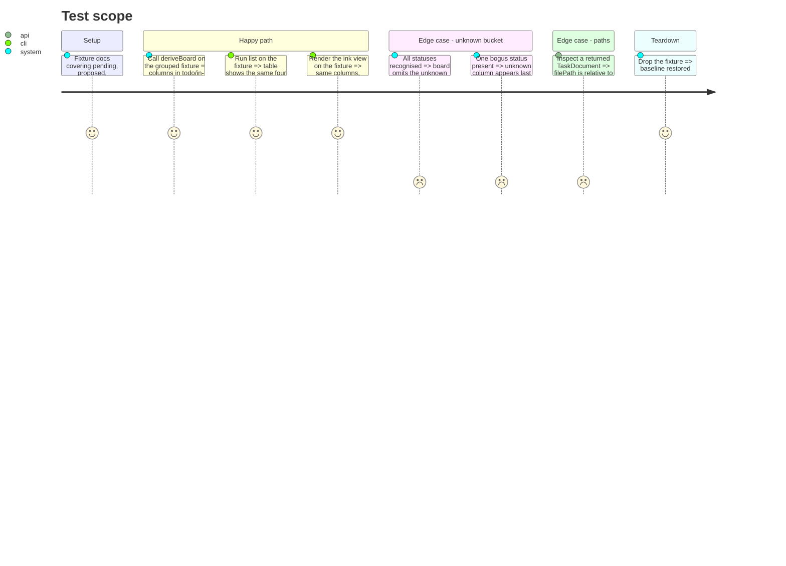

# Instruction: Unified board semantics in the domain

> Scope: the `list` table and the ink view switch to the five fixed `Board` columns this phase. The web view's payload shape changes here too but its frontend is knowingly out of sync until phase 5 — `list` and `interactive` are the surfaces this phase verifies.

## Architecture projection

> Tree of the final files. ✅ create · ✏️ modify · ❌ delete

```txt
kanban/src/
├── domain/
│   └── models/
│       ├── progress-status.ts       ✏️ add proposed|open|reported → todo; keep unmapped → unknown
│       ├── board.ts                 ✅ Board, BoardColumn, deriveBoard(taskGroups), PROGRESS_STATUS_LABELS
│       └── task-document.ts         ✏️ filePath documented as project-relative
├── application/
│   └── use-cases/
│       └── list-task-documents.ts   ✏️ returns Board (calls deriveBoard); filters still applied to task groups
├── presentation/web/
│   └── http-server.ts               ✏️ still compiles (SseManager.broadcast takes unknown, JSON.stringify any); the /api/tasks + SSE payload is now a raw Board until phase 4 wraps it in BoardDto — the web frontend realigns in phase 5
├── infrastructure/
│   └── filesystem/
│       └── filesystem-task-document-repository.ts  ✏️ filePath = relative(projectPath, entryPath)
├── presentation/
│   ├── status-grouping.ts           ❌ delete — logic absorbed by deriveBoard
│   ├── commands/
│   │   └── list-command.ts          ✏️ render Board columns; drop collectDistinctParentStatuses / groupTaskGroupsByParentStatus
│   └── components/
│       ├── status-columns-view.tsx  ✏️ consume Board; drop horizontal scroll / hidden-column machinery
│       └── status-column.tsx        ✏️ header from PROGRESS_STATUS_LABELS, not status.toUpperCase()
kanban/tests/
├── domain/models/board.test.ts            ✅ deriveBoard: fixed order, unknown only when non-empty, mapping table
├── domain/models/progress-status.test.ts  ✏️ new raw-status rows
├── application/use-cases/list-task-documents.test.ts  ✏️ asserts Board shape
├── infrastructure/filesystem/*.test.ts    ✏️ expects relative filePath
├── presentation/status-grouping.test.ts   ❌ delete
└── presentation/components/*.test.tsx      ✏️ Board-driven columns
```

## User Journey



## Test Scope



## Tasks to do

### `1)` Extend `progress-status.ts`

1. Add to `RAW_STATUS_TO_PROGRESS_STATUS`: `proposed`, `open`, `reported` → `PROGRESS_STATUS_TODO`.
2. Leave the `?? PROGRESS_STATUS_UNKNOWN` fallback: `superseded`, `cancelled`, and any unlisted value stay `unknown`.
3. No change to `PROGRESS_STATUSES_IN_COLUMN_ORDER`.

### `2)` Create `domain/models/board.ts`

1. `interface BoardColumn { progressStatus: ProgressStatus; label: string; taskGroups: TaskGroup[] }`.
2. `interface Board { columns: BoardColumn[] }`.
3. `PROGRESS_STATUS_LABELS: Record<ProgressStatus, string>` = `{ todo: "TODO", "in-progress": "IN PROGRESS", done: "DONE", blocked: "BLOCKED", unknown: "UNKNOWN" }`.
4. `deriveBoard(taskGroups: TaskGroup[]): Board` — bucket each group by `group.parent.progressStatus`, emit columns in `PROGRESS_STATUSES_IN_COLUMN_ORDER`, drop the `unknown` column when its bucket is empty, keep the other four always.

### `3)` Use case returns `Board`

1. `ListTaskDocumentsUseCase.execute` keeps building filtered `TaskGroup[]`, then returns `deriveBoard(groups)`.
2. Update the return type; `shouldIncludeUnknownStatus` still filters groups before `deriveBoard`.

### `4)` Repository returns relative paths

1. In `filesystem-task-document-repository.ts`, set `filePath: relative(projectPath, entryPath)` (`node:path` `relative`).
2. Confirm nothing downstream depends on an absolute path (grep `filePath`).

### `5)` Delete `presentation/status-grouping.ts` and rewire consumers

1. Remove the file and its test.
2. `list-command.ts`: iterate `board.columns`; `buildStatusColumnTable` takes `Board`. The `--json` branch now serializes the `Board` as-is (the use case no longer returns `TaskGroup[]`); phase 4 replaces that with `BoardDto` and greps for consumers of the old shape.
3. `status-columns-view.tsx`: consume `board.columns`; delete `useColumnNavigation`, `HiddenColumnsNotice`, `computeVisibleColumnCount`, `clampToRange`, the `‹ n/m columns ›` notice.
4. `status-column.tsx`: header text = `column.label`.

### `6)` Update tests

1. New `board.test.ts`; extend `progress-status.test.ts`.
2. Rework use-case, repository, list-command, and component tests to the `Board` shape.
3. Full `pnpm --dir kanban test` green.

## Test acceptance criteria

| Task | Acceptance criteria                                                                                          |
| ---- | ----------------------------------------------------------------------------------------------------------- |
| 1    | `deriveProgressStatus("proposed" \| "open" \| "reported")` returns `todo`; `deriveProgressStatus("superseded")` returns `unknown` |
| 2    | `deriveBoard` output lists columns in fixed order, labels from the map, `unknown` present only with ≥1 group |
| 3    | `execute` returns a `Board`; `--all=false` still removes unknown-status groups before derivation             |
| 4    | A returned `TaskDocument.filePath` equals the path relative to the project root                              |
| 5    | `status-grouping.ts` is gone; `list` and the ink view render five fixed columns with no horizontal-scroll UI |
| 6    | `pnpm --dir kanban test` passes with the new and reworked suites                                             |
