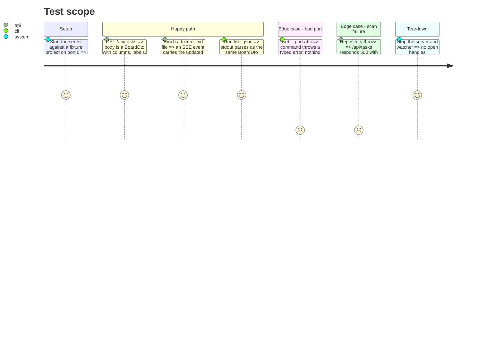

# Instruction: HTTP transport to infrastructure and board DTO

## Architecture projection

> Tree of the final files. ✅ create · ✏️ modify · ❌ delete

```txt
kanban/src/
├── infrastructure/
│   └── http/
│       ├── kanban-web-server.ts     ✏️ moved from presentation/web/http-server.ts; serves BoardDto
│       ├── sse-manager.ts           ✏️ moved from presentation/web/sse-manager.ts (unchanged logic)
│       └── frontend-assets.ts       ✏️ moved from presentation/web/; no readFileSync-on-import
├── presentation/
│   ├── dto/
│   │   └── board-dto.ts             ✅ BoardDto + toBoardDto(board): the transport contract
│   ├── web/                         ❌ delete the folder (frontend/ moves to infrastructure/http/, phase 5 renders from it)
│   └── commands/
│       ├── web-command.ts           ✏️ awaits server.start(); validates --port; passes assets + toBoardDto
│       └── list-command.ts          ✏️ --json prints toBoardDto(board)
├── composition/
│   └── kanban-runtime.ts            ✏️ exposes frontend assets + a web-server factory
kanban/src/presentation/web/frontend/   → moves to kanban/src/infrastructure/http/frontend/  (assets read by frontend-assets.ts)
kanban/tests/
├── infrastructure/http/kanban-web-server.test.ts  ✏️ moved from tests/presentation/http-server.test.ts; asserts BoardDto payload
├── presentation/dto/board-dto.test.ts             ✅ toBoardDto maps every field, sub counts, relative paths
└── presentation/commands/web-command.test.ts      ✏️ rejects a non-numeric --port; awaits start
cli/
└── tsup.config.ts                   ✏️ copy frontend from infrastructure/http/frontend/
```

## User Journey

```mermaid
flowchart TD
  A[web command builds runtime] --> B[runtime.createWebServer with useCase + watcher + assets + toBoardDto]
  B --> C[KanbanWebServer in infrastructure/http listens]
  C --> D[GET /api/tasks => toBoardDto(board) as JSON]
  C --> E[watcher change => fetchAndBroadcast => SSE sends BoardDto]
  A --> F[await server.start; then openBrowser]
  F --> G{port flag numeric?}
  G -- no --> H[throw before listen]
  G -- yes --> C
```

## Test Scope



## Tasks to do

### `1)` Create `presentation/dto/board-dto.ts`

1. `interface BoardSubCardDto { name: string; status: string; progressStatus: ProgressStatus; path: string }`.
2. `interface BoardCardDto { name; status; type; progressStatus; description; path; subDocuments: BoardSubCardDto[]; doneSubCount: number; totalSubCount: number }`.
3. `interface BoardColumnDto { progressStatus: ProgressStatus; label: string; cards: BoardCardDto[] }`.
4. `interface BoardDto { columns: BoardColumnDto[] }`.
5. `toBoardDto(board: Board): BoardDto` — maps `column.taskGroups` to cards, `parent.filePath` → `path`, counts `subDocuments` with `progressStatus === "done"`.

### `2)` Move HTTP transport into `infrastructure/http/`

1. Move `http-server.ts` → `infrastructure/http/kanban-web-server.ts`; move `sse-manager.ts` alongside; fix relative imports.
2. `KanbanWebServerDeps`: replace `filters` passthrough with a `boardProvider: () => Promise<BoardDto>` (the server no longer knows the use case or `toBoardDto`), keep `watcher`, `output`, and the three asset strings.
3. `handleApiTasks` and `fetchAndBroadcast` call `boardProvider()` and serialize its result directly.

### `3)` Rework frontend-asset provision

1. Move `frontend-assets.ts` and the `frontend/` folder under `infrastructure/http/`.
2. Replace module-load `readFileSync` with a function `readFrontendAssets(): { indexHtml; stylesCss; appJs }` called by the composition root at server-build time.
3. Update `cli/tsup.config.ts` `onSuccess` copy source path to `../kanban/src/infrastructure/http/frontend/`.

### `4)` Wire through the composition root

1. `kanban-runtime.ts` gains `createWebServer(port: number): KanbanWebServer` — builds `boardProvider = async () => toBoardDto(await listTaskDocuments.execute(runtime.projectPath, {}))`, calls `createWatcher()`, reads assets via `readFrontendAssets()`, `new`s the server.
2. `runtime.projectPath` already exists (resolved once in `register-kanban`, phase 1) — reuse it, do not re-resolve `cwd` here.

### `5)` Fix `web-command.ts` lifecycle

1. Parse `--port`: `const port = Number.parseInt(options.port, 10); if (Number.isNaN(port)) throw` a typed error routed through `onError`.
2. `const actualPort = await runtime.createWebServer(port).start(); openBrowser(...)` — awaited, errors caught. `web-command.ts` no longer calls `runtime.createWatcher()` directly (that moves inside `createWebServer`).
3. Keep the existing `SIGINT` / `SIGTERM` handlers that call `server.stop()`.

### `6)` `list --json` emits `BoardDto`

1. Before changing the shape: `grep -rn "kanban.*list.*json\|--json" plugins/ scripts/ cli/` and check `plugins/aidd-*/skills/**` for any consumer of the current `TaskGroup[]` output. The command is hidden/experimental; record what (if anything) reads it in the phase notes.
2. Replace `JSON.stringify(taskGroups)` with `JSON.stringify(toBoardDto(board), null, 2)`.
3. If a consumer exists, update it in this phase or flag it as a follow-up.

### `7)` Move and update tests

1. `tests/presentation/http-server.test.ts` → `tests/infrastructure/http/kanban-web-server.test.ts`; assert the `BoardDto` payload and the 500 branch.
2. New `board-dto.test.ts`; update `web-command.test.ts` for the port guard.

## Test acceptance criteria

| Task | Acceptance criteria                                                                                   |
| ---- | --------------------------------------------------------------------------------------------------- |
| 1    | `toBoardDto` output has no `TaskGroup`/`TaskDocument` reference; `doneSubCount`/`totalSubCount` correct on a mixed fixture |
| 2    | `kanban-web-server.ts` lives under `infrastructure/http/`; it imports no `application/` use case, only `boardProvider` |
| 3    | Importing `frontend-assets.ts` performs no filesystem read; `readFrontendAssets()` returns the three strings |
| 4    | `runtime.createWebServer(0).start()` serves a `BoardDto` at `/api/tasks`                             |
| 5    | `web --port abc` exits non-zero via the error handler with nothing bound; a valid port opens the board |
| 6    | `list --json` stdout parses to `BoardDto`                                                            |
| 7    | `pnpm --dir kanban test` green; the HTTP test sits under `tests/infrastructure/http/`               |
