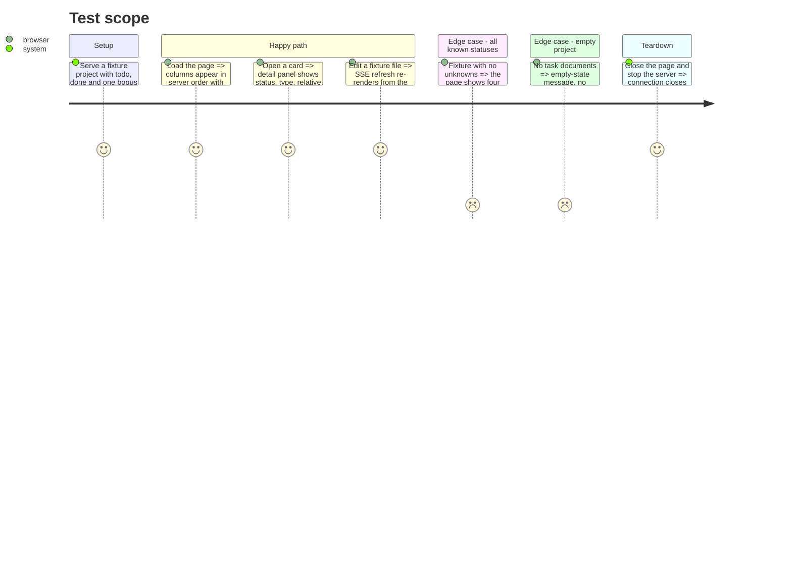

# Instruction: Frontend renders the server board

## Architecture projection

> Tree of the final files. ✅ create · ✏️ modify · ❌ delete

```txt
kanban/src/infrastructure/http/frontend/
├── app.js        ✏️ render BoardDto.columns from the server; delete PROGRESS_ORDER / PROGRESS_LABELS / groupByProgress
├── index.html    ✏️ only if a hook id changes (expected: none)
└── styles.css    ✏️ only if a class is dropped (expected: none)
```

## User Journey

```mermaid
flowchart TD
  A[Page loads] --> B[fetch /api/tasks => BoardDto]
  B --> C[renderBoard iterates board.columns in server order]
  C --> D[Each column: header = column.label, count = column.cards.length]
  D --> E[Each card from column.cards: name, status, sub progress]
  A --> F[EventSource /events]
  F --> G[message => JSON.parse => same renderBoard(boardDto)]
  G --> C
```

## Test Scope



## Wireframe

```txt
┌ Kanban ──────────────────────────── ● connected ─┐
│  aidd_docs/tasks                                   │
├─────────┬────────────┬────────┬─────────┬──────────┤
│ TODO  3 │ IN PROG  1 │ DONE 2 │ BLOCKED0│ UNKNOWN 1│
│ ┌─────┐ │ ┌────────┐ │ ┌────┐ │         │ ┌──────┐ │
│ │name │ │ │name    │ │ │name│ │         │ │name  │ │
│ │stat │ │ │2/4 done│ │ │done│ │         │ │ ???  │ │
│ └─────┘ │ │▓▓▓░░░░░ │ │ └────┘ │         │ └──────┘ │
│         │ └────────┘ │        │         │          │
└─────────┴────────────┴────────┴─────────┴──────────┘
        (columns + labels + counts all come from BoardDto)
```

## Tasks to do

### `1)` Render from `BoardDto`

1. `loadInitialData` / SSE `onmessage`: the payload is now `{ columns: [...] }`; call `renderBoard(boardDto.columns)`.
2. `renderBoard(columns)`: iterate `columns` directly; header text = `column.label`, count = `column.cards.length`; for each `card` in `column.cards` call `createCard(card)`.
3. Empty state: when every column has zero cards, show the existing "No task documents found." message.

### `2)` Delete the re-implemented domain logic

1. Remove `PROGRESS_ORDER`, `PROGRESS_LABELS`, `groupByProgress`.
2. `countDoneSubs` — replace with `card.doneSubCount` / `card.totalSubCount` from the DTO.

### `3)` Adjust `createCard` / `openPanel` to the card shape

1. `group.parent.X` → `card.X`; `group.subDocuments` → `card.subDocuments`.
2. `group.parent.filePath` → `card.path`.
3. No visual change intended; keep every class name and DOM id.

### `4)` Manual verification

1. `pnpm --dir cli build` then run `aidd kanban web` against this repo; confirm columns, counts, panel, and live refresh on a file edit.

## Test acceptance criteria

| Task | Acceptance criteria                                                                              |
| ---- | ---------------------------------------------------------------------------------------------- |
| 1    | The board shows exactly the columns the server sent, in that order, with the server's labels and counts |
| 2    | `app.js` contains no status-order array, no label map, no client-side grouping function        |
| 3    | Card and panel show name, status, type, relative path, and `n/m done` from the DTO with no console error |
| 4    | `aidd kanban web` on this repo renders the board and refreshes within ~1s of editing a task file |
