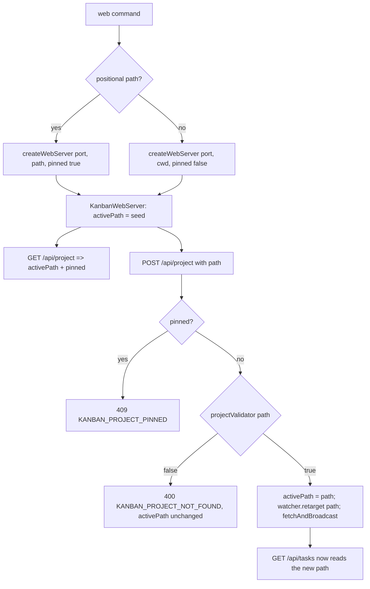
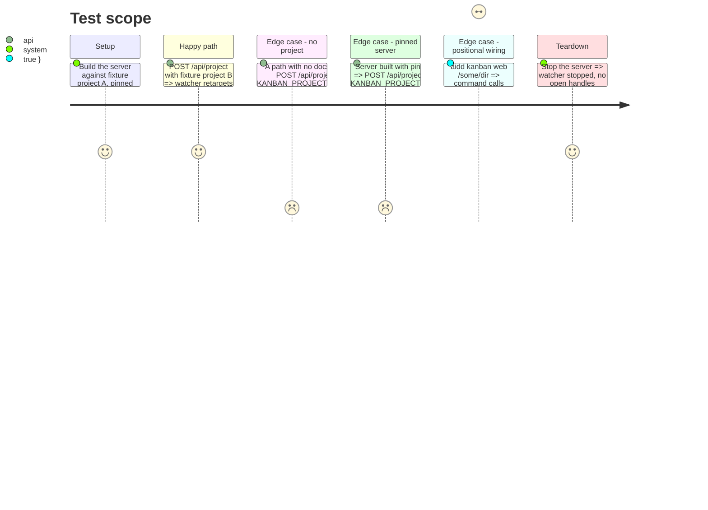

# Instruction: Project path selection in the web transport

> Phase 4 froze `boardProvider: () => Promise<BoardDto>` and a single seed `projectPath`.
> This phase widens that contract so the running server can be re-pointed at another
> project from the browser, and pins the path when the CLI passed a positional.
> Backend and tests only — the frontend picker is phase 6.

## Architecture projection

> Tree of the final files. ✅ create · ✏️ modify · ❌ delete

```txt
kanban/src/
├── domain/ports/
│   ├── task-document-watcher.ts        ✏️ add retarget(projectPath: string): void
│   └── task-document-repository.ts     ✏️ add projectExists(projectPath: string): Promise<boolean>
├── infrastructure/
│   ├── filesystem/
│   │   ├── filesystem-task-document-watcher.ts     ✏️ implement retarget = stop() then start(path), via a shared private watch helper
│   │   └── filesystem-task-document-repository.ts   ✏️ implement projectExists via existsSync(join(path, docsDirectoryName))
│   └── http/
│       └── kanban-web-server.ts        ✏️ active-path state, pinned flag, projectValidator dep, boardProvider(path), GET+POST /api/project
├── composition/
│   └── kanban-runtime.ts               ✏️ createWebServer(port, { projectPath, pinned }); wire boardProvider(path) + projectValidator
└── presentation/commands/
    └── web-command.ts                  ✏️ restore .argument("[path]"); pinned = path !== undefined; pass a target object
kanban/tests/
├── infrastructure/
│   ├── filesystem-task-document-watcher.test.ts     ✏️ retarget swaps the watched directory, onChange survives
│   └── filesystem-task-document-repository.test.ts  ✏️ projectExists true with a docs dir, false without
├── infrastructure/http/kanban-web-server.test.ts    ✏️ /api/project GET + POST, pin 409, no-project 400, retarget + rebroadcast
├── composition/kanban-runtime.test.ts               ✏️ createWebServer new signature; POST switches the served project end to end
└── presentation/commands/web-command.test.ts        ✏️ positional pins; target object reaches createWebServer
```

## User Journey



## Test Scope



## Tasks to do

### `1)` Extend the watcher port with `retarget`

> Switching project moves the file watch without losing the subscription.

1. `task-document-watcher.ts`: add `retarget(projectPath: string): void` to the interface.
2. `filesystem-task-document-watcher.ts`: extract the `watch(...)` body of `start` into a private `watchDirectory(projectPath)`; `start` and `retarget` both call it. `retarget` first runs the existing `stop()` (clears debounce, closes the FSWatcher), then `watchDirectory(projectPath)`. `this.callback` is untouched, so `onChange` survives.

### `2)` Extend the repository port with `projectExists`

> The picker checks a path is a project before anything is re-pointed.

1. `task-document-repository.ts`: add `projectExists(projectPath: string): Promise<boolean>`.
2. `filesystem-task-document-repository.ts`: implement as `existsSync(join(projectPath, this.docsDirectoryName))`. No scan, no read.

### `3)` Give `KanbanWebServer` an active path and the project endpoints

1. `KanbanWebServerDeps`: keep `projectPath` as the **seed**; add `pinned: boolean`; change `boardProvider` to `(projectPath: string) => Promise<BoardDto>`; add `projectValidator: (projectPath: string) => Promise<boolean>`.
2. Server holds `private activeProjectPath: string` initialised to `deps.projectPath`. `start()` calls `this.deps.watcher.start(this.activeProjectPath)`. `handleApiTasks` and `fetchAndBroadcast` call `this.deps.boardProvider(this.activeProjectPath)`.
3. Widen the `createServer` callback to pass `req`; `handleRequest(req, res)` branches on the pathname then `req.method`.
4. `GET /api/project` => `200 { path: activeProjectPath, pinned: deps.pinned }`.
5. `POST /api/project`: if `deps.pinned` => `409 { error, code: "KANBAN_PROJECT_PINNED" }`. Read and JSON-parse the body; a missing or non-string `path` => `400 { error, code: "KANBAN_PROJECT_INVALID_REQUEST" }`. `await deps.projectValidator(path)` false => `400 { error, code: "KANBAN_PROJECT_NOT_FOUND" }`. Otherwise set `activeProjectPath = path`, `deps.watcher.retarget(path)`, `await this.fetchAndBroadcast()`, respond `200 { path, pinned: false }`.
6. All error bodies carry a translated English message plus the code; no path echoed back beyond what the client sent.

### `4)` Wire the composition root

1. `KanbanRuntime.createWebServer` becomes `(port: number, target: { projectPath: string; pinned: boolean }) => KanbanWebServer`. `runtime.projectPath` (the cwd from phase 1) stays for `list` / `interactive` and as the bare-mode default.
2. Build the server with `projectPath: target.projectPath`, `pinned: target.pinned`, `boardProvider: (projectPath) => toBoardDto(await listTaskDocuments.execute(projectPath, {}))`, `projectValidator: (projectPath) => repository.projectExists(projectPath)`.

### `5)` Restore the positional in `web-command.ts`

1. `.argument("[path]", "project path to serve")` on the `web` command; action signature `(path: string | undefined, options: WebCommandOptions)`.
2. `const projectPath = path ?? runtime.projectPath;` `const pinned = path !== undefined;`
3. `runtime.createWebServer(port, { projectPath, pinned })`. `--port` parsing and the `SIGINT` / `SIGTERM` handlers are unchanged.

### `6)` Move and update tests

1. `filesystem-task-document-watcher.test.ts`: after `start(a)` then `retarget(b)`, a change under `b` fires `onChange` and a change under `a` does not.
2. `filesystem-task-document-repository.test.ts`: `projectExists` true for a dir containing the docs directory, false otherwise.
3. `kanban-web-server.test.ts`: mock watcher gains `retarget: vi.fn()`; `createServer` helper takes `pinned` (default false) and `projectValidator` (default `async () => true`). Add the four `/api/project` cases from the test scope; keep the existing route tests, updating `boardProvider` to accept the path arg.
4. `kanban-runtime.test.ts`: call `createWebServer(0, { projectPath: fixtureA, pinned: false })`; new test POSTs `fixtureB` and asserts `/api/tasks` then serves `fixtureB`'s cards.
5. `web-command.test.ts`: `createWebServer` asserted with `(8080, { projectPath: "/resolved/project/path", pinned: false })`; new test parses `["node","aidd-kanban","/some/dir"]` and asserts `{ projectPath: "/some/dir", pinned: true }`.

## Test acceptance criteria

| Task | Acceptance criteria |
| ---- | ------------------- |
| 1 | `retarget(path)` closes the previous FS watch and watches `path`; a callback registered before `retarget` still fires |
| 2 | `projectExists(path)` is true only when `<path>/<docsDirectoryName>` exists; it performs no file read |
| 3 | `GET /api/project` returns the active path and the pin flag; `POST /api/project` retargets the watcher, rebroadcasts, and shifts `/api/tasks` to the new path |
| 3 | `POST /api/project` with a non-project path => 400 `KANBAN_PROJECT_NOT_FOUND`, watcher untouched, active path unchanged; on a pinned server => 409 `KANBAN_PROJECT_PINNED` |
| 4 | `runtime.createWebServer(0, target)` serves `target.projectPath` and validates switches through `repository.projectExists` |
| 5 | `aidd kanban web <path>` builds the server `{ projectPath: <path>, pinned: true }`; bare `aidd kanban web` builds `{ projectPath: cwd, pinned: false }` |
| 6 | `pnpm --dir kanban test` green |
