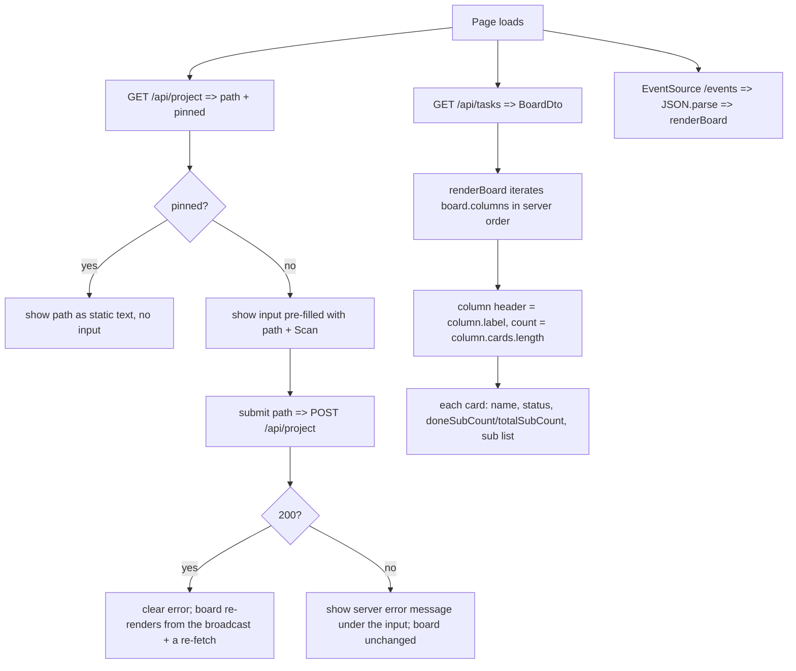
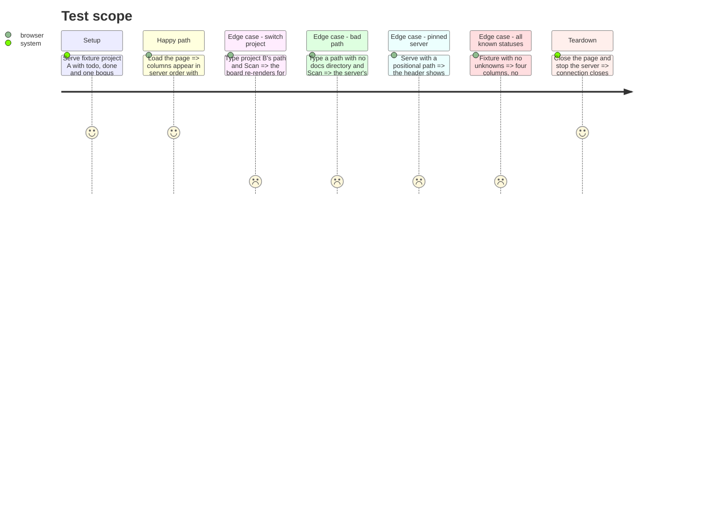

# Instruction: Frontend renders the server board and the project picker

> The frontend still re-implements the domain (progress order, labels, grouping) and
> reads a fixed project. This phase makes it render straight from `BoardDto.columns`
> and, when the server is not pinned, exposes a free-form project-path field wired to
> the `/api/project` endpoints from phase 5.

## Architecture projection

> Tree of the final files. ✅ create · ✏️ modify · ❌ delete

```txt
kanban/src/infrastructure/http/frontend/
├── app.js        ✏️ render BoardDto.columns; drop PROGRESS_ORDER / PROGRESS_LABELS / groupByProgress / countDoneSubs; add the project-path control
├── index.html    ✏️ add the project-path input + Scan button + error slot in the header
└── styles.css    ✏️ styles for the project-path field and its error line
```

## User Journey



## Test Scope



## Wireframe

```txt
┌ (1) Header ───────────────────────────────────────────── (3) ● connected ─┐
│  aidd kanban   (2) [ /abs/path/to/project              ] [ Scan ]           │
│                (8) project not found: no aidd_docs at that path            │
├──────────┬────────────┬─────────┬──────────┬──────────────────────────────┤
│ (4) TODO 3 │ IN PROG 1 │ DONE 2  │ BLOCKED 0 │ UNKNOWN 1                    │
│  ┌───────┐ │ ┌────────┐│         │           │  ┌───────┐                   │
│  │ (5)   │ │ │ name   ││         │           │  │ name  │                   │
│  │ name  │ │ │2/4 done││         │           │  │  ???  │                   │
│  │ stat  │ │ │▓▓░░░░  ││         │           │  └───────┘                   │
│  └───────┘ │ └────────┘│         │           │                             │
├────────────┴───────────┴─────────┴───────────┴──────────────────────────────┤
│ (6) 7 tasks                                        Last updated 12:00:03    │
└────────────────────────────────────────────────────────────────────────────┘

    ┌ (7) Detail panel (overlay) ──────────┐
    │  name                          [ x ] │
    │  Status: pending · plan              │
    │  Path: aidd_docs/tasks/x/plan.md     │
    │  Sub-tasks (2/4)  ▓▓░░               │
    └──────────────────────────────────────┘
```

1. Header: title; connection dot at right.
2. Project-path field: text input pre-filled with the active path + Scan action. Rendered only when the server reports `pinned:false`.
3. Connection indicator: connected / disconnected (unchanged).
4. Columns: from `BoardDto.columns` in server order, server label + card count.
5. Card: parent name, raw status, `doneSubCount/totalSubCount` + bar; opens the panel.
6. Footer: task count + last-updated (unchanged).
7. Detail panel overlay: name, status + type, relative path, sub-task list — from the card DTO.
8. Error line: the server's 400 message for a rejected scan; cleared on success. When `pinned:true`, region 2 is the path as static dimmed text and region 8 never appears.

## Tasks to do

### `1)` Render from `BoardDto`

> The server sends columns already ordered and labelled; the page just draws them.

1. `loadInitialData` / SSE `onmessage`: payload is `{ columns: [...] }`; call `renderBoard(boardDto.columns)`.
2. `renderBoard(columns)`: iterate `columns` directly; header text = `column.label`, count = `column.cards.length`; for each `card` in `column.cards` call `createCard(card)`.
3. Empty state: when every column has zero cards, show the existing "No task documents found." message.

### `2)` Delete the re-implemented domain logic

1. Remove `PROGRESS_ORDER`, `PROGRESS_LABELS`, `groupByProgress`, `countDoneSubs`.
2. Use `card.doneSubCount` / `card.totalSubCount` from the DTO for the progress summary and bar.

### `3)` Adjust `createCard` / `openPanel` to the card shape

1. `group.parent.X` => `card.X`; `group.subDocuments` => `card.subDocuments`; `group.parent.filePath` => `card.path`.
2. No visual change intended; keep every class name and DOM id already present.

### `4)` Add the project-path control

1. `index.html`: in the header, add `<input id="project-path-input">`, a Scan `<button id="project-path-scan" type="button">`, and `<span id="project-path-error">`. Keep `#project-path` for the pinned static display.
2. `app.js` on load: `GET /api/project`. When `pinned` is true, set `#project-path` text to the path and leave the input hidden. When false, show the input pre-filled with `path` and the Scan button.
3. Submit (Scan click or Enter in the input): `POST /api/project` with `{ path: input.value }`. On `200`, clear `#project-path-error` and call `loadInitialData()` (the server also broadcasts). On a non-200, read `body.error` into `#project-path-error` and leave the board as is.
4. Toggle `[hidden]` on the input vs the static span; never both visible.

### `5)` Styles

1. `styles.css`: minimal rules for `#project-path-input`, `#project-path-scan`, and an error style for `#project-path-error`. Reuse existing header layout classes; no new colour system.

### `6)` Manual verification

1. `pnpm --dir cli build`, then from this repo run `aidd kanban web`: columns, counts, panel, live refresh on a file edit; the path input shows this repo; type another checkout's path, Scan, the board switches and edits there refresh it; a bogus path shows the inline error.
2. Run `aidd kanban web <path-to-another-checkout>`: the header shows that path as text, no input, and `POST /api/project` from devtools returns 409.

## Test acceptance criteria

| Task | Acceptance criteria |
| ---- | ------------------- |
| 1 | The board shows exactly the columns the server sent, in that order, with the server's labels and counts |
| 2 | `app.js` contains no status-order array, no label map, no client-side grouping or done-count function |
| 3 | Card and panel show name, status, type, relative path, and `n/m done` from the DTO with no console error |
| 4 | On load the page calls `GET /api/project`; with `pinned:false` it renders a path input holding the active path; with `pinned:true` it renders the path as text and no input |
| 4 | Scanning a valid path posts to `/api/project`, the board re-renders for that project within ~1s, and editing a file there refreshes the board |
| 4 | Scanning a path with no docs directory shows the server's error message inline and leaves the board unchanged |
| 6 | `aidd kanban web` switches project from the browser; `aidd kanban web <path>` shows no picker |
