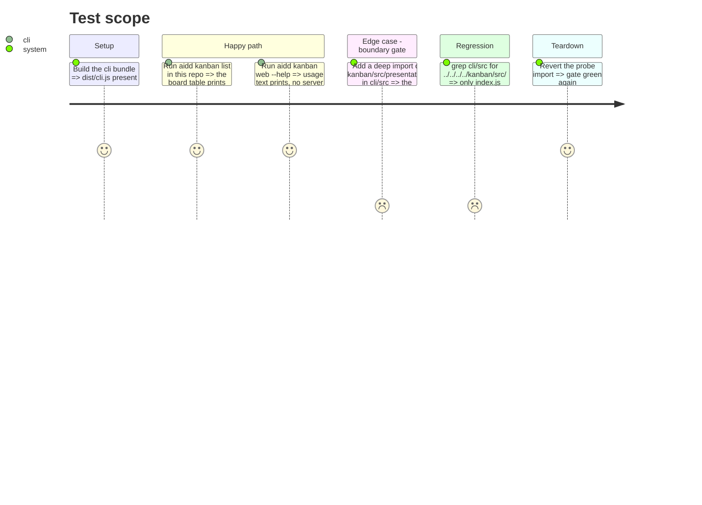

# Instruction: CLI boundary hardened around the public entrypoint

> `kanban/src/index.ts` and the single-import cli consumer already exist (phase 1). This phase moves deps assembly into `deps.ts`, locks the boundary with a gate, and documents it.

## Architecture projection

> Tree of the final files. ✅ create · ✏️ modify · ❌ delete

```txt
kanban/src/
└── index.ts                         ✏️ confirm it exports exactly registerKanban + KanbanCommandDeps + KanbanOutput, nothing deeper
cli/src/
├── application/commands/kanban.ts    ✏️ stop building deps inline; call createKanbanCommandDeps(program), pass result to registerKanban(kanban, deps)
├── infrastructure/deps.ts            ✏️ add createKanbanCommandDeps(program): docsDirectoryName + the lazy output/onError closures
└── domain/models/paths.ts            (unchanged) DOCS_DIR still the source of docsDirectoryName
cli/
├── scripts/check-kanban-boundary.mjs ✅ grep gate: cli/src may reference kanban/src only via index
├── package.json                      ✏️ wire the gate into a script + the hook list
└── tsup.config.ts                    (unchanged from phase 4)
kanban/
└── README.md                         ✏️ document index.ts as the only entrypoint for hosts
cli/tests/
└── e2e/kanban.e2e.test.ts            ✏️ or ✅ — `aidd kanban list` / `web --help` run through the public entrypoint
```

## User Journey

```mermaid
flowchart TD
  A[cli/infrastructure/deps.ts builds KanbanCommandDeps] --> B[cli/application/commands/kanban.ts]
  B --> C[import registerKanban from kanban/src/index.js]
  C --> D[registerKanban(program, deps)]
  D --> E[kanban feature composes its own runtime internally]
  F[boundary-check script] --> G{any cli/src import of kanban/src/ beyond index?}
  G -- yes --> H[script exits 1, CI fails]
  G -- no --> I[pass]
```

## Test Scope



## Tasks to do

### `1)` Confirm `kanban/src/index.ts` is the whole contract

1. Exports are exactly `registerKanban`, `KanbanCommandDeps`, `KanbanOutput` — no re-export reaches into `composition/`, `application/`, `infrastructure/`, or `domain/`.
2. If phases 2-6 added anything a host needs, add it here explicitly rather than letting the cli deep-import.

### `2)` Slim `cli/src/application/commands/kanban.ts`

1. Import stays the single `import { registerKanban, type KanbanCommandDeps } from "../../../../kanban/src/index.js";`
2. Remove the inline `deps` construction (currently lines ~19-23); call a `createKanbanCommandDeps(program)` factory and pass its result to `registerKanban(kanban, deps)`.
3. Keep the command hidden, as today. `cli/src/cli.ts:44 registerKanbanCommand(program)` is unchanged — the factory is called inside `registerKanbanCommand`.

### `3)` Assemble kanban deps in `cli/src/infrastructure/deps.ts`

1. Add `createKanbanCommandDeps(program): KanbanCommandDeps` — `docsDirectoryName: DOCS_DIR`, plus the **lazy** `output` / `onError` closures currently inline in `kanban.ts` (`resolveOutput = () => parseGlobalOptions(program).output`). They must stay lazy: `--verbose` is parsed by commander after `registerKanbanCommand` returns, so eager resolution at registration would capture the wrong output. This is deps *construction* moving to `deps.ts`, not a switch to the eager `createDeps` graph.
2. `kanban.ts` no longer knows `DOCS_DIR`, `ErrorHandler`, or `parseGlobalOptions` directly.

### `4)` Add the boundary-check gate

1. Script (e.g. `cli/scripts/check-kanban-boundary.mjs` or a `package.json` line): `grep -rn "kanban/src/" cli/src | grep -v "kanban/src/index" && exit 1 || exit 0`.
2. Wire it into `pnpm --dir cli lint` prerequisites or the lefthook `pre-push` list documented in `cli/aidd_docs/memory/deployment.md`.
3. Note the gate in `kanban/README.md` next to the existing "Nothing here may import from `../cli`."

### `5)` Full verification

1. `pnpm --dir kanban test`
2. `pnpm --dir cli typecheck && pnpm --dir cli test && pnpm --dir cli build`
3. Smoke: from a fresh `/tmp` dir, run the built `aidd kanban list` against a checkout; confirm the table renders.

## Test acceptance criteria

| Task | Acceptance criteria |
| ---- | ------------------------------------------------------------------------------------------ |
| 1    | `kanban/src/index.ts` exports exactly `registerKanban` + the two types; nothing deeper is re-exported |
| 2    | `cli/src` contains a single reference to `kanban/src/`, and it is `kanban/src/index.js`; `kanban.ts` no longer builds deps inline |
| 3    | `aidd kanban list` and `aidd kanban web` work end to end with deps built in `deps.ts`        |
| 4    | The boundary script exits 1 when a deep `kanban/src/presentation` import is added to `cli/src`, 0 otherwise |
| 5    | `kanban` tests, `cli` typecheck+test+build all green; smoke `aidd kanban list` prints the board |
