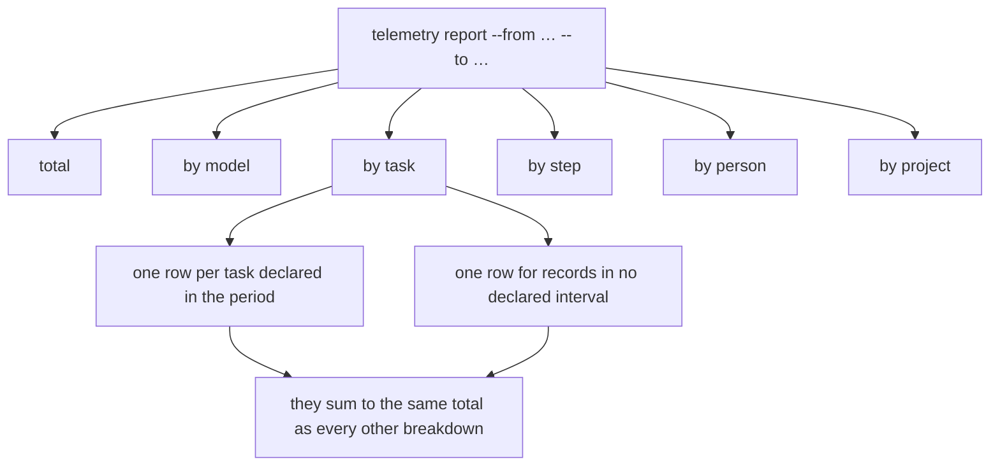
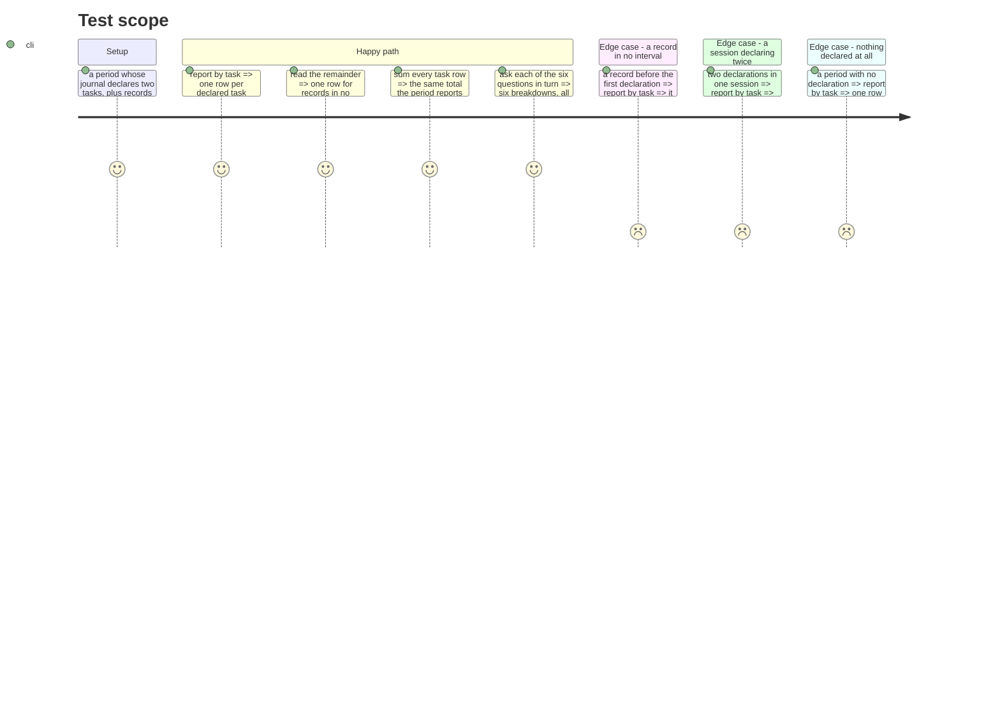

# Instruction: the sixth question gets its breakdown

## Architecture projection

```txt
.
└── cli
    ├── src
    │   ├── domain/models
    │   │   ├── cost-report.ts                              ✏️
    │   │   └── cost-report-envelope.ts                     ✏️
    │   └── application/display
    │       ├── cost-report-artefact.ts                     ✏️
    │       └── cost-report-display.ts                      ✏️
    └── tests
        ├── domain/models/cost-report-task.unit.test.ts     ✅
        └── e2e/telemetry-six-questions.e2e.test.ts         ✅
```

## User Journey



## Test Scope



## Tasks to do

### `1)` Group by the task a record was written into

> The intervals already exist and are already closed. This groups by them.

1. In `cli/src/domain/models/cost-report.ts`, add a task grouping beside the project and model ones, keyed on the declared interval a record falls in.
2. A record in no declared interval keys on a symbol, the technique `NO_KNOWN_PROJECT` already uses, so it can never collide with a real task identity.
3. Reuse the intervals `buildTaskIntervals` already produces. Do not recompute a second notion of when a task was running — two computations of one fact is how they come to disagree.
4. Document that a record belongs to at most one interval by construction, citing why intervals are closed rather than open-ended.

### `2)` The row, and what it carries

1. Declare `CostReportTaskRow`: the task identity when there is one, its totals, and the attribution the interval already carries.
2. Sort largest first, the way `byProjects` does, with the no-task row last so a reader sees tasks before the remainder.
3. Add `by_task` to the envelope. Raise the report version only if a consumer would misread the old shape as the new one; verify every consumer is in this repository first, the way the previous envelope changes were verified.

### `3)` Rendering it, and the six together

1. Add `task` to `ARTEFACT_AXES` and write its artefact, carrying the attribution the way the step axis now does.
2. Name the no-task row for what is known — no task was declared in that session's journal — never for what is guessed.
3. Check every other axis for a row keyed on more than the column it prints, the fault the step axis had.

## Test acceptance criteria

| Task | Acceptance criteria                                                                        |
| ---- | -------------------------------------------------------------------------------------------- |
| 1    | Records are grouped by the declared interval they fall in                                     |
| 1    | A record in no interval lands in its own row and is never dropped                             |
| 1    | A record is counted once, in exactly one row, when a session declares twice                   |
| 2    | The task rows sum to the same period total as every other breakdown                           |
| 3    | `--axis task` prints one row per task plus the remainder, each carrying its attribution        |
| 3    | All six questions are answerable over one period, demonstrated on the built command            |
