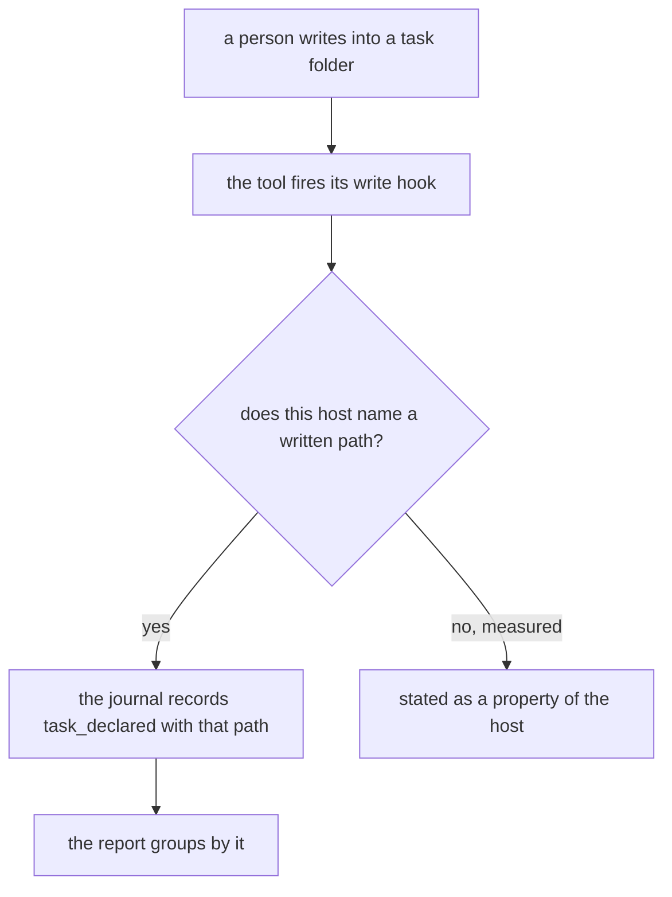
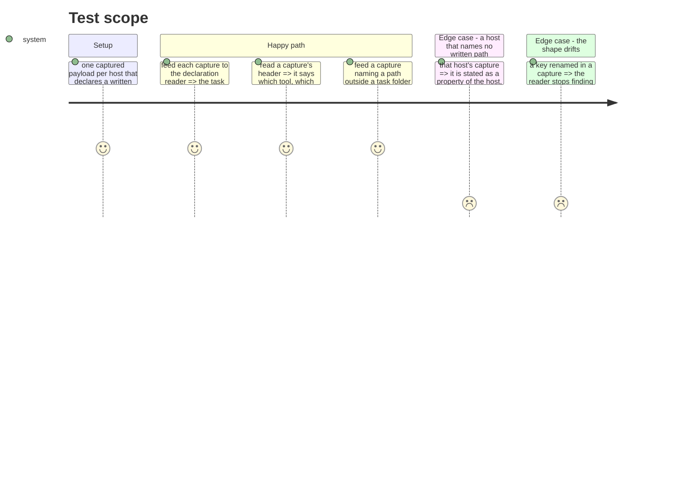

# Instruction: task capture stops being hand-written

## Architecture projection

```txt
.
├── scripts/__tests__
│   ├── fixtures/claude-code-task-declared.json             ✅
│   ├── fixtures/codex-task-declared.json                   ✅
│   ├── fixtures/copilot-task-declared.json                 ✅
│   ├── fixtures/cursor-task-declared.json                  ✅
│   └── aidd-telemetry-task-declaration.test.js             ✅
└── plugins/aidd-telemetry/hooks/lib
    ├── task-declared.cjs                                   ✏️
    └── tools/*.cjs                                         ✏️
```

## User Journey



## Test Scope



## Tasks to do

### `1)` Capture what each host really sends

> The weakest cell in the core is weak for one reason: its reader was written against nothing.

1. Capture one real payload per host that can name a written path, at the moment a file inside a task folder is written.
2. Keep the key sets exactly as captured. Synthesise every value: no real session id, no prompt, no path from this machine, no personal name. This repository is public.
3. Give each fixture a header saying which tool, which version, and the date it was taken — the way the existing captured fixtures do.
4. A host whose payload names no written path gets a fixture too, and that absence is the evidence for the statement about it.

### `2)` Test the value, not the call

1. Assert, per host, that the declaration reader extracts the task path the captured payload actually names.
2. Assert the negative: a captured payload writing outside a task folder declares nothing.
3. Make a renamed key fail. If a shape drifts and nothing goes red, the fixture is decoration.

### `3)` State what a host cannot do

1. Where a host names no written path, say so where its coverage is described, with the measured reason and the date.
2. Do not leave that branch untested. A host that cannot declare is a case with an expected answer, not an absence of a case.

## Test acceptance criteria

| Task | Acceptance criteria                                                                    |
| ---- | ---------------------------------------------------------------------------------------- |
| 1    | Every host that can declare a task has a captured payload, headed with tool, version, date |
| 1    | No fixture carries a real session id, prompt, machine path or personal name                |
| 2    | Each host's reader extracts the path its own capture names                                 |
| 2    | A capture writing outside a task folder declares nothing                                   |
| 2    | Renaming a key in a capture turns a test red                                               |
| 3    | A host that names no written path is described that way, with its reason and date          |
