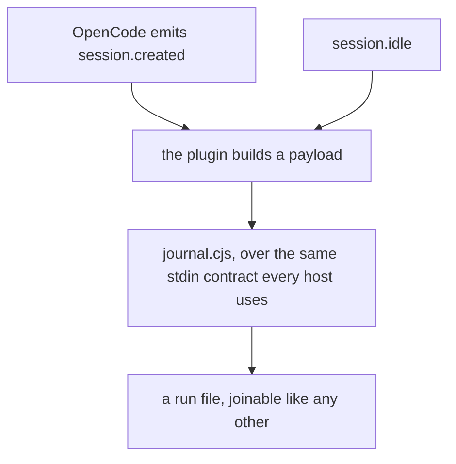
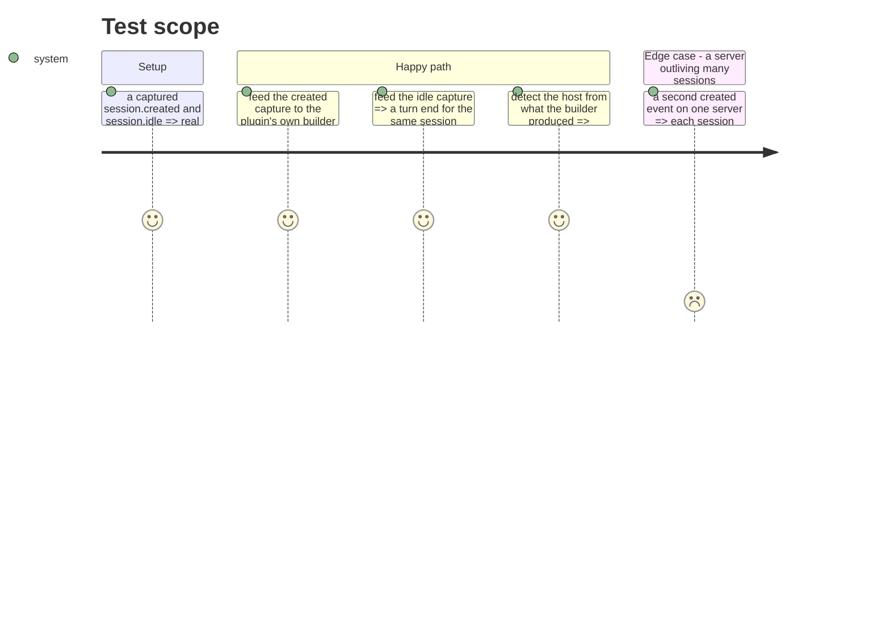

# Instruction: OpenCode stops being the tool with no capture

## Architecture projection

```txt
.
├── scripts/__tests__
│   ├── fixtures/opencode-session-created.json              ✅
│   ├── fixtures/opencode-session-idle.json                 ✅
│   └── aidd-telemetry-opencode-payloads.test.js            ✅
└── plugins/aidd-telemetry
    ├── hooks/opencode-plugin.js                            ✏️
    └── README.md                                           ✏️
```

## User Journey



## Test Scope



## Tasks to do

### `1)` Capture the two events

> Every other tool has between three and eight captures. This one has none, and its coverage is asserted from a doc comment.

1. Capture `session.created` and `session.idle` as OpenCode really emits them, with real key sets and synthesised values.
2. Head each with the OpenCode version and the date, like the others.
3. Record what each event does and does not carry — `session.created` names the session's own directory, `session.idle` names only the session — because that asymmetry is why the plugin exists in the shape it does.

### `2)` Test the builder against them

1. Assert the plugin's payload builder turns each capture into what the journal recognises, and that host detection answers `opencode` rather than unrecognised.
2. Assert the directory carried by `session.created` survives to the journal, since `session.idle` cannot supply it.

### `3)` Say where the evidence now stands

1. Where the plugin README describes OpenCode's coverage, replace any claim resting on a doc comment with one resting on a capture.
2. Where a claim still rests on no capture, say so rather than leaving it to read as measured.

## Test acceptance criteria

| Task | Acceptance criteria                                                                |
| ---- | ------------------------------------------------------------------------------------ |
| 1    | Both events have a captured fixture, headed with version and date                     |
| 1    | Neither fixture carries a real session id, prompt, machine path or personal name      |
| 2    | The builder turns each capture into a payload the journal recognises as `opencode`     |
| 2    | The directory from `session.created` reaches the journal                              |
| 3    | No coverage claim about OpenCode rests on a doc comment where a capture now exists    |
