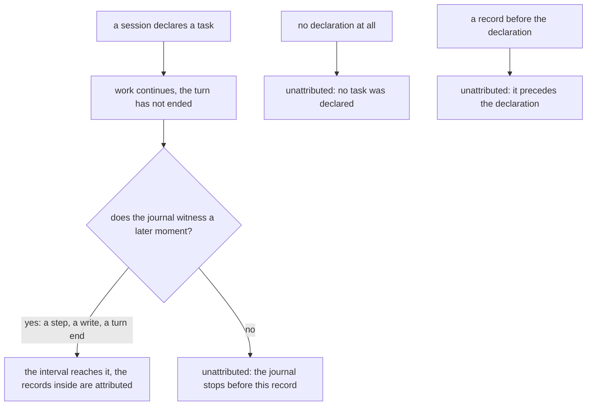
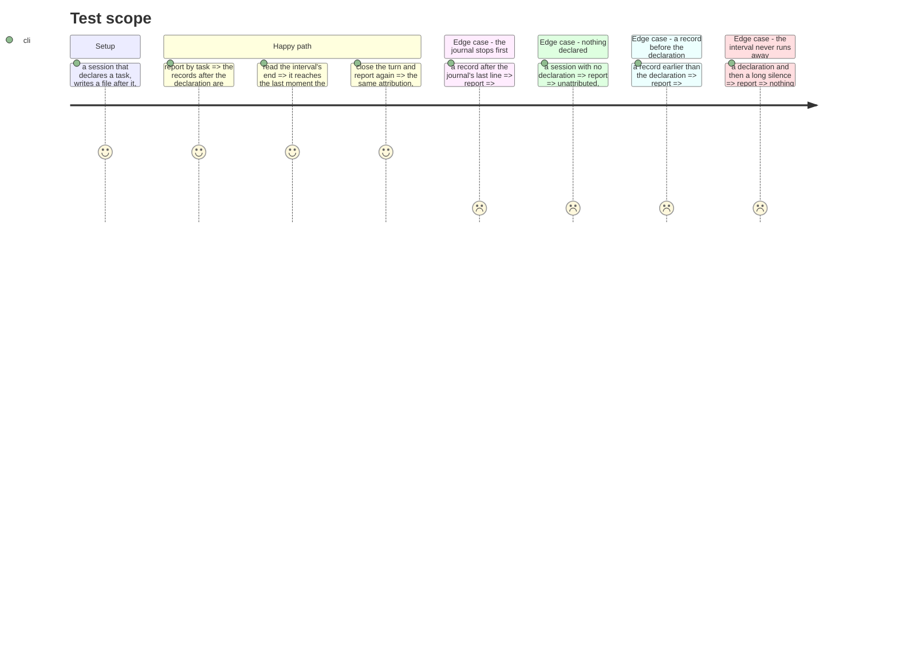

# Instruction: an interval reaches what the journal witnessed

## Architecture projection

```txt
.
└── cli
    ├── src/domain/models
    │   ├── task-attribution.ts                              ✏️
    │   ├── cost-report.ts                                   ✏️
    │   └── cost-report-envelope.ts                          ✏️
    ├── src/application/display
    │   ├── cost-report-artefact.ts                          ✏️
    │   └── cost-report-display.ts                           ✏️
    └── tests
        ├── domain/models/task-attribution.unit.test.ts      ✏️
        └── e2e/telemetry-task-midsession.e2e.test.ts        ✅
```

## User Journey



## Test Scope



## Tasks to do

### `1)` The journal's last witnessed moment

> The end of an interval is a question about when the journal was last alive, not about which lines close a step.

1. In `buildTaskIntervals`, widen the moment that stands in for "the journal's end" to include the journal's written-file lines, which are timestamped activity it already carries as its own array.
2. Do **not** add anything to `RunJournalBoundary`. Its exclusion rule is about not closing a running step early, and that rule stays untouched — read `filesWritten` separately.
3. Keep the interval closed. Widening moves the end later; it never removes it. Restate, where the change is made, the reason an open-ended interval is refused.

### `2)` Three reasons, never one

1. Give the unattributed outcome a reason distinguishing: no declaration in this session; this record precedes the declaration; the journal falls silent before this record.
2. `momentFallsWithin` already refuses to read a declaration backward onto earlier work — that refusal is the second reason and must keep working, now named rather than silent.
3. Carry the reason through to the report and the envelope, so a program reads what a person reads.

### `3)` Say it where the figure is read

1. The task breakdown's remainder row states which reason applies, rather than one label covering three situations.
2. Where more than one reason is present in a period, each is its own row — two different gaps are not one gap.

## Test acceptance criteria

| Task | Acceptance criteria                                                                       |
| ---- | ------------------------------------------------------------------------------------------- |
| 1    | A task declared in a session with no turn end attributes the records that follow it          |
| 1    | The interval ends at the last moment the journal witnessed, and never later                  |
| 1    | Closing the turn afterwards does not change the attribution                                  |
| 2    | Each of the three unattributed cases reports its own reason                                  |
| 2    | A record earlier than the declaration is never attributed to it                              |
| 3    | Two different reasons present in one period appear as two rows                               |
