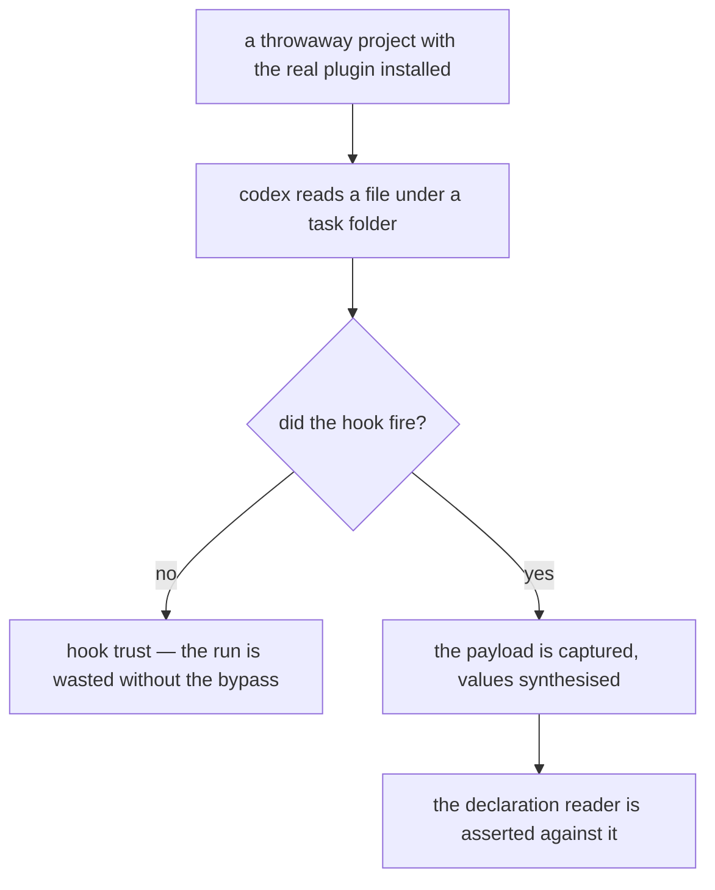
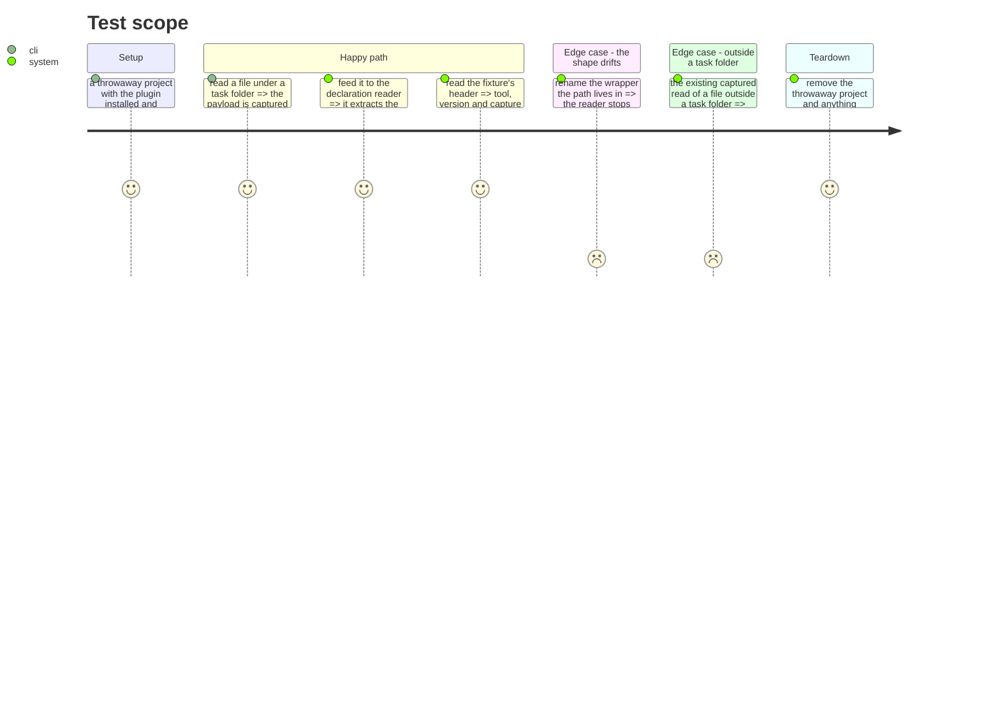

# Instruction: Codex declares from its own capture

## Architecture projection

```txt
.
└── scripts/__tests__
    ├── fixtures/codex-task-declared.json                    ✏️ replaced by a capture
    ├── fixtures/README.md                                   ✏️
    └── aidd-telemetry-task-declaration.test.js              ✏️ if the shape moved
```

## User Journey



## Test Scope



## Tasks to do

### `1)` Capture it, for real

> Codex is runnable now. A derivation standing in for a capture is only honest while the tool cannot be run.

1. Install the real plugin into a throwaway project the way the other three captures were taken, and capture the payload Codex sends when a file under a task folder is read.
2. **Codex gates hooks on trust.** A headless run needs the documented bypass, or the hook never fires and the session is spent for nothing — see the diagnostic's own untrusted-hook claim for the shape of that failure.
3. Keep the key set exactly as captured; synthesise every value. This repository is public.
4. Head the fixture with the tool, the version and the date, like the others.

### `2)` Retire the derivation

1. Replace the derived fixture, and remove its entry from the fixtures README — including the enumeration of fields that were changed, which describes something that no longer exists.
2. State in the README that Codex's task fixture is now a capture, with the date.
3. Check whether any other Codex fixture is a derivation while the tool is runnable. If one is, say so; replacing it is in scope only if it is the same act.

### `3)` The assertions follow the capture

1. Re-run the per-host declaration tests against the new fixture; if the real shape differs from the derivation, the test follows the capture, never the other way round.
2. Keep the mutation test: renaming the wrapper the path lives in must turn the reader red.

## Test acceptance criteria

| Task | Acceptance criteria                                                                     |
| ---- | ----------------------------------------------------------------------------------------- |
| 1    | Codex's task fixture is a capture from the running binary, headed with version and date    |
| 1    | It carries no real session id, prompt, machine path or personal name                       |
| 2    | The fixtures README no longer describes a derivation that has been replaced                |
| 2    | Any remaining derivation whose tool is runnable is named                                   |
| 3    | The declaration reader extracts the path Codex's own capture names                         |
| 3    | Renaming the wrapper in the capture turns a test red                                       |
