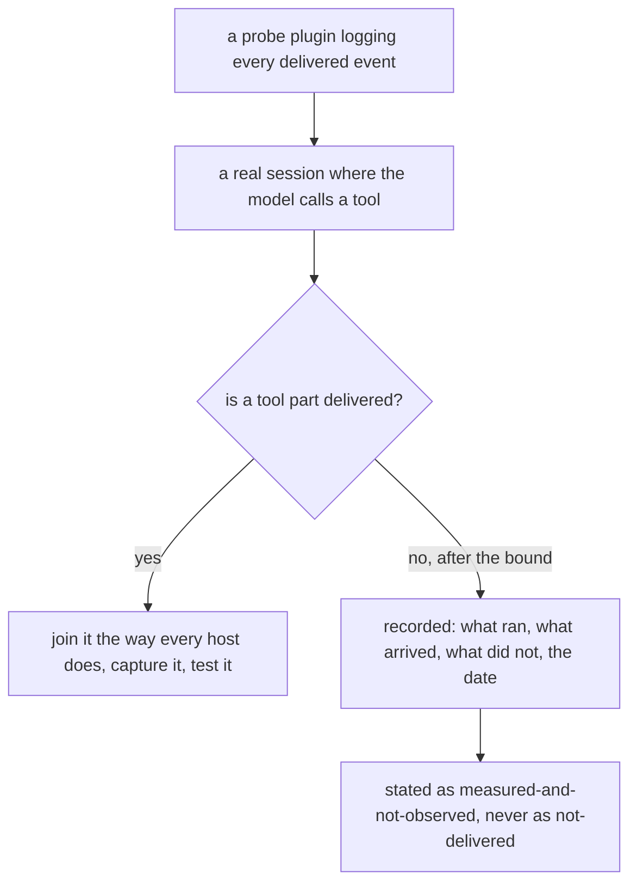
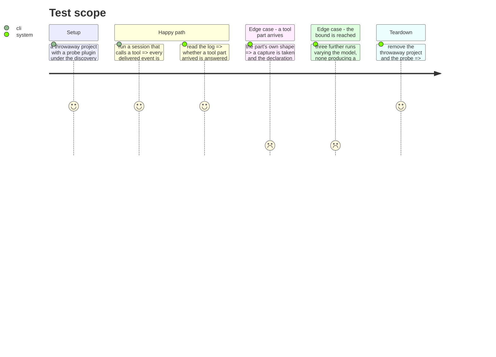

# Instruction: OpenCode's answer is measured, and bounded

## Architecture projection

```txt
.
├── scripts/__tests__
│   ├── fixtures/README.md                                   ✏️
│   └── aidd-telemetry-task-declaration.test.js              ✏️
└── plugins/aidd-telemetry
    ├── hooks/opencode-plugin.js                             ✏️ only if a tool part is observed
    └── README.md                                            ✏️
```

## User Journey



## Test Scope



## Tasks to do

### `1)` Measure, with a bound agreed before starting

> An unbounded spike either burns sessions or quietly becomes a build.

1. Place a probe plugin under OpenCode's own discovery path — `.opencode/plugin/`, and a genuine ESM export, both of which the shipped plugin already documents as load-bearing.
2. Log every delivered event with its part type. Already measured 2026-08-31 on 1.14.20: `message.part.updated` is delivered carrying a `part.type`, alongside session and message events; no tool part was observed across three runs where the model answered in text.
3. Run at most three further sessions, varying the model, with a prompt that requires a tool call. Then stop.

### `2)` If a tool part is delivered

1. Join it the way every other host does: the plugin builds the payload and spawns the journal over the same stdin contract, naming itself so host detection recognises it.
2. Capture the part, synthesise its values, head it with version and date, and assert the declaration reader against it.
3. Replace the test asserting OpenCode has no such event.

### `3)` If none is observed within the bound

1. Record what was run, what arrived, what did not, and the date — in the fixtures README and where OpenCode's coverage is described.
2. State it as **measured and not observed**, never as not delivered. The distinction is the whole point: this repository already carries one case where a type exists and delivery was never established, and names it.
3. Keep the test that asserts the absence, and make its name say what was measured rather than what is assumed.

### `4)` Either way, the table is complete

1. Every coverage table names all five tools, with what each can and cannot declare.
2. No tool is silently absent from a table because it has nothing to show there.

## Test acceptance criteria

| Task | Acceptance criteria                                                                  |
| ---- | -------------------------------------------------------------------------------------- |
| 1    | The probe records every delivered event and its part type                               |
| 1    | No more than three further sessions were run                                            |
| 2    | If a tool part arrived, OpenCode declares a task from a captured payload                |
| 3    | If none arrived, the outcome names what ran, what arrived, what did not, and the date   |
| 3    | Nothing states that tool parts are undelivered on the strength of not having seen one   |
| 4    | Every coverage table names all five tools                                               |
