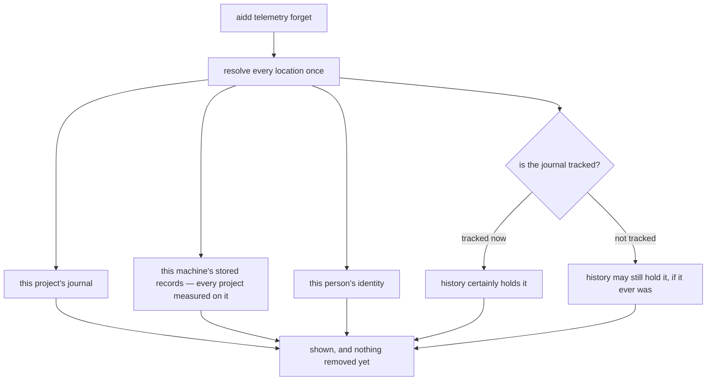
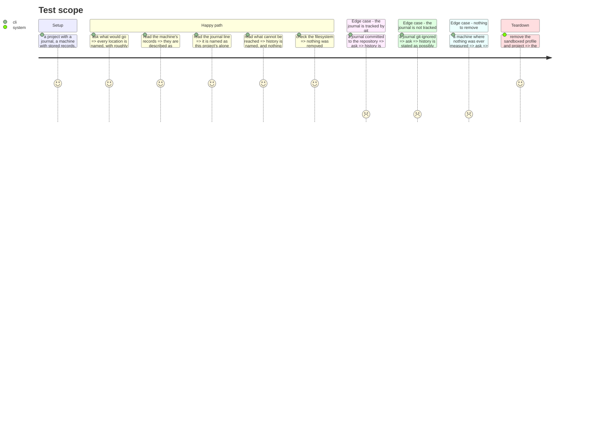

# Instruction: what would go, and what cannot

## Architecture projection

```txt
.
└── cli
    ├── src
    │   ├── domain
    │   │   └── models/telemetry-removal.ts                     ✅
    │   └── application/use-cases/telemetry/forget-telemetry-use-case.ts ✅
    └── tests
        ├── domain/models/telemetry-removal.unit.test.ts        ✅
        └── application/use-cases/telemetry/forget-telemetry-use-case.unit.test.ts ✅
```

<!-- Corrected post-review (2026_08_31): `domain/ports/telemetry-sink.ts` and
`infrastructure/adapters/telemetry-sink-adapter.ts` were never touched by this phase — the
sink's day-file deletion already existed, exactly as `plan.md`'s Resources table says. The
original projection marked both ✏️; `git diff --stat` against the shipped diff shows
neither file. -->

## User Journey



## Test Scope



## Tasks to do

### `1)` What a removal would touch

> One value. It is what the person is shown, and later exactly what the removal consumes.

1. Add `cli/src/domain/models/telemetry-removal.ts`, carrying every location this tool would remove from, each with what it is, where it is, and roughly how much is in it.
2. Distinguish, in the shape itself, what belongs to this project from what belongs to this machine — a journal is one project's, stored records span every project measured here. A caller must not be able to render them as the same kind of thing.
3. Carry what cannot be reached beside what can, so a renderer cannot show one without the other.
4. Document that this value exists to be resolved once: showing and removing read the same instance, which is what makes it impossible for a removal to reach past what was shown.

### `2)` What history holds, at its true strength

1. Report two distinct readings: the journal is tracked now, so history certainly holds it; or it is not tracked, so history may still hold it if it ever was.
2. Never collapse the second into an all-clear. A journal not tracked today is indistinguishable from one never committed, and saying "history is clean" would assert something unmeasured.
3. Use `VersionControl.listTrackedFiles` on the journal's own path — the same call `TelemetryOnUseCase.protectRunsDir` already makes — rather than a second way of asking.

### `3)` Counting without reading

1. The sink can already list its day files; the journal's directory can be listed. Report how much is in each in terms a person can check afterwards, without opening what is inside.
2. A location that cannot be read is reported as such and still listed for removal: a damaged file is exactly what a person needs removed.

### `4)` Showing, and removing nothing

1. Add `forget-telemetry-use-case.ts` with a preview that resolves the value and returns it, touching nothing.
2. Assert, in a test, that a preview leaves every file exactly as it was.

## Test acceptance criteria

| Task | Acceptance criteria                                                                                |
| ---- | ---------------------------------------------------------------------------------------------------- |
| 1    | Every location carries what it is, where it is, and how much is in it                                 |
| 1    | A project's journal and a machine's records cannot be rendered as the same kind of thing               |
| 2    | A tracked journal reads as history certainly holding it                                                |
| 2    | An untracked journal reads as history possibly holding it, never as clear                              |
| 3    | A location that cannot be read is reported and still listed for removal                                |
| 4    | A preview removes nothing, verified against the filesystem                                             |
| 4    | A machine where nothing was measured says so and offers nothing                                        |
