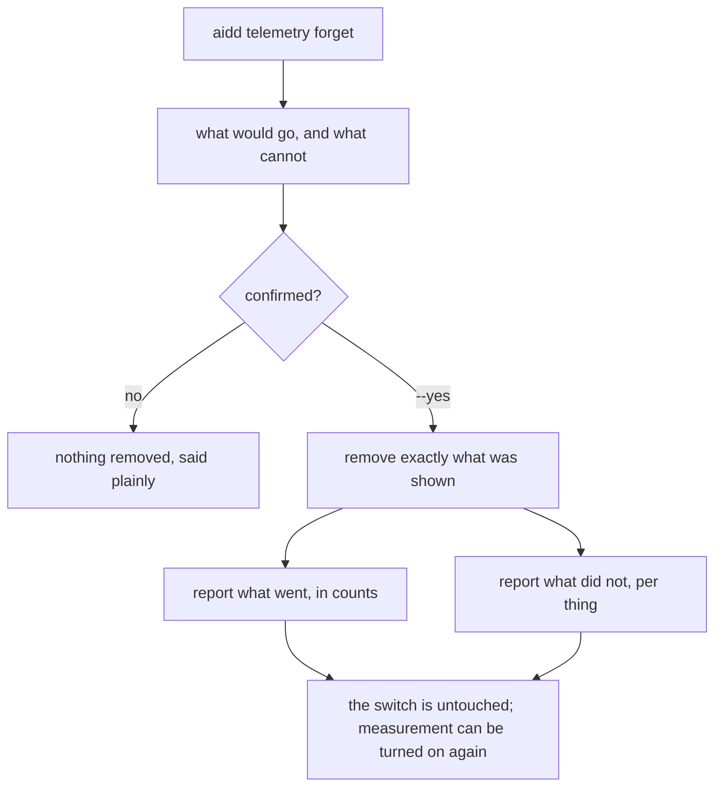
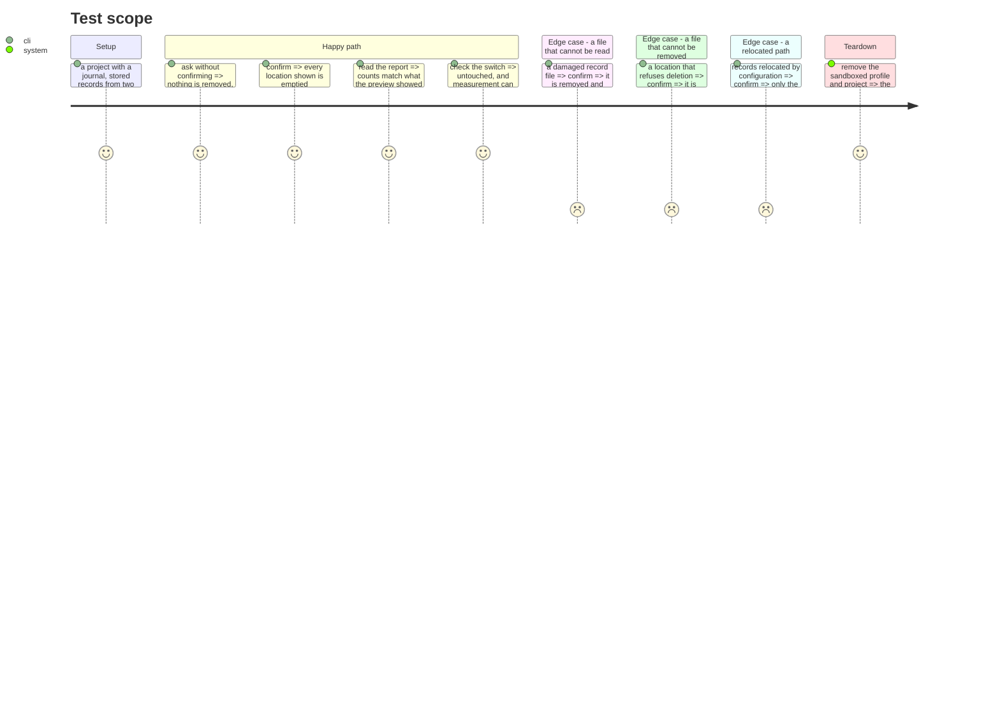

# Instruction: removing it, and saying what happened

## Architecture projection

```txt
.
└── cli
    ├── src
    │   ├── domain/ports/run-journal-reader.ts                  ✏️
    │   ├── infrastructure/adapters/run-journal-reader-adapter.ts ✏️
    │   ├── application
    │   │   ├── use-cases/telemetry/forget-telemetry-use-case.ts ✏️
    │   │   ├── display/telemetry-forget-display.ts             ✅
    │   │   └── commands/telemetry.ts                           ✏️
    │   └── infrastructure/deps.ts                              ✏️
    └── tests
        ├── application/use-cases/telemetry/forget-telemetry-use-case.unit.test.ts ✏️
        └── e2e/telemetry-forget.e2e.test.ts                    ✅
```

## User Journey



## Test Scope



## Tasks to do

### `1)` The journal learns to be removed

> The one location with no deletion of its own.

1. Extend the run journal's port with a removal that reports what it removed, mirroring how the identity store already answers whether a file was there.
2. Remove the journal's own files only. Never the directory's other contents, and never a path derived from anything but the journal's own resolution.
3. Failure is per file, reported, never a throw that costs the rest.

### `2)` Removing exactly what was shown

> The structural guarantee, not a test of it.

1. The removal takes the value phase 1 resolved. It must not resolve locations itself — passing them in is what makes reaching past the preview inexpressible.
2. Write that reason in the use case's own doc comment, so nobody later "simplifies" it into re-resolving.
3. Remove each location in turn, collecting what went and what did not. One failure never stops the next.
4. Never touch the switch. Say so in the output, because a person who removed everything needs to know they can measure again.

### `3)` Asking before doing

1. Add `aidd telemetry forget` to the command surface, with `--yes` to confirm, refusing without it after showing what would go.
2. Refusing is the default and exits successfully — a person who looked and decided not to is not an error.
3. The help text says what the command removes and that it is irreversible.

### `4)` Saying what happened

1. Add the display: what went, in counts a person can check against the preview; what did not, per thing, with why.
2. Repeat what cannot be reached after removing, not only before — history does not become reachable by having removed the rest.

## Test acceptance criteria

| Task | Acceptance criteria                                                                          |
| ---- | ---------------------------------------------------------------------------------------------- |
| 1    | The journal's files are removed and nothing else in its directory is                            |
| 2    | The removal acts on the value the preview produced, and cannot resolve its own locations         |
| 2    | A location that refuses removal is reported, and every other location is still emptied           |
| 2    | The switch is untouched, and measurement can be turned on again afterwards                       |
| 3    | Without confirmation nothing is removed, and the command exits successfully                      |
| 4    | The counts reported match what the preview showed                                                |
| 4    | What cannot be reached is repeated after removing                                                |
