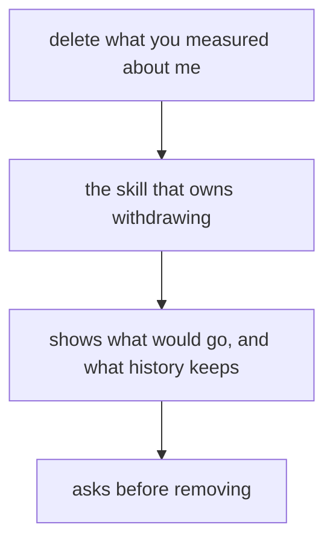
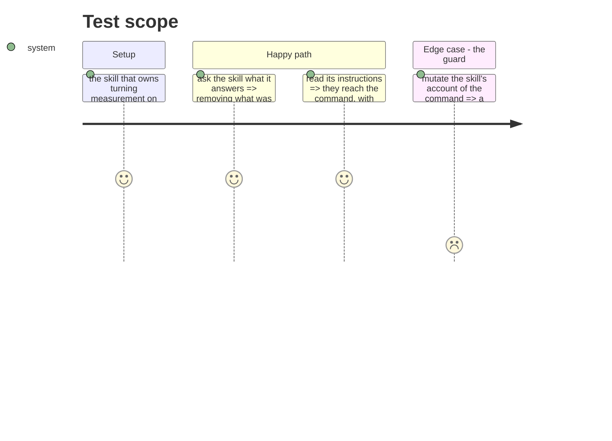

# Instruction: a person who asks is answered

## Architecture projection

```txt
.
├── plugins/aidd-telemetry
│   ├── skills/00-init/SKILL.md                               ✏️
│   ├── skills/00-init/actions/05-forget.md                   ✏️
│   ├── README.md                                             ✏️
│   └── CATALOG.md                                            ✏️ generated
├── docs/prompts-documentation.md                             ✏️ generated
└── scripts/__tests__/aidd-telemetry-*.test.js                ✏️
```

## User Journey



## Test Scope



## Tasks to do

### `1)` The skill knows the command exists

> The failure three deleted commands shared was that no skill invoked them. This one must not repeat it.

1. `00-init` already owns identity and withdrawal, and `actions/05-forget.md` already covers removing the identity. Extend it to removing what was measured, which is the larger act it currently stops short of.
2. Its description must let the skill trigger on a person asking to have their data deleted — today that question reaches nothing.
3. The instructions relay what cannot be reached, and never present history as removable.

### `2)` The documentation stops being silent

1. `plugins/aidd-telemetry/README.md` documents where data lives and says it stays after `off`. Say what removes it.
2. Sweep for any statement that a person cannot remove what was recorded — it was true until this phase.

### `3)` A guard, in the shape the repo already uses`

1. The plugin's script tests already pin what a skill claims against what the CLI offers. Extend that family so the skill's account of this command cannot go stale.
2. Prove it by mutation on both sides.

### `4)` Regenerate what is generated

1. `CATALOG.md` and `docs/prompts-documentation.md` regenerate through their own scripts, never by hand. Both have pre-commit commands; confirm they ran.

## Test acceptance criteria

| Task | Acceptance criteria                                                                     |
| ---- | ----------------------------------------------------------------------------------------- |
| 1    | A person asking to have their measurement removed reaches this command through the skill   |
| 1    | The skill's instructions relay what cannot be reached                                      |
| 2    | No shipped document still says what was recorded cannot be removed                         |
| 3    | A guard fails when the skill's account and the command disagree                            |
| 4    | The generated catalogue and prompt index match what their scripts produce                  |
