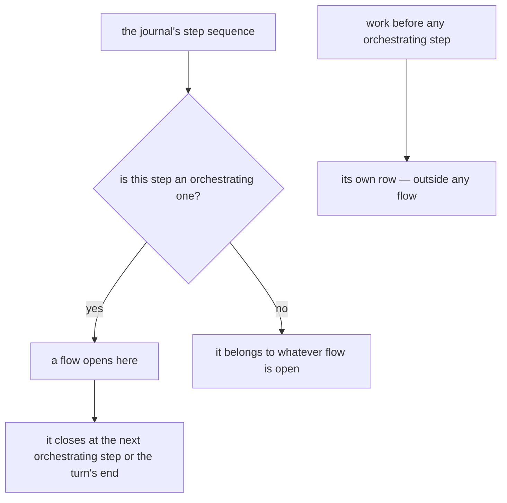
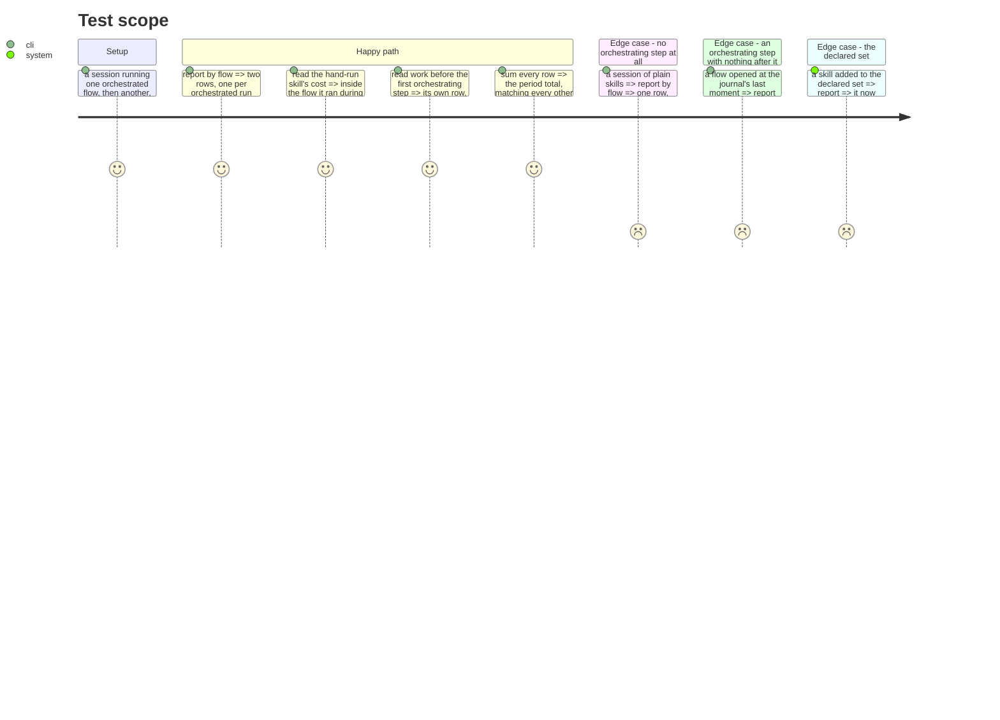

# Instruction: the flow, read from what is already there

## Architecture projection

```txt
.
└── cli
    ├── src
    │   ├── domain/models/flow-attribution.ts                ✅
    │   ├── domain/models/cost-report.ts                     ✏️
    │   ├── domain/models/cost-report-envelope.ts            ✏️
    │   └── application/display/cost-report-artefact.ts      ✏️
    └── tests
        ├── domain/models/flow-attribution.unit.test.ts      ✅
        └── e2e/telemetry-flow-axis.e2e.test.ts              ✅
```

## User Journey



## Test Scope



## Tasks to do

### `1)` Which skills orchestrate, declared once

> Never matched from a plugin string. That branching is a debt this repository already carries.

1. Add one declared set naming the skills that open a flow, in the domain, with the reason it is a declaration and not a pattern.
2. Document that a project extending the framework adds to that set and nothing else.
3. Do not read skill frontmatter at report time — the skill need not be installed where a report runs, and the stored record carries only a name.

### `2)` The intervals

> Same shape as the task intervals that already work, one layer wider.

1. Add `flow-attribution.ts`: from an orchestrating step's own moment to the next orchestrating step or the journal's last witnessed moment, never open-ended.
2. Reuse the witnessing rule task attribution already uses, rather than a second notion of when a journal was last alive.
3. A record before any orchestrating step belongs to no flow; that is a row, not a gap.

### `3)` The axis

1. Group records by the flow interval they fall in, keyed so a record outside every flow can never collide with one inside.
2. Add the axis and its envelope field. If the version rises, enumerate every consumer and update them in the same commit.
3. Where the figure is read, state the limit: a skill run by hand during a flow counts inside it, because the journal cannot tell it from one the orchestrator invoked.

## Test acceptance criteria

| Task | Acceptance criteria                                                                |
| ---- | -------------------------------------------------------------------------------------- |
| 1    | The orchestrating set is one declared list, and nothing matches a plugin name in passing |
| 2    | A flow closes at the next orchestrating step or the journal's last witnessed moment      |
| 2    | No flow interval runs open-ended                                                        |
| 3    | Two orchestrated runs in one session are two rows                                       |
| 3    | Work outside any flow is its own row                                                    |
| 3    | The rows reconcile to the same total as every other axis                                |
| 3    | The stated limit appears where the figure is read                                       |
