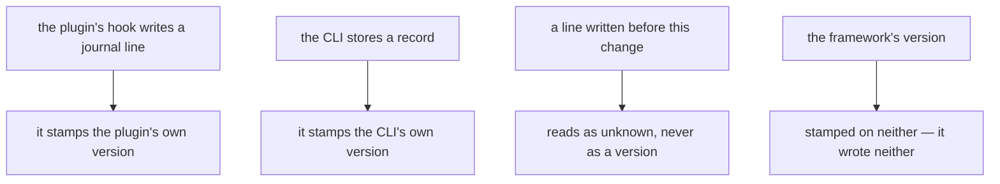
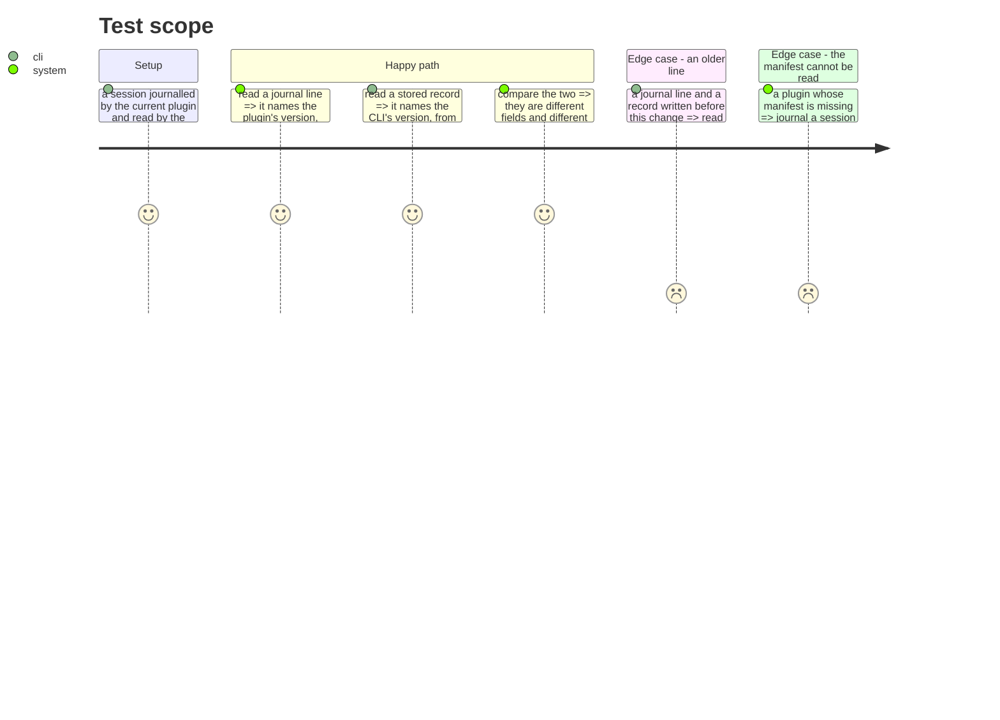

# Instruction: each producer stamps its own version

## Architecture projection

```txt
.
├── plugins/aidd-telemetry/hooks/lib
│   ├── record.cjs                                           ✏️
│   └── plugin-version.cjs                                   ✅
├── cli/src
│   ├── domain/models/telemetry-sink-record.ts               ✏️
│   ├── domain/ports/run-journal-reader.ts                   ✏️
│   └── application/use-cases/telemetry/read-local-cost-use-case.ts ✏️
├── aidd_docs/product/metrics-contract.md                    ✏️
└── aidd_docs/runs/README.md                                 ✏️
```

## User Journey



## Test Scope



## Tasks to do

### `1)` The plugin stamps the journal

1. Add a small module reading the plugin's own version from its manifest, which sits one directory from the hook and is not read today.
2. Read it once per process, not per line. A hook that fires on every tool call must not open a file each time.
3. A manifest that cannot be read costs the version, never the line. Journalling must never fail because a version is unavailable.
4. Stamp it on the line that names the session, not on every line — one statement per run file, not a repetition.

### `2)` The CLI stamps the record

1. Stamp the CLI's own version on the record it stores, read through the port that already resolves it.
2. Never stamp it on an export-provenance record: the CLI did not produce that line's figures, only stored them. State the distinction the way `person_id`'s own contract already does.
3. Document both fields in the record contract, saying which producer each names and, explicitly, that neither is the framework's version.

### `3)` What an older line reads as

1. A journal line or a record with no version reads as unknown — absent, not a default, and never the current one.
2. Assert it: a fixture written before this change still reads, still counts, and reports an unknown version.

## Test acceptance criteria

| Task | Acceptance criteria                                                                |
| ---- | -------------------------------------------------------------------------------------- |
| 1    | A journal line names the plugin's version, read from the plugin's own manifest          |
| 1    | An unreadable manifest costs the version and never the line                             |
| 1    | The manifest is read once per process, not per line                                     |
| 2    | A stored record names the CLI's version, read through the existing port                  |
| 2    | An export-provenance record carries no CLI version                                      |
| 2    | The contract says which producer each version names, and that neither is the framework's |
| 3    | A line written before this change reads as an unknown version and loses no figure        |
