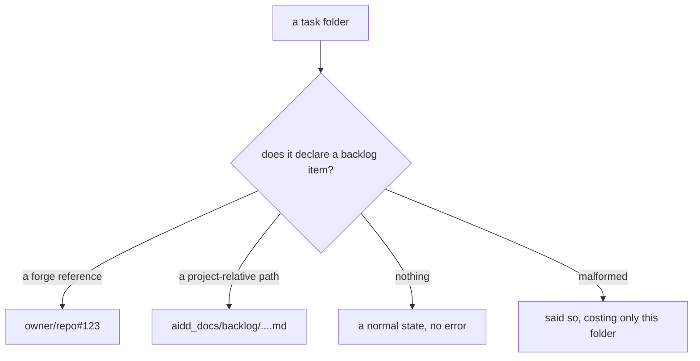
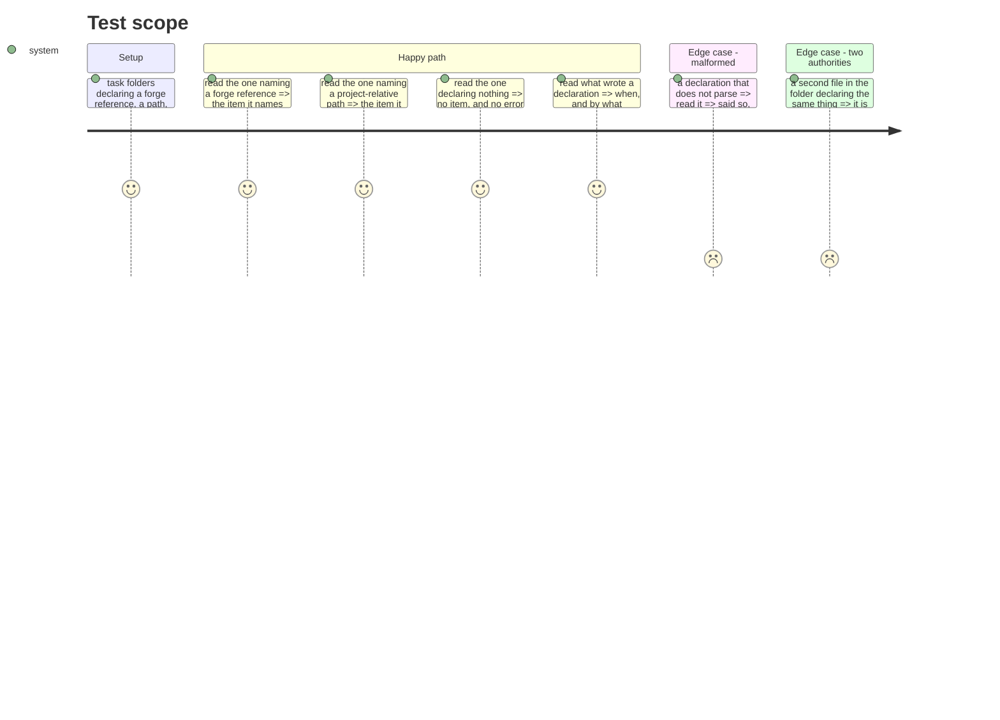

# Instruction: a folder says what it delivers

## Architecture projection

```txt
.
└── cli
    ├── src
    │   ├── domain/models/task-backlog-link.ts               ✅
    │   ├── domain/ports/task-backlog-reader.ts              ✅
    │   └── infrastructure/adapters/task-backlog-adapter.ts  ✅
    └── tests
        ├── domain/models/task-backlog-link.unit.test.ts     ✅
        └── helpers/ports/in-memory-task-backlog-reader.ts   ✅
```

## User Journey



## Test Scope



## Tasks to do

### `1)` What a declaration is

> One field for both supports, because the framework's own rule says one authority.

1. Add `cli/src/domain/models/task-backlog-link.ts`: the item a folder declares, and the provenance of the declaration — when it was written and by what.
2. One field carries the item whichever support it lives on. Document that this follows `persistence.md:13`, quoted, rather than inventing a convention.
3. Model "declared nothing" and "could not be read" as different answers. A folder that declares nothing is normal; one whose declaration is damaged is not, and the two must never print the same.
4. Carry nothing the backlog artefact already holds — no type of work, no originating ticket, no status.

### `2)` Reading it

1. Add the port and its adapter, resolving one task folder's declaration.
2. A missing declaration answers "none", never throws. A damaged one answers "unreadable", also never throws — one bad folder must not cost a period its figures.
3. **The adapter never writes.** State that in its doc comment as a property, and make a test assert the folder is byte-identical after a read.

### `3)` The in-memory double

1. Add the double the way the other in-memory readers are shaped, so the report's tests need no filesystem.

## Test acceptance criteria

| Task | Acceptance criteria                                                          |
| ---- | -------------------------------------------------------------------------------- |
| 1    | A forge reference and a project-relative path are the same field                   |
| 1    | "Declared nothing" and "could not be read" are different answers                   |
| 1    | Nothing the backlog artefact holds is carried here                                 |
| 2    | A missing declaration answers none, and a damaged one answers unreadable, neither throwing |
| 2    | A folder is byte-identical after being read                                        |
| 3    | The report's tests can run against the double with no filesystem                   |
