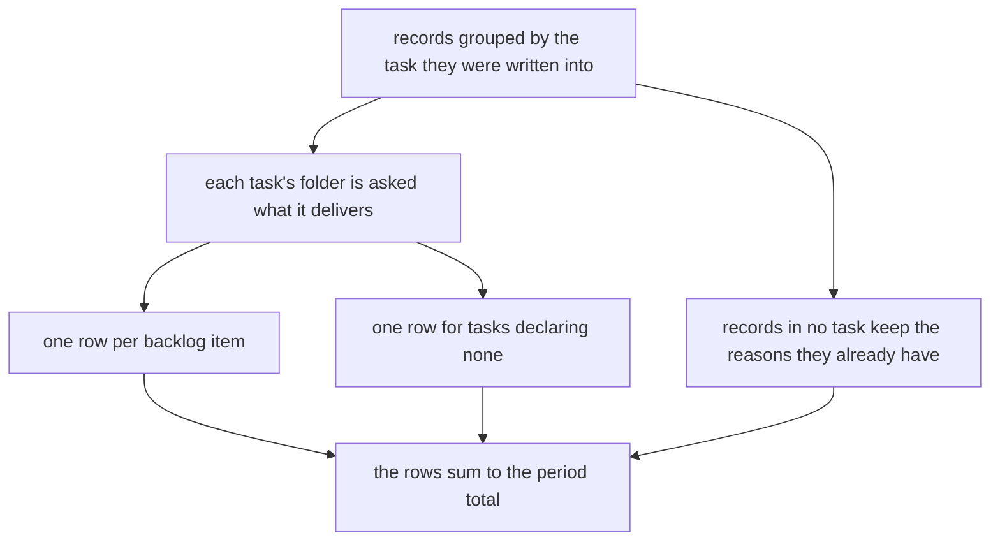
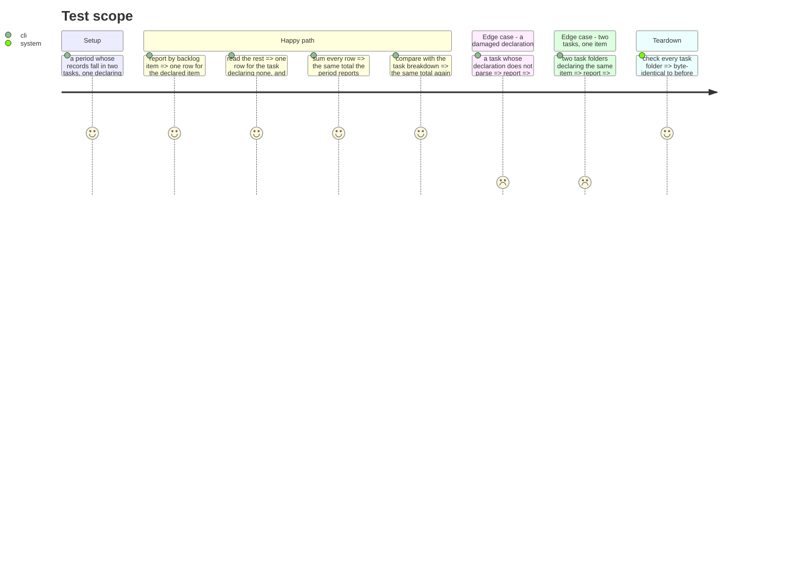

# Instruction: a period breaks down by it

## Architecture projection

```txt
.
└── cli
    ├── src
    │   ├── domain/models/cost-report.ts                     ✏️
    │   ├── domain/models/cost-report-envelope.ts            ✏️
    │   ├── application/use-cases/telemetry/report-cost-use-case.ts ✏️
    │   ├── application/display/cost-report-artefact.ts      ✏️
    │   ├── application/display/cost-report-display.ts       ✏️
    │   └── infrastructure/deps.ts                           ✏️
    └── tests
        ├── domain/models/cost-report-backlog.unit.test.ts   ✅
        └── e2e/telemetry-backlog-axis.e2e.test.ts           ✅
```

## User Journey



## Test Scope



## Tasks to do

### `1)` Group by what a task delivers

> This composes on the task grouping that already exists; it does not replace it.

1. Resolve each task the period's records fall into to what its folder declares, once per task rather than once per record.
2. Key a record on the item its task declares. A task declaring none keys on a symbol, the technique already used for the unknown rows, so it can never collide with a real item.
3. Records in no task at all keep the three reasons they already carry, untouched.
4. Two tasks declaring the same item land in one row; that is the point of the axis.

### `2)` The row and the envelope

1. Declare the row: the item when there is one, its totals, and where the declaration came from.
2. Add it to the envelope. If the version rises, enumerate every consumer and update them in the same commit — the consumer set has been exactly enumerable each of the three previous times.
3. Add the axis to the artefact and the terminal rendering, carrying the same reconciliation the other axes do.

### `3)` The read stays a read

1. Assert, end to end, that running the report leaves every task folder byte-identical.
2. A damaged declaration costs its own row's resolution and no figure anywhere.

## Test acceptance criteria

| Task | Acceptance criteria                                                                |
| ---- | -------------------------------------------------------------------------------------- |
| 1    | A period breaks down by backlog item, over a chosen period                              |
| 1    | A task declaring none is its own row, distinct from records in no task                  |
| 1    | Two tasks declaring one item produce one row                                            |
| 2    | The rows reconcile to the same total as the task, step, model, person and project axes   |
| 2    | Every envelope consumer is updated in the same commit as any version rise               |
| 3    | Every task folder is byte-identical after the report runs                               |
| 3    | A damaged declaration costs no figure                                                   |
