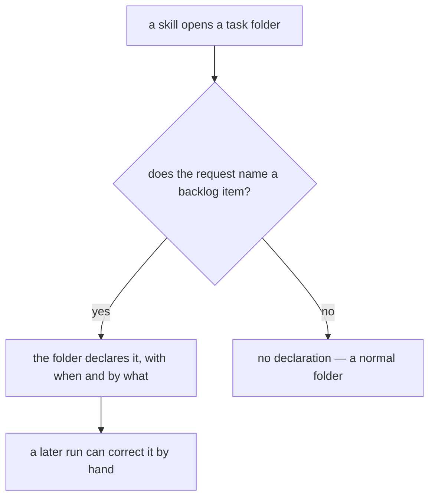
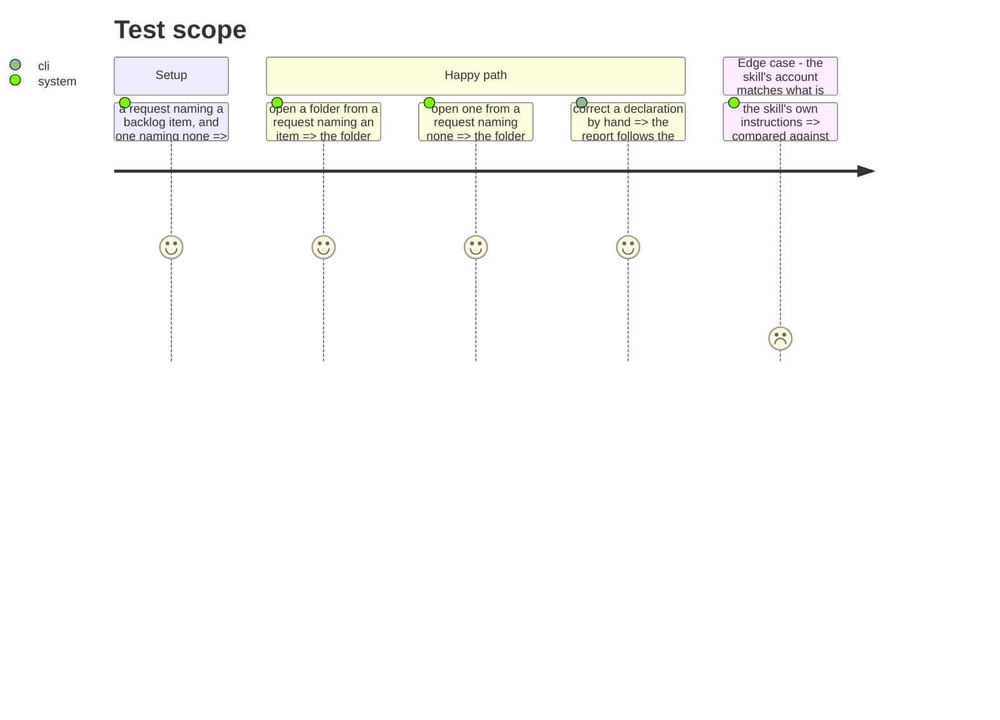

# Instruction: the skills that open a folder write it

## Architecture projection

```txt
.
└── plugins
    ├── aidd-pm/skills/04-spec/**                            ✏️
    ├── aidd-dev/skills/01-plan/**                           ✏️
    ├── aidd-orchestrator/skills/01-sdlc/references/01-frame.md ✏️
    └── aidd-telemetry/README.md                             ✏️
```

## User Journey



## Test Scope



## Tasks to do

### `1)` Whoever opens the folder declares

> The link is knowable exactly when the folder is created, and guessable never.

1. The skills that create a task folder record the backlog item when the request names one — the SDLC's own Frame resolves a ticket, and that is the moment the item is known.
2. Where no item is named, nothing is written. A folder without a declaration is a normal folder.
3. The declaration records when it was written and by what, per the contract.

### `2)` Say it where a person will read it

1. Document the file, its one meaningful field, and both supports it accepts, where task folders are described.
2. State that it is correctable by hand, and that the report reads the file rather than any cache.
3. Say what it deliberately does not carry, and why: steps and produced files come from the journal, `branch` and `pull_request` from git.

### `3)` A guard against the skill and the reader drifting

1. The repository already pins a skill's account of a command against what the command does. Extend that family so the shape the skills write and the shape the reader accepts cannot diverge.
2. Prove it by mutating each side.

## Test acceptance criteria

| Task | Acceptance criteria                                                            |
| ---- | ---------------------------------------------------------------------------------- |
| 1    | A folder opened from a request naming a backlog item declares it                    |
| 1    | A folder opened from a request naming none declares nothing, and nothing errors     |
| 2    | The file, its field and both supports are documented where task folders are described |
| 2    | A hand-corrected declaration changes what the report says                           |
| 3    | A guard fails if the skills and the reader disagree about the shape                 |
