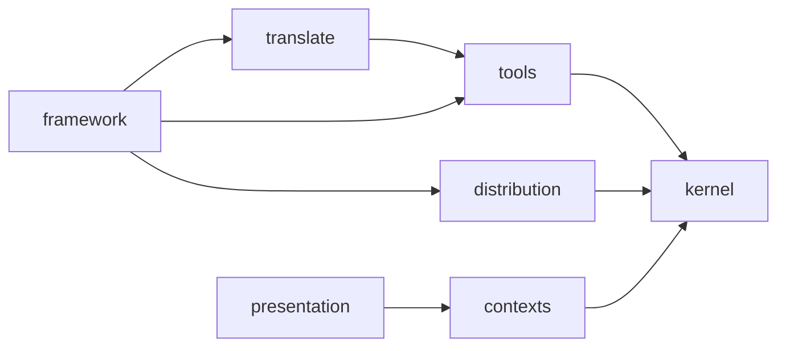

---
paths:
  - "src/**/*.ts"
---

# Contexts

The three invariants the context refactor exists to hold. `tests/architecture/` enforces each
one mechanically — this file is what a contributor reads before the test tells them no.

## 1. The chain

The only edges between contexts are `framework → translate`, `translate → tools`,
`framework → tools`, and `framework → distribution`. No other context-to-context edge exists.
`presentation` and `runtime` may depend on any context; no context may depend on `presentation`
or `runtime` — the arrows run one way, down toward the kernel, never back up.
`tests/architecture/context-graph.arch.test.ts` holds this as a ratchet: an edge the chain does
not name fails the build the moment it appears, and the file's own baseline records the small,
shrinking set of exceptions that predate the ratchet.

## 2. The kernel

`kernel/` imports no context and carries no business logic. It is shared vocabulary — types,
pure helpers, typed errors, and the ports two or more contexts both need (a port used by exactly
one context belongs to that context, not the kernel). If a kernel module needs a domain decision
to be correct, it is not kernel material; move the decision to whichever context makes it and
keep the kernel a place with nothing to get wrong.

## 3. No reach into a context's interior

An import from outside a context may only target a module that context declares public. There is
no `index.ts` anywhere — barrels are forbidden (`.claude/rules/01-standards/1-exports.md`,
Biome's `noBarrelFile`) — so the boundary is not a re-export file, it is a list:
`tests/architecture/context-boundary.arch.test.ts`'s `PUBLIC_MODULES` names every module each
context exposes. A new module a caller outside the context needs is invisible until it is added
to that list; everything else inside the context is internal whether or not anything currently
reaches for it.

## What this means when adding something

- Ask which context the concept belongs to before writing anything — the `tools`, `translate`,
  `distribution`, and `framework` skills each answer what goes in, how, and how it is tested.
- A cross-context call goes through a module the target context has declared public, in the
  direction the chain allows. If the direction is wrong, the caller is in the wrong context, not
  the callee missing an export.
- `kernel/`, `presentation/`, and `runtime/` are not contexts and carry no context-specific rule
  here — `presentation` follows `.claude/rules/00-architecture/0-deps-wiring.md`; a context's own
  ports and use-cases follow `0-ports-adapters.md`, `0-use-case.md`, `0-orchestration.md`, and
  `0-shared-modules.md`, all scoped to `src/contexts/*/`.
