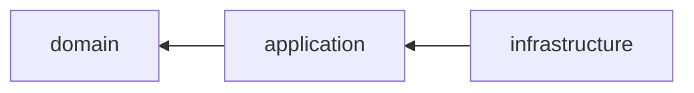

---
paths:
  - "src/**/*.ts"
---

# Dependency Direction

Which layer may import which.

- Imports point inward only
- Domain imports nothing outward
- Application imports ports, never adapters
- Infrastructure implements, never orchestrates
