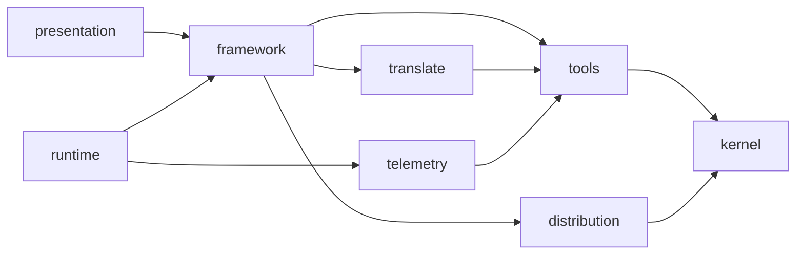

# Architecture

The macro shape of this package: the stack, how the pieces fit, and the decisions behind them.

## Stack

- TypeScript ESM on Node, bundled by tsup into one file.
- Runtime dependencies are capped at six, each justified, a new one needs an ADR: `commander` (parsing), `@inquirer/prompts` (interaction), `ajv` and `ajv-formats` (schema validation), `simple-git` (fetching a marketplace), `smol-toml` (Codex config round-trips).
- vitest, biome, stryker, knip. Their conventions live in `testing.md` and `coding-assertions.md`.

## How it fits together

## Key decisions

- Organised by bounded context, never by layer. The allowed edges, the kernel's rule and the no-reach-inside rule are enforced by `tests/architecture/`, stated in `.claude/rules/00-architecture/0-contexts.md`.
- A tool declares, a context reads. What a tool says about being measured lives in `kernel/measurement.ts`, not in `tools` itself, so `tools` has nothing of `telemetry`'s to import back — the edge runs one way, `telemetry → tools`, and `telemetry` does reuse ordinary `tools` config/capability modules along it (`registry.ts`, `marketplace-settings.ts`, three format helpers), unrelated to measurement.
- Telemetry reaches no context but `tools`, and no context reaches into it. What it needs elsewhere it declares as its own port, satisfied at the composition root.
- Some tools' project config is inert: Codex, Copilot and Claude only load a plugin once their own CLI has registered it. Which ones is a per-tool fact, verified against the real tool, never inferred.
- Claude's registration is driven at `--scope local`, so the file this CLI hashes keeps a single writer.
- Two file regimes: what this CLI owns is regenerated from source; what it co-owns with a person is merged, and conflicts reported. Confusing them is where accidental complexity comes from.
- The manifest reads one version only and refuses anything else, naming the fix. No migration chain: a domain entity carrying every past shape of its own JSON is a persistence concern.
- As of v7, every installed plugin records its own `scope` (`project` | `user`) at install time; everything that later resolves its base directory reads that record, never the tool's current profile, which can disagree with what was true when the entry was written.
- The `aidd-framework` marketplace entry is machine-scope (`scope: "user"`), not project-scope: every project on a machine shares one registration in `userConfigDir()/marketplaces.json`, built once per CLI version at `userConfigDir()/cache/built/<version>/aidd-framework/<tool>` (`kernel/paths.ts`'s `userBuiltMarketplaceDir`). A project-scope source would make claude, codex and copilot disagree on a second project (measured: codex and copilot refuse a second source under the same name, claude silently repoints the whole machine), so the source is no longer under `<projectRoot>/.aidd/`. `MarketplaceRegisterFrameworkUseCase` migrates a pre-existing project-scope entry to this shared one unconditionally, on the next `setup` or `sync` — not an option `--force` gates, since a project scope left in place would keep `MarketplaceRegistryAdapter.list()` (project-scope entries first, by construction) answering the pre-migration entry forever. `clean` on one project therefore leaves this shared registration, its `userConfigDir()/marketplaces.json` entry, and its cache all in place — a project holding the last reference cannot yet tell, so removing any of the three is not this project's decision alone until a reference count exists; `aidd marketplace remove aidd-framework` refuses for the same reason. Neither `setup`, `sync`, `clean` nor `marketplace remove` exposes a `--scope user` flag yet — the entry is always machine-scope internally, with no user-facing lever over it. `doctor` reads the same version-tagged path structurally (never a catalog read) to warn, not error, when a host already follows a newer aidd version than this run (naming `aidd update`) or still points at a project's own pre-migration cache (naming `aidd sync`) — and the write path (`sync`'s own `registerMarketplace`) refuses the first case outright rather than only reporting it after the fact: nothing is written to a host already ahead, a host behind is brought forward as an ordinary update, and the same-version case is a no-op either way.
- A launcher locates and runs an external binary; it never embeds that binary's code. `kanban` broke this and was unwired until it can meet it.
- `clean` never deletes what a host's own CLI wrote to its own registry — it drives that CLI to undo it (`uninstallPlugin` then `removeMarketplace`, the same activator port `sync` and `plugin remove` use), and names a tool whose binary is absent rather than touching its registry by any other means. Nor does it delete under a user's home directory on a manifest's word alone: a user-scope plugin's own path must first resolve, through `realpath`, strictly inside the tool's declared user-scope directory — the one check that catches both a `..` segment a corrupted entry carries and a plugin directory that became a symlink after install.
- A cache a host's own CLI leaves behind after `clean` drives its own undo — claude's full built tree, marked `.orphaned_at` but never deleted; codex's now-empty `cache/<hostName>/` shell, since it deletes only the content — is purged under the same declared-root-plus-`realpath`-containment whitelist as `clean`'s other deletions, never guessed: a profile with nothing to declare (`NativeActivation.pluginCacheDir`, copilot included) gets nothing purged.
- A project's own local alias for a marketplace is free to differ from what its catalog declares itself under — claude only ever registers by the catalog's own name, so `nativeRegistrations.marketplaces` records both (`alias`, aidd's own key; `hostName`, the catalog's declared name), and every host-facing call — this guard, `checkMarketplaceSources`, `clean`'s `marketplace remove` — addresses the host by `hostName`, never `alias`.
- aidd refuses what claude would accept by overwriting: `claude plugin marketplace add` derives the registered name from the catalog's own `marketplace.json` and, when that name is already known, silently repoints it to the new install location — no prompt, no error, exit 0. `MarketplaceSyncSettingsUseCase.registerMarketplace` reads claude's own `known_marketplaces.json` (`contexts/tools/domain/ports/host-marketplace-registry-reader.ts`, resolved through `realpath` the same way `host-plugin-registry-reader-adapter.ts` already does) before ever calling `addMarketplace`, and refuses only when that `hostName` is already registered under a genuinely *different catalog* (`contexts/tools/domain/marketplace-source-conflict.ts`) — identity is a catalog's declared name plus its plugin set, read from each side's own `marketplace.json`, never a resolved path and never the version: a version bump alone, under the same name and the same plugins, is the host repointing to a newer build it already knows, not a different marketplace, so the project still holding the older version is not in conflict and `doctor` has nothing to reproach it for. The same catalog registered from a different, merely differently-resolved path is deliberately not a conflict either: two independent projects on one machine both auto-registering `aidd-framework` from their own `.aidd/cache/built/…` measure exactly that, and refusing it would refuse every second `sync` either project ever runs — the case `pnpm smoke`'s shared-`$HOME`, per-project-build pattern (`testing.md`) surfaces for real. A registered source whose own catalog can no longer be read is a dead entry a re-add repairs, not a conflict either. `doctor` carries the same read as its own `checkMarketplaceSources` pass, `error`-severity, independent of the `not-registered`/`registered-disabled`/`registered`/`unanswerable` states already used for native-registration drift — a source conflict is not a registration state, and forcing it into one of those four would answer a question nobody asked.

## Gotchas

- Configs are inlined at build time, schemas are not: five JSON files are copied beside the binary and read from disk. Drop them from `files` and the CLI breaks.
- The build empties its output directory. `AIDD_BUILD_OUT_DIR` therefore accepts only two shapes.
- `git` exports `GIT_*` into everything it spawns. Anything reading a repository must strip them, or it reads the wrong one.
