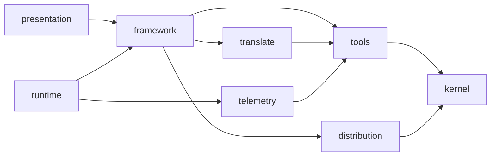

# Architecture

The macro shape of this package: the stack, how the pieces fit, and the decisions behind them.

## Stack

- TypeScript ESM on Node, bundled by tsup into one file.
- Runtime dependencies are capped at six, each justified, a new one needs an ADR: `commander` (parsing), `@inquirer/prompts` (interaction), `ajv` and `ajv-formats` (schema validation), `simple-git` (fetching a marketplace), `smol-toml` (Codex config round-trips).
- vitest, biome, stryker, knip. Their conventions live in `testing.md` and `coding-assertions.md`.

## How it fits together

## Key decisions

- Organised by bounded context, never by layer. The allowed edges, the kernel's rule and the no-reach-inside rule are enforced by `tests/architecture/`, stated in `.claude/rules/00-architecture/0-contexts.md`.
- A tool declares, a context reads. What a tool says about being measured lives in `kernel/measurement.ts`, not in `tools` itself, so `tools` has nothing of `telemetry`'s to import back — the edge runs one way, `telemetry → tools`, and `telemetry` does reuse ordinary `tools` config/capability modules along it (`registry.ts`, `marketplace-settings.ts`, three format helpers), unrelated to measurement.
- Telemetry reaches no context but `tools`, and no context reaches into it. What it needs elsewhere it declares as its own port, satisfied at the composition root.
- Some tools' project config is inert: Codex, Copilot and Claude only load a plugin once their own CLI has registered it. Which ones is a per-tool fact, verified against the real tool, never inferred.
- Claude's registration is driven at `--scope local`, so the file this CLI hashes keeps a single writer.
- Two file regimes: what this CLI owns is regenerated from source; what it co-owns with a person is merged, and conflicts reported. Confusing them is where accidental complexity comes from.
- The manifest reads one version only and refuses anything else, naming the fix. No migration chain: a domain entity carrying every past shape of its own JSON is a persistence concern.
- As of v7, every installed plugin records its own `scope` (`project` | `user`) at install time; everything that later resolves its base directory reads that record, never the tool's current profile, which can disagree with what was true when the entry was written.
- A launcher locates and runs an external binary; it never embeds that binary's code. `kanban` broke this and was unwired until it can meet it.

## Gotchas

- Configs are inlined at build time, schemas are not: five JSON files are copied beside the binary and read from disk. Drop them from `files` and the CLI breaks.
- The build empties its output directory. `AIDD_BUILD_OUT_DIR` therefore accepts only two shapes.
- `git` exports `GIT_*` into everything it spawns. Anything reading a repository must strip them, or it reads the wrong one.
