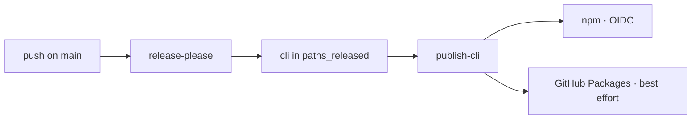

# Deployment

Where the package ships and how: CI, release, and the environment it reads.

## Pipeline

- `.github/workflows/cli-ci.yml` — typecheck, lint, architecture, test, coverage, smoke, build, knip, jscpd. Path-filtered on `cli/**`, `kanban/**` and the telemetry plugin.
- `.github/workflows/ci.yml` — commitlint, release-please, then the release jobs. It runs none of the checks above.
- Build: `pnpm build` (tsup) → `dist/cli.js`, plus the five JSON schemas its `onSuccess` copies beside it. They are read from disk at runtime; dropping them breaks the binary.
- Bundle budget in `package.json` (`bundleBudgetKB`), enforced by `scripts/check-bundle-size.mjs` after every build. That script records why the budget was raised twice.
- `AIDD_BUILD_OUT_DIR` accepts only `dist` or a directory under `.e2e-build/`: the build empties its target first.

## Environments

None. What ships are published packages and release assets.

## Release

- release-please, `include-component-in-tag: true`. This package tags `cli-v<semver>`; a bare `v<semver>` is the root marketplace, a different line.
- `publish-cli` is gated on `cli` appearing in `paths_released`, never on a tag: a root or plugin release publishes nothing here.
- npm is the load-bearing step, `npm publish` under OIDC with no token. pnpm is avoided there on purpose. The GitHub Packages step is `continue-on-error`.
- `aidd update` reads the latest version from the npm dist-tags, not from GitHub releases — see `internal/decisions/self-update-version-source-npm.md`. `AIDD_SELF_UPDATE_NPM_BASE` and `AIDD_SELF_UPDATE_API_BASE` point both reads elsewhere for tests.
- npm answers `Accept: application/vnd.github+json` with **406**. The shared HTTP client defaults to it, so a registry read must set `application/json`.

## Monitoring

None. A failure is a red run.
