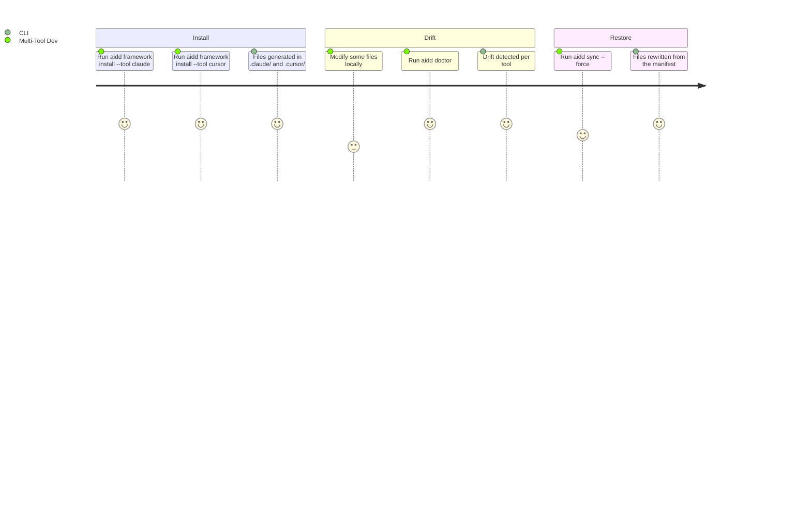

# Project Brief

## Executive Summary

- **Package**: `@ai-driven-dev/cli`
- **Vision**: Distribute a canonical AI-Driven Development framework consistently across multiple AI coding assistants, eliminating manual tool-specific adaptation
- **Mission**: CLI that resolves the AIDD framework from remote/local sources, generates tool-specific file distributions with content rewriting and frontmatter conversion, and tracks every generated file in a hash-based manifest

### Description

- Community product gated by GitHub authentication token
- CLI is the distribution backbone — not a generic scaffolding tool
- Framework assets: agents, commands, rules, skills, templates
- Supported tools: Claude Code, Cursor, GitHub Copilot, OpenCode, Codex (AI); VS Code (IDE)

## Core Domain

- Framework resolved from remote (GitHub Releases) or local path/tarball
- Files are rewritten per tool conventions (path, frontmatter, content format)
- Every installed file tracked in `.aidd/manifest.json` via MD5 hash
- Drift = local modification vs. what was written at install time

## Ubiquitous Language

| Term                 | Definition                                                                                                                                                                        |
| -------------------- | --------------------------------------------------------------------------------------------------------------------------------------------------------------------------------- |
| Framework            | Canonical set of agents, commands, rules, skills, templates                                                                                                                       |
| Distribution         | Tool-specific generated output (files rewritten per tool conventions)                                                                                                             |
| Manifest             | `.aidd/manifest.json` — hash-based tracking of every installed file                                                                                                               |
| ToolConfig           | Per-tool configuration: output paths, frontmatter conversion, merge rules. Tools: `claude` → `.claude/`, `cursor` → `.cursor/`, `copilot` → `.github/`, `opencode` → `.opencode/`, `codex` → `.codex/` |
| Plugin               | Capability files (agents, commands, hooks, mcp, rules, skills) distributed per AI tool format via marketplace catalogs                                                            |
| Drift                | Installed file modified locally vs. what was written at install time                                                                                                              |
| Init                 | Bootstrap: CLI writes `.aidd/manifest.json` (+ `.aidd/cache` gitignore). The `aidd_docs/` memory bank is scaffolded by the `aidd-context` project-init skill, not the CLI binary    |
| Install              | Generates and writes tool-specific distribution files                                                                                                                             |

## Commands

Twenty-two leaf commands, captured from `--help`. `scripts/smoke-tools.sh` exercises every
one of them and fails if its own list drifts from the binary's.

The tool is chosen by `--tool <id>`, not by a command group: the per-category `ai`/`ide`
verbs this document used to list were merged into the unified commands below.

### Bootstrap
| Command | Purpose |
|---|---|
| `aidd setup` | Bring the project to a correct state: marketplace, framework, tools, plugins |
| `aidd clean [--force]` | Remove every AIDD-managed file from the project |

### The framework on a tool
| Command | Purpose |
|---|---|
| `aidd framework install \| update \| remove` | The framework's lifecycle on installed tools |

### Plugins
| Command | Purpose |
|---|---|
| `aidd plugin install [name\|path]` | Install from a marketplace or a local path; no argument opens an interactive pick |
| `aidd plugin list \| remove \| search \| update` | Plugin operations |

### Marketplaces
| Command | Purpose |
|---|---|
| `aidd marketplace add [name] [source]` | Register a marketplace |
| `aidd marketplace list \| remove \| refresh \| check` | Marketplace operations |

### Auth
| Command | Purpose |
|---|---|
| `aidd auth login \| logout \| status` | GitHub authentication |

### Across everything
| Command | Purpose |
|---|---|
| `aidd doctor` | Detected and equipped tools, plugins, drift, and problems |
| `aidd sync [files...]` | Rewrite owned files from the manifest — the tracked regeneration |
| `aidd translate <source>` | Convert an arbitrary source into a target-native plugin tree, recording nothing |
| `aidd update` | Update the CLI itself |

### What went, and where the record is

This document describes the surface as it is. The record of what each retired command became
is the migration table in
`aidd_docs/tasks/2026_08/2026_08_20_refactor-contextes-cli/commandes.md`, which carries the
reason for every merge and deletion.

A list of removals kept here went stale twice over: it named `aidd sync` as removed while the
command exists, and it described a per-category surface two refactors old as the replacement.

## User Journey

### Multi-Tool Developer

