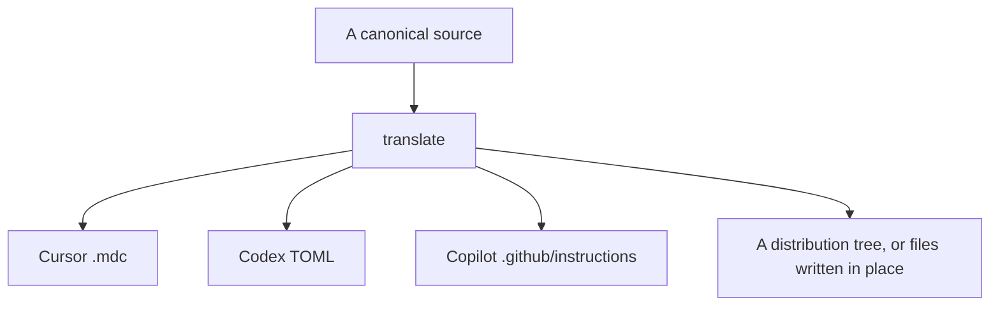
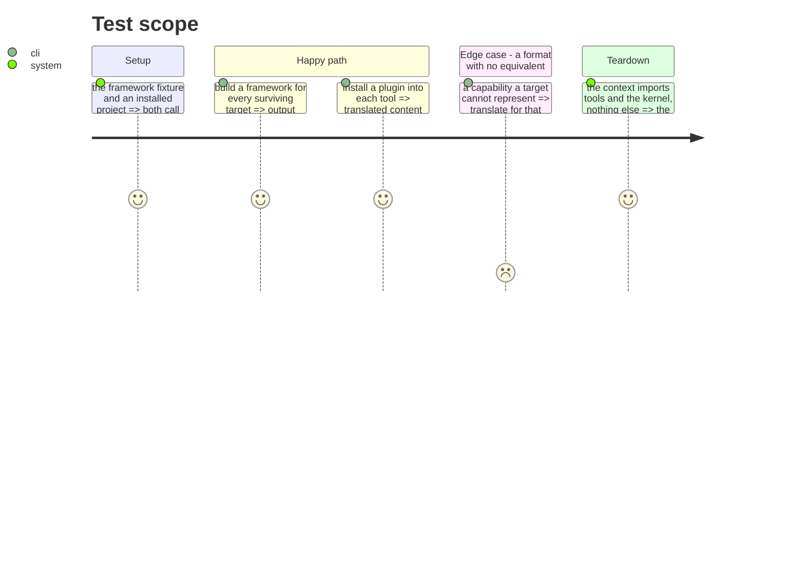

# Instruction: Extract the translate context

The core. Converting one canonical source into what each tool expects, at every level: plugin
content into a tool's format, a framework source into a target-native distribution, paths, merges
and rewrites.

It is the only thing the CLI does that a user cannot do without it, which is why it is a context and
not a service.

## Architecture projection

> Tree of the final files. ✅ create · ✏️ modify · ❌ delete

```txt
.
└── cli/src/contexts/translate/      ✅ create
    ├── index.ts                     ✅ create (the only public entry)
    ├── domain/
    │   ├── capabilities/            ✏️ modify (agents, skills, commands, rules, hooks)
    │   ├── formats/                 ✏️ modify (markdown, command, placeholders, toml, jsonc, paths, merges, rewrites)
    │   ├── content-translator.ts    ✏️ modify (from domain/models/plugin-content-translator.ts)
    │   ├── canon.ts                 ✏️ modify (from domain/models/framework.ts)
    │   └── build-target.ts          ✏️ modify (what remains of framework-build.ts)
    ├── application/
    │   └── translate-source.ts      ✏️ modify (from use-cases/framework/, in place or to a distribution tree)
    └── infrastructure/schema-validator.ts  ✏️ modify
```

## User Journey



## Test Scope



## Tasks to do

### `1)` Move the content capabilities

1. `agents`, `skills`, `commands`, `rules` and `hooks` describe content. They come here; `settings`
   and `mcp` stayed in `tools` at phase 10.

### `2)` Move the formats and the translator

1. Everything under `domain/formats/` that survived phase 2, plus `plugin-content-translator.ts`.
2. `framework.ts` becomes `canon.ts`: it describes the canonical source shape, not a product.

### `3)` Move the build, renamed for what it does

1. `use-cases/framework/` becomes `translate-source`: one source, N targets, written in place or to
   a distribution tree. The command keeps its current name until phase 16.

### `4)` Close the context

1. One `index.ts`. Add the biome `override`. Verify it depends on `tools` and the kernel and on
   nothing else.

## Test acceptance criteria

| Task | Acceptance criteria |
| ---- | ------------------- |
| 1    | Installing a plugin produces the same files for every tool |
| 2    | Every format transform behaves as before; the build golden is unchanged |
| 3    | `framework build` still works, unchanged, under its current name |
| 4    | The context imports only `tools` and the kernel; an import into its interior fails the lint |
| all  | Golden, build golden and e2e pass **unmodified** |
