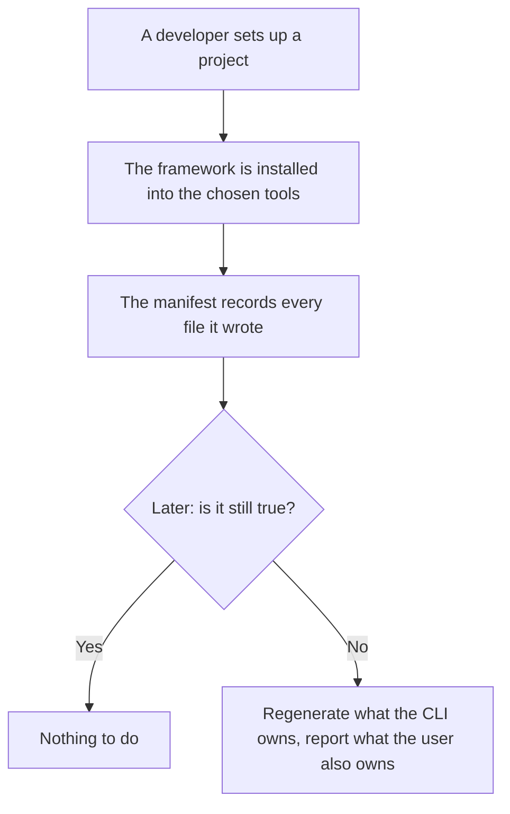
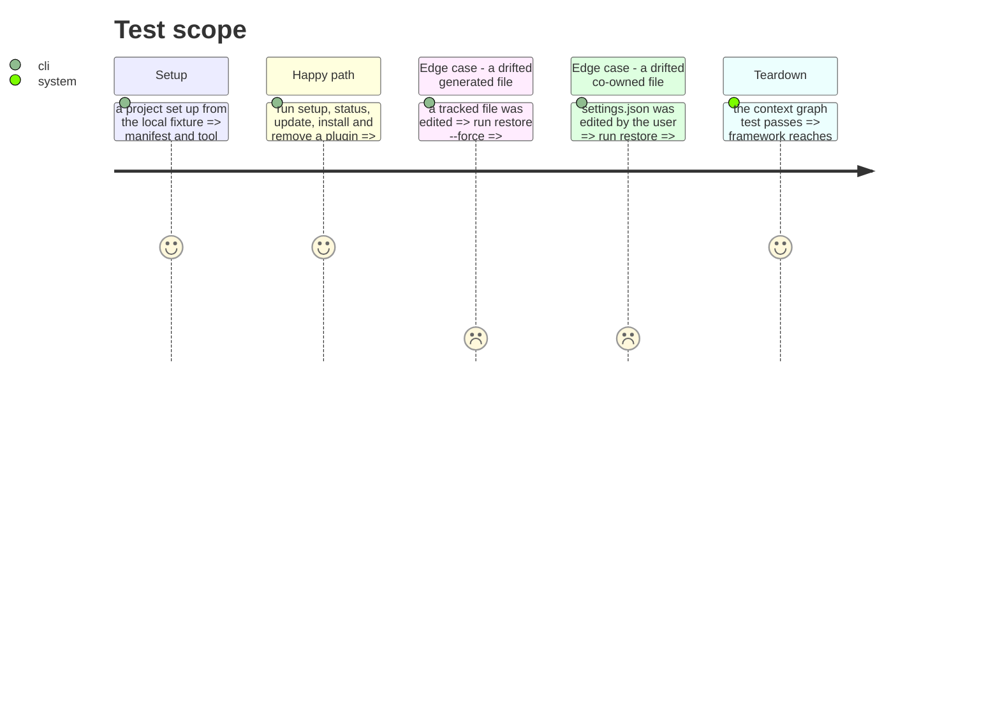

# Instruction: Extract the framework context

What is installed here, at which version, and whether it is still true. It is the only context
allowed to call another, and it owns `manifest.json` and the tool files.

This phase **moves only**. The aggregate keeps the shape it has today, defects included: 529 lines,
28 public methods, six responsibilities. Splitting it is phase 13, on its own, because a move and a
domain redesign in the same pass cannot both be reviewed.

## Architecture projection

> Tree of the final files. ✅ create · ✏️ modify · ❌ delete

```txt
.
└── cli/src/contexts/framework/      ✅ create
    ├── index.ts                     ✅ create (the only public entry)
    ├── domain/
    │   ├── manifest.ts              ✏️ modify (moved as-is, not yet split)
    │   ├── plugin.ts                ✏️ modify (moved as-is, renamed in phase 13)
    │   ├── doctor.ts                ✏️ modify
    │   ├── install-scope.ts         ✏️ modify
    │   ├── setup-flow.ts            ✏️ modify
    │   ├── project-context.ts       ✏️ modify
    │   ├── semver.ts                ✏️ modify
    │   └── ports/                   ✅ create (manifest-repository, plugin-distribution-reader)
    ├── application/
    │   ├── flows/                   ✏️ modify (setup, sync, update, and the three from phase 7)
    │   └── cases/                   ✏️ modify (install, uninstall, plugin *, materialize, status, doctor, clean, init)
    └── infrastructure/              ✏️ modify (manifest-repository, plugin-distribution-reader, native plugin CLIs)
```

## User Journey



## Test Scope



## Tasks to do

### `1)` Move what is left

> After four contexts leave, this context is what remains.

1. The installation domain, its two ports, the flows and the cases.
2. Change no signature and no method. Anything tempting to fix here belongs to phase 13.

### `2)` Close the context

1. One `index.ts`. It is the only context entry allowed to import another context's.
2. Add the biome `override` refusing imports into the interior.

### `3)` Turn the chain into a test

> The invariant that carries the whole plan deserves more than a lint pattern.

1. Add `tests/architecture/context-graph.arch.test.ts`: build the import graph, map each file to its
   context, and assert the only edges are `framework → translate`, `framework → distribution`, and
   every context to the kernel.
2. It replaces the per-context `override` guesswork with one readable list of allowed edges.

## Test acceptance criteria

| Task | Acceptance criteria |
| ---- | ------------------- |
| 1    | Every command touching the installation record behaves as before; no public method changed |
| 2    | An import into `contexts/framework/` interior fails the lint |
| 3    | The context graph test lists the allowed edges and fails when a new one appears, verified by adding one |
| all  | Golden, help snapshot and e2e pass **unmodified** |
