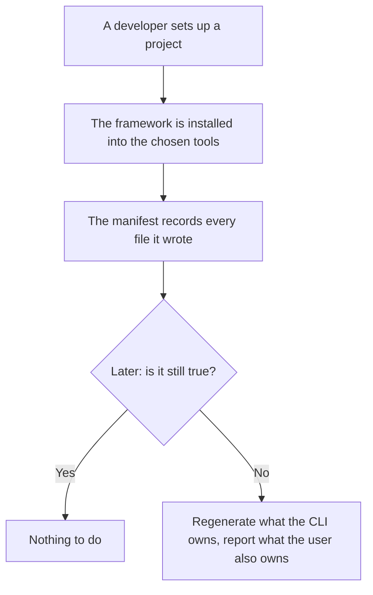
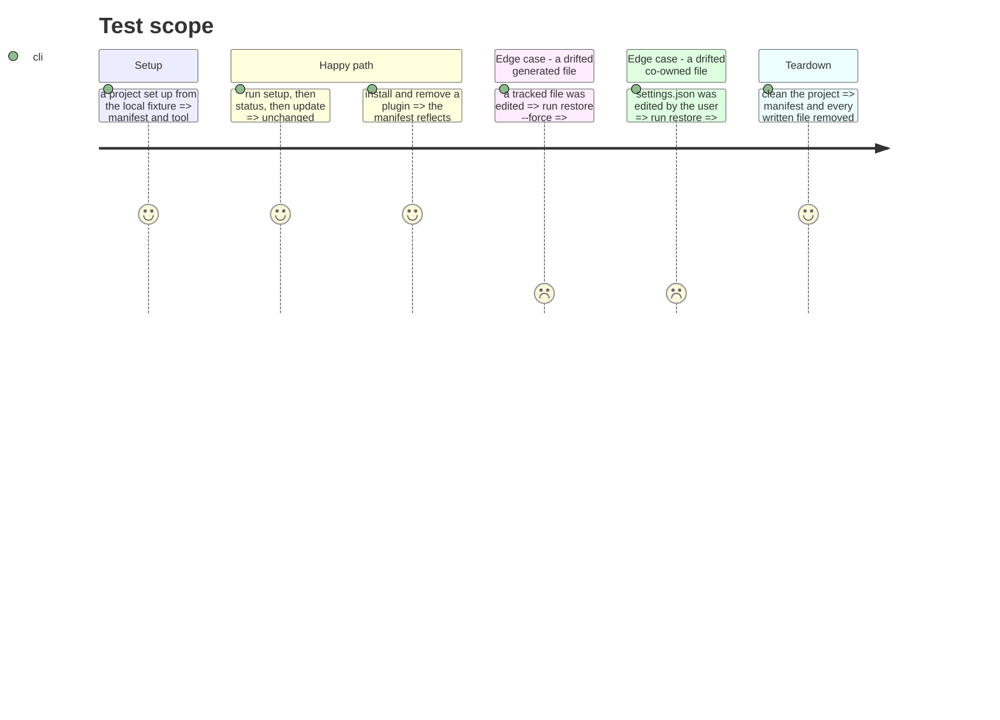

# Instruction: Extract the framework context

What is installed here, at which version, and whether it is still true. It is the only context
allowed to call another, and it is the one that owns `manifest.json` and the tool files.

It is also the phase where `Manifest` stops being a facade: 529 lines, 28 public methods, six
responsibilities. It becomes an aggregate root whose members are separated, which is what makes any
of the six evolve without reopening the same file.

## Architecture projection

> Tree of the final files. ✅ create · ✏️ modify · ❌ delete

```txt
.
└── cli/src/contexts/framework/      ✅ create
    ├── index.ts                     ✅ create (the only public entry)
    ├── domain/
    │   ├── manifest.ts              ✏️ modify (aggregate root, identity and consistency only)
    │   ├── tool-entry.ts            ✅ create (tracked files, merge files, mcp exclusions, installed plugins)
    │   ├── installed-plugin.ts      ✏️ modify (from domain/models/plugin.ts, renamed for what it is)
    │   ├── doctor.ts                ✏️ modify
    │   ├── install-scope.ts         ✏️ modify
    │   ├── setup-flow.ts            ✏️ modify
    │   ├── project-context.ts       ✏️ modify
    │   └── ports/                   ✅ create (manifest-repository, plugin-distribution-reader)
    ├── application/
    │   ├── flows/                   ✏️ modify (setup, sync, update, and the three from phase 8)
    │   └── cases/                   ✏️ modify (install, uninstall, plugin *, materialize, status, doctor, clean, init)
    └── infrastructure/              ✏️ modify (manifest-repository, plugin-distribution-reader, native plugin CLIs)
```

## User Journey



## Test Scope



## Tasks to do

### `1)` Move what is left

1. The installation domain, its two ports, the flows and the cases. What remains after four
   contexts left is this context.

### `2)` Split the aggregate

1. `Manifest` keeps identity and consistency: one save, one invariant.
2. `ToolEntry` takes tracked files, merge files, mcp exclusions and installed plugins, one file per
   responsibility.
3. Type the three `Map<string, string>` of the installed record: path to hash, installed path to
   component path, mcp server name to digest. `FileHash` already shows the way.

### `3)` Rename by intention

1. `Plugin` becomes `InstalledPlugin`. The catalog entry and the fetched payload keep their own
   names, so each context speaks of its own plugin without ambiguity.

### `4)` Close the context

1. One `index.ts`. It is the only context whose `index.ts` may import another context's.
2. Verify the chain by import graph: `framework` reaches `translate` and `distribution`, and neither
   reaches back.

## Test acceptance criteria

| Task | Acceptance criteria |
| ---- | ------------------- |
| 1    | Every command that touches the installation record behaves as before |
| 2    | One save still writes one consistent manifest; the three maps can no longer be passed for one another |
| 3    | No type named `Plugin` alone remains; each context's plugin type says which one it is |
| 4    | `framework` is the only context importing another; an import into any interior fails the lint |
| all  | Golden and e2e pass **unmodified** |
