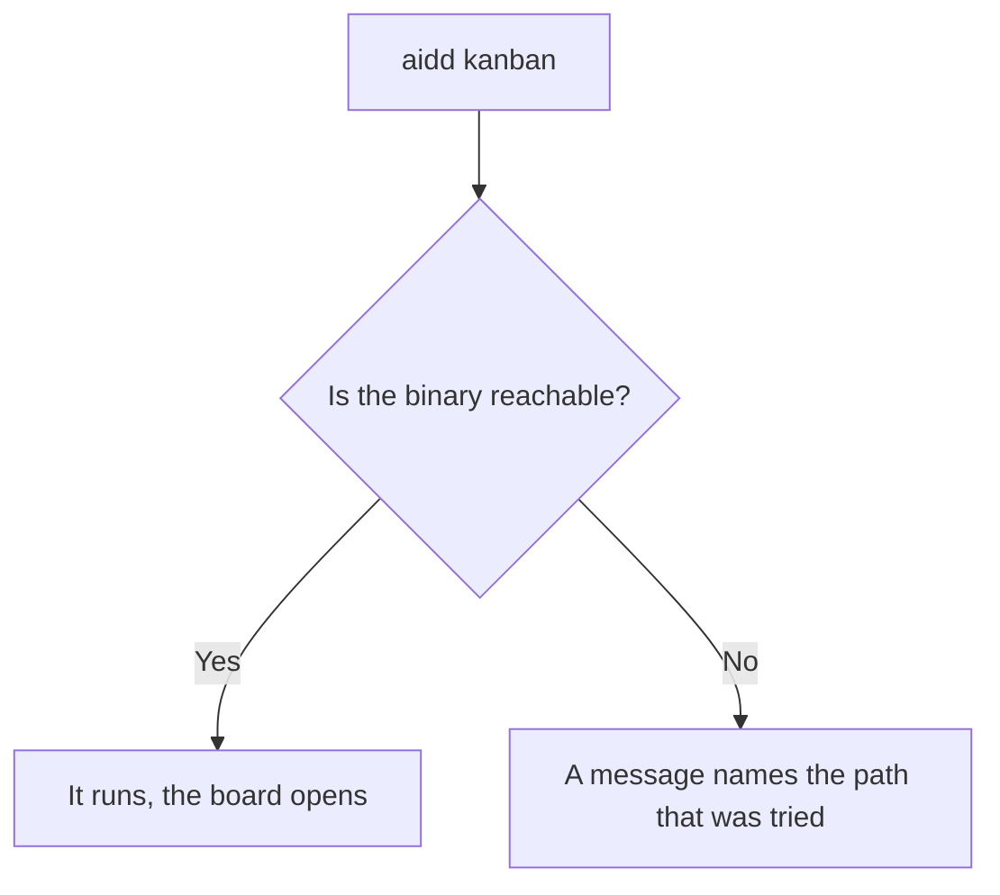
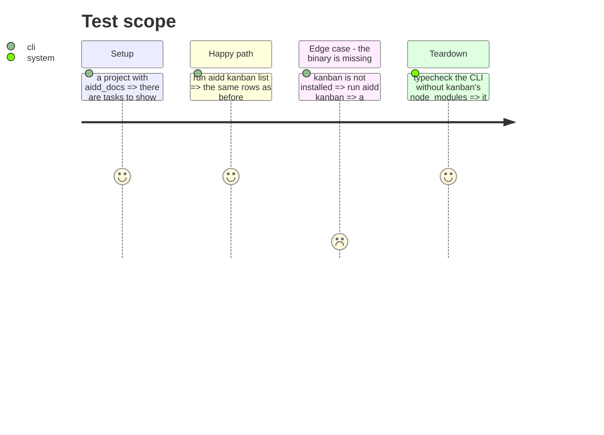

# Instruction: Turn kanban into a launcher

`commands/kanban.ts` imports `../../../../kanban/src/presentation/…`, a deep path into another
package. The consequences are measured: `cli/package.json` declares `ink`, `react`, `cli-table3` and
`gray-matter`, none of which `cli/src` imports — they are listed in `knip.json` as ignored
dependencies for exactly that reason. And `pnpm typecheck` fails on `../kanban/src/**` unless
kanban's own dependencies are installed, which `lefthook.yml` already documents as a workaround.

kanban only ever needed `DOCS_DIR`. The CLI should locate and run it, not contain it.

## Architecture projection

> Tree of the final files. ✅ create · ✏️ modify · ❌ delete

```txt
.
└── cli/
    ├── src/launchers/kanban.ts      ✅ create (locate the binary, execute it)
    ├── src/presentation/commands/kanban.ts  ✏️ modify (no deep import)
    ├── package.json                 ✏️ modify (drop ink, react, cli-table3, gray-matter)
    ├── knip.json                    ✏️ modify (drop the four ignored dependencies)
    └── ../lefthook.yml              ✏️ modify (cli-typecheck no longer needs kanban's node_modules)
```

## User Journey



## Test Scope



## Tasks to do

### `1)` Locate and execute

1. Replace the deep import with a launcher that finds the binary and runs it.
2. On failure, name the path that was tried — a launcher that fails silently is worse than none.

### `2)` Drop the four dependencies

1. `ink`, `react`, `cli-table3` and `gray-matter` leave `cli/package.json`, and their entries leave
   `knip.json`.

   > Knip signale déjà `@types/react` et `ink-testing-library` comme inutilisées : cette tâche est
   > ce qui les fait disparaître. Il signale aussi `@commitlint/cli`, et c'est un **faux positif** —
   > `lefthook.yml` l'appelle, fichier que knip ne lit pas. Ne pas la supprimer : lui apprendre où
   > regarder. La CI masque les trois aujourd'hui derrière `--exclude exports,types`, ce qui rend
   > l'outil aveugle à ce qu'il devrait garder ; retirer l'exclusion une fois les vraies mortes
   > parties.
2. Note the drop in the bundle budget: it is a verifiable gain, not a claim.

### `3)` Simplify the hook

1. `cli-typecheck` no longer needs to install kanban's dependencies. Remove the workaround and its
   comment.

## Test acceptance criteria

| Task | Acceptance criteria |
| ---- | ------------------- |
| 1    | `aidd kanban` and `aidd kanban list` behave as before; a missing binary gives a message naming the path |
| 2    | `cli/src` imports none of the four packages, and `knip.json` ignores no dependency |
| 3    | `pnpm typecheck` passes with `kanban/node_modules` absent |
| all  | The bundle is smaller than before, measured by `check-bundle-size.mjs` |
