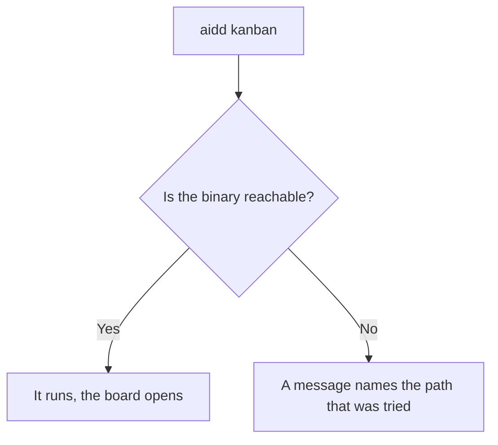
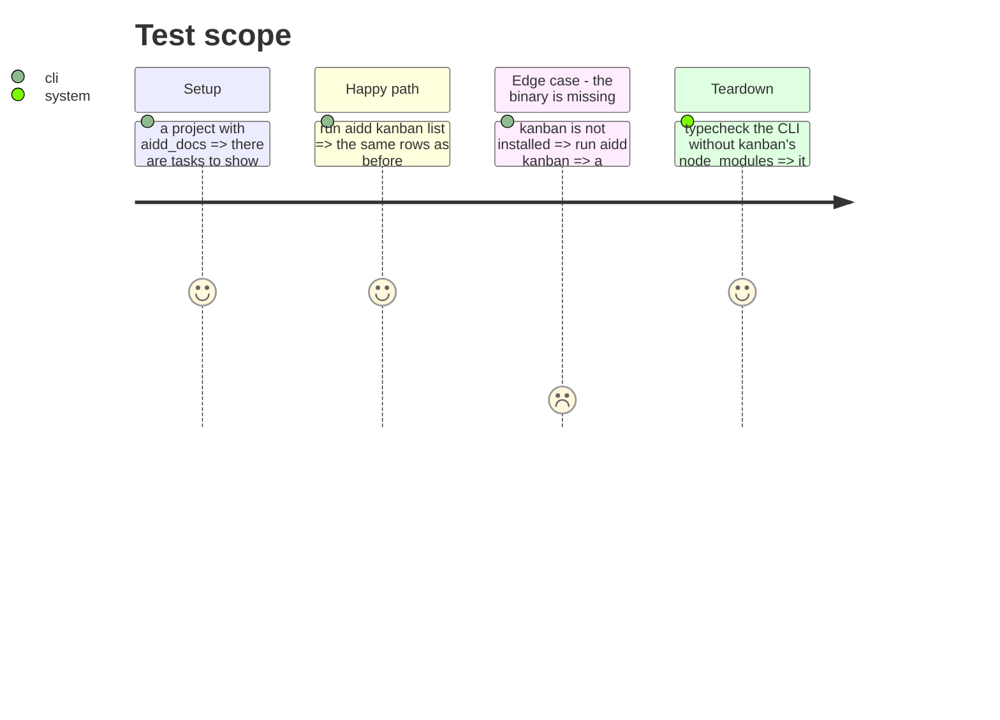

# Instruction: Turn kanban into a launcher

`commands/kanban.ts` imports `../../../../kanban/src/presentation/…`, a deep path into another
package. The consequences are measured: `cli/package.json` declares `ink`, `react`, `cli-table3` and
`gray-matter`, none of which `cli/src` imports — they are listed in `knip.json` as ignored
dependencies for exactly that reason. And `pnpm typecheck` fails on `../kanban/src/**` unless
kanban's own dependencies are installed, which `lefthook.yml` already documents as a workaround.

kanban only ever needed `DOCS_DIR`. The CLI should locate and run it, not contain it.

## Architecture projection

> Tree of the final files. ✅ create · ✏️ modify · ❌ delete

```txt
.
└── cli/
    ├── src/launchers/kanban.ts      ✅ create (locate the binary, execute it)
    ├── src/presentation/commands/kanban.ts  ✏️ modify (no deep import)
    ├── package.json                 ✏️ modify (drop ink, react, cli-table3, gray-matter)
    ├── knip.json                    ✏️ modify (drop the four ignored dependencies)
    └── ../lefthook.yml              ✏️ modify (cli-typecheck no longer needs kanban's node_modules)
```

## User Journey



## Test Scope



## Bloquée (2026-09-02) — la prémisse ne tient pas

La tâche 1 dit « remplacer l'import profond par un lanceur qui trouve le binaire et l'exécute ».
Mesuré : **il n'y a pas de binaire à trouver.**

`kanban/package.json` déclare `@ai-driven-dev/kanban-source`, et c'est tout ce qu'il déclare :

| champ | valeur |
|---|---|
| `private` | `true` |
| `version` | absente |
| `main` / `exports` / `bin` | aucun |
| `scripts` | `test`, `test:watch`, `typecheck`, `lint`, `format` — aucun build |

Et `kanban/src/` ne contient aucun fichier d'entrée : seulement `registerInteractiveCommand` et
`registerListCommand`, des fonctions qui enregistrent des commandes **dans un programme hôte**.
Kanban n'est pas un programme qu'on lance, c'est une bibliothèque que le CLI compile avec lui — ce
qui est précisément la raison d'être de l'import profond que cette phase veut retirer.

### Ce que la phase voulait vraiment, et ce qu'il en reste

Le but n'est pas le lanceur, c'est que le CLI cesse de porter les dépendances d'une interface
texte. Vérifié, les quatre sont déclarées dans `cli/package.json` et **utilisées par zéro fichier**
du CLI :

| dépendance | `cli/src` | `cli/tests` | `kanban/src` |
|---|---|---|---|
| `ink` | 0 | 0 | 3 |
| `react` | 0 | 0 | 2 |
| `cli-table3` | 0 | 0 | 1 |
| `gray-matter` | 0 | 0 | 1 |

Elles ne sont là que parce que le CLI importe le source de kanban. Les retirer exige donc de
retirer l'import profond, et retirer l'import profond exige que kanban devienne lançable.

### Ce que coûte l'attente, mesuré

`tsup.config.ts` déclare `skipNodeModulesBundle: true` : les quatre dépendances ne sont **pas**
empaquetées, elles restent exigées à l'exécution. Chaque installation d'`aidd` les télécharge donc,
pour une commande déclarée `hidden`.

| dépendance | poids direct |
|---|---|
| `ink` | 1,1 Mo |
| `react` | 252 Ko |
| `gray-matter` | 80 Ko |
| `cli-table3` | 68 Ko |

Environ 1,5 Mo avant leurs propres arbres — `ink` tire notamment un moteur de rendu et une mise en
page WASM.

### Une demi-livraison a été tentée, et elle échoue pour une raison précise

Différer le chargement des vues côté CLI, avec un `import()` dans un hook `preSubcommand`, ne marche
pas : commander doit connaître ses sous-commandes **au parsing**, et le hook ne se déclenche qu'après.
Mesuré — `aidd kanban list` répond alors `too many arguments for 'kanban'`. Le changement a été
annulé.

Il faut aussi noter, pour qui réessaiera : avec `splitting: false`, esbuild replie un `import()` en
import statique et la paresse est perdue en silence. Activer le découpage la restaure et sort bien
`ink` du bundle principal — vérifié, 400,4 Ko à 385,9 Ko — mais cela ne répare pas le problème de
parsing ci-dessus.

### Ce qui reste donc possible sans décision produit

Différer **dans kanban**, pas dans le CLI : déplacer les imports de `ink`, `react` et `cli-table3`
dans le corps des actions de ses deux fichiers de commandes. Les fonctions d'enregistrement
resteraient importables immédiatement — commander garde ses sous-commandes — et les dépendances
lourdes ne se chargeraient qu'à l'exécution, ce qui permettrait de les passer en
`optionalDependencies` côté CLI.

C'est un changement de code dans un autre paquet, pas une décision de produit. Il est plus petit que
celui décrit plus bas, et il livre l'essentiel de la valeur.

### Ce qu'il faudrait décider

Faire de kanban un programme autonome : un fichier d'entrée, un build, un `bin`, une version, et la
question produit qui va avec — kanban se publie-t-il séparément, ou reste-t-il interne au dépôt ?
C'est un changement dans un autre paquet et une décision de produit, pas une étape de ce refactor.

Un import dynamique paresseux ne rendrait rien : les quatre dépendances resteraient nécessaires à
l'exécution, donc déclarées.

**Rien d'autre n'attend cette phase.** La 18 et la 19 ne la traversent pas.

## Tasks to do

### `1)` Locate and execute

1. Replace the deep import with a launcher that finds the binary and runs it.
2. On failure, name the path that was tried — a launcher that fails silently is worse than none.

### `2)` Drop the four dependencies

1. `ink`, `react`, `cli-table3` and `gray-matter` leave `cli/package.json`, and their entries leave
   `knip.json`.

   > Knip signale déjà `@types/react` et `ink-testing-library` comme inutilisées : cette tâche est
   > ce qui les fait disparaître. Il signale aussi `@commitlint/cli`, et c'est un **faux positif** —
   > `lefthook.yml` l'appelle, fichier que knip ne lit pas. Ne pas la supprimer : lui apprendre où
   > regarder. La CI masque les trois aujourd'hui derrière `--exclude exports,types`, ce qui rend
   > l'outil aveugle à ce qu'il devrait garder ; retirer l'exclusion une fois les vraies mortes
   > parties.
2. Note the drop in the bundle budget: it is a verifiable gain, not a claim.

### `3)` Simplify the hook

1. `cli-typecheck` no longer needs to install kanban's dependencies. Remove the workaround and its
   comment.

## Test acceptance criteria

| Task | Acceptance criteria |
| ---- | ------------------- |
| 1    | `aidd kanban` and `aidd kanban list` behave as before; a missing binary gives a message naming the path |
| 2    | `cli/src` imports none of the four packages, and `knip.json` ignores no dependency |
| 3    | `pnpm typecheck` passes with `kanban/node_modules` absent |
| all  | The bundle is smaller than before, measured by `check-bundle-size.mjs` |
