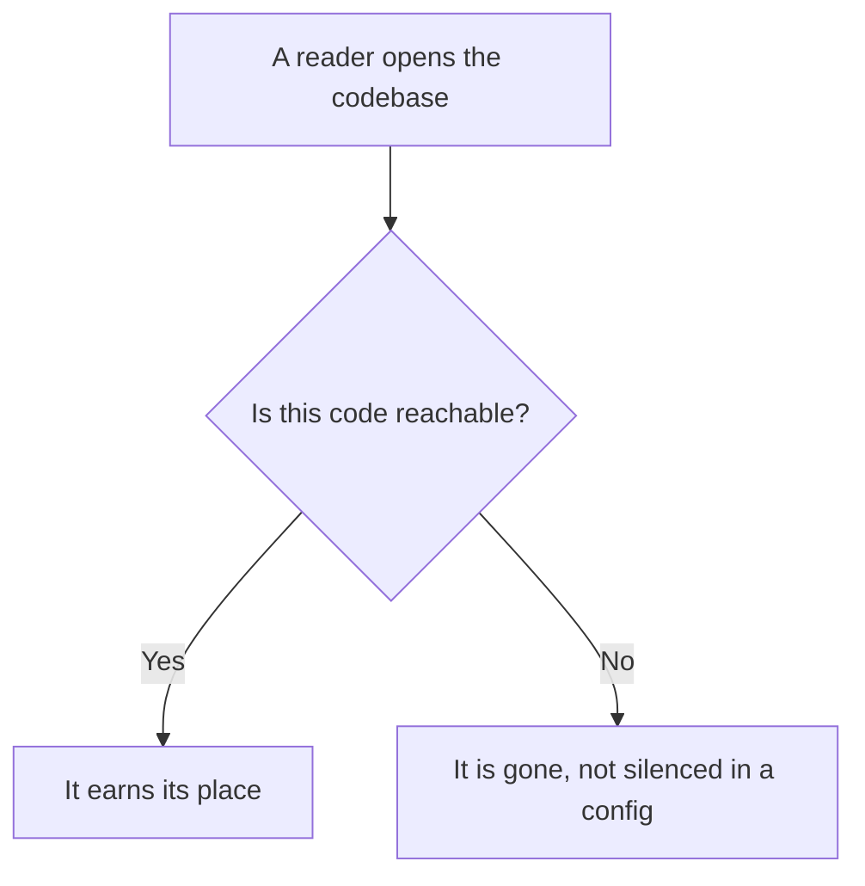
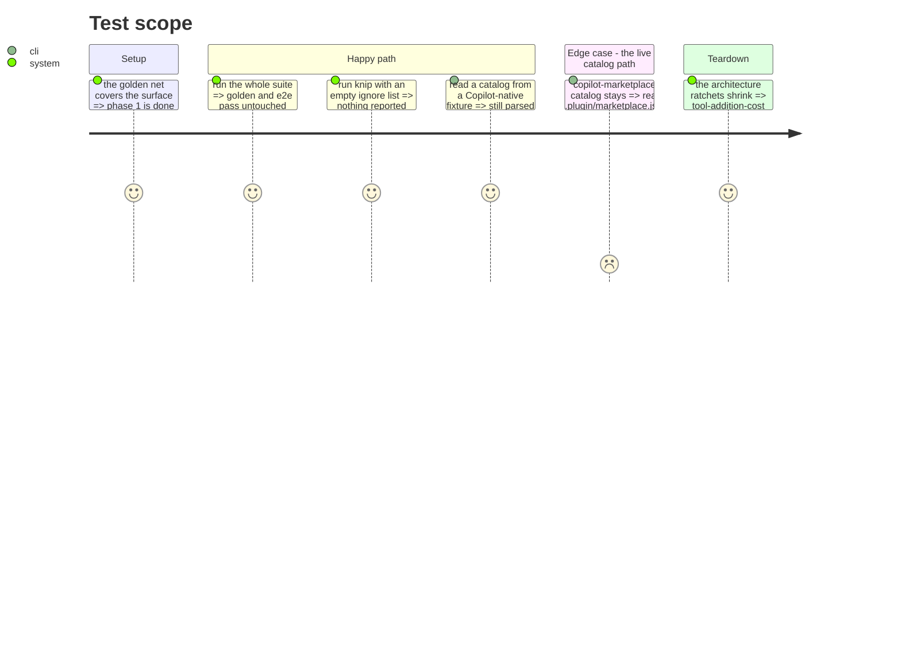

# Instruction: Delete dead code

Do not move what will be thrown away. Three findings, each measured: `loadForeign()` has no
production caller, `domain/models/marketplace-entry.ts` is the only file unreachable from
`src/cli.ts`, and four exports of `mcp-exclusion.ts` are covered by tests but called by nothing.

The last one is the telling case: live tests guarding dead behavior.

## Architecture projection

> Tree of the final files. ✅ create · ✏️ modify · ❌ delete

```txt
.
└── cli/
    ├── src/domain/
    │   ├── models/
    │   │   ├── marketplace-entry.ts        ❌ delete (unreachable; knip.json silenced it)
    │   │   ├── normalized-plugin.ts        ❌ delete (only the dead foreign path used it)
    │   │   ├── mcp-exclusion.ts            ✏️ modify (drop 4 uncalled exports)
    │   │   └── merge.ts                    ✏️ modify (drop buildMergeFileEntries)
    │   ├── formats/{cursor,codex,copilot,opencode}-marketplace.ts  ❌ delete (foreign catalogs)
    │   └── ports/plugin-catalog-repository.ts  ✏️ modify (drop loadForeign)
    ├── src/infrastructure/adapters/
    │   └── plugin-catalog-repository-adapter.ts  ✏️ modify (drop loadForeign and its readers)
    ├── src/application/use-cases/global/
    │   ├── update-ai-tools-use-case.ts     ✏️ modify (drop unused Input/Result types)
    │   └── update-ide-tools-use-case.ts    ✏️ modify (idem)
    ├── tests/domain/models/marketplace-entry.unit.test.ts  ❌ delete (tests a deleted file)
    ├── tests/domain/models/mcp.unit.test.ts ✏️ modify (drop the 4 dead-export cases)
    ├── tests/application/use-cases/marketplace/marketplace-list-use-case.unit.test.ts  ✏️ modify (drop loadForeign stubs)
    └── knip.json                            ✏️ modify (empty the ignore list)
```

## User Journey



## Test Scope



## Tasks to do

### `1)` Remove the foreign catalog branch

> Reachable but never invoked.

1. Delete `loadForeign()` from `PluginCatalogRepositoryAdapter` and from the port.
2. Delete `normalized-plugin.ts` and the four `{cursor,codex,copilot,opencode}-marketplace.ts`.
3. Drop the three `loadForeign` stubs in the marketplace-list unit test.
4. Keep `copilot-marketplace-catalog.ts`: it serves the live `load()` path, reading Copilot's own
   `.plugin/marketplace.json` into `PluginCatalog`.

### `2)` Remove the unreachable model

1. Delete `domain/models/marketplace-entry.ts` and its unit test.
2. Empty the `ignore` list in `knip.json`. The live namesake is
   `domain/capabilities/marketplace-entry.ts`, 25 lines, untouched.

### `3)` Remove the uncalled exports

1. From `mcp-exclusion.ts`, drop `extractMcpKeys`, `filterMcpExclusions`, `computeMcpExclusions`,
   `detectNewMcpEntries`. Keep `transformFor`, `McpExclusion`, `mcpExclusionEquals`.
2. Drop their cases from `tests/domain/models/mcp.unit.test.ts`.
3. Drop `buildMergeFileEntries` and the four `Update{Ai,Ide}Tools{Input,Result}` types.

### `4)` Shrink the ratchets

1. Remove the deleted files from the `tool-addition-cost` baseline.

## Test acceptance criteria

| Task | Acceptance criteria |
| ---- | ------------------- |
| 1    | Reading a Copilot-native marketplace still returns the same plugin list; no other behavior changes |
| 2    | `knip.json` carries no ignore entry for `src/`, and knip reports nothing |
| 3    | `mcp-exclusion.ts` exports three symbols, all called from production |
| 4    | The `tool-addition-cost` baseline shrank, and the test fails if an entry is removed from the list without the file being fixed |
| all  | The golden snapshot and every e2e file pass **unmodified**: this batch removes only code nothing reaches |
