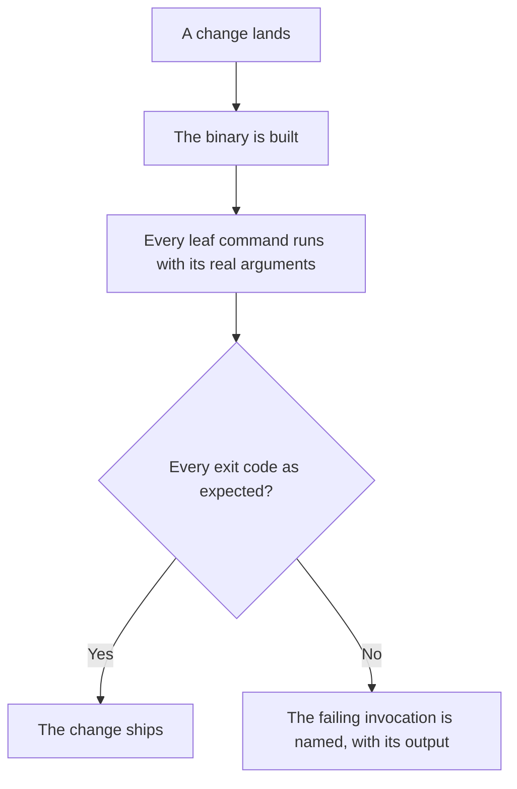
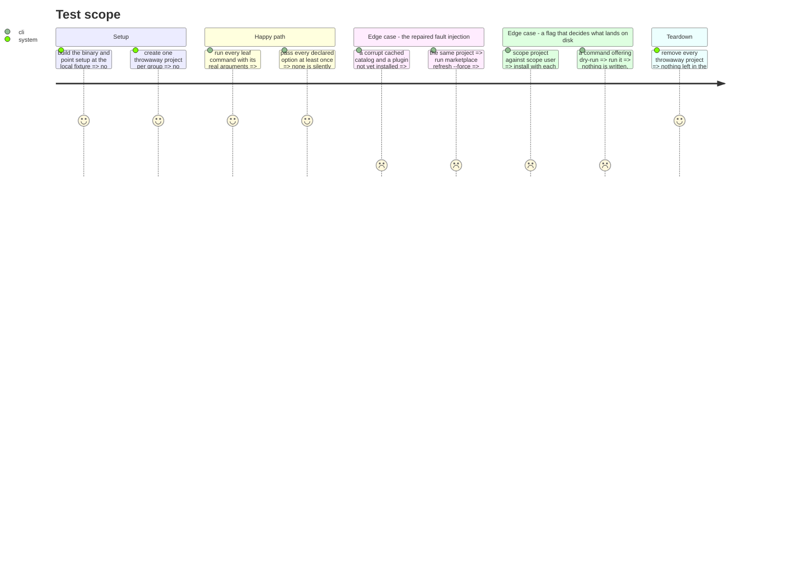

# Instruction: Revive and make the smoke suite hermetic

`scripts/smoke-tools.sh` is the only net that drives the built binary the way a user does: real
arguments, throwaway projects, deliberate fault injection. It reports **100% leaf command coverage,
37 of 37**, and it measures that itself.

It runs nowhere. No CI job, no lefthook entry, last touched by the commit that moved the repository.

Run on 2026-08-21, it is **red**: 73 pass, 4 fail, 7 minutes 11 seconds.

## What the four failures actually are

One scenario, four shapes. `corrupt-cache fault injection` runs
`setup --source remote --ai claude --plugins recommended --yes`, corrupts the cached catalog, then
expects `plugin install aidd-dev` to fail with a message naming `marketplace refresh --force`.

It gets `Error: Plugin 'aidd-dev' is already installed.` — because `aidd-dev` is in the recommended
set, so setup installed it, and the install refuses on "already installed" **before ever reading the
corrupt catalog**. The scenario stopped testing what it claims the day that plugin became
recommended. Nobody saw it, because nobody ran it.

This is a test defect, not a product defect. It must be fixed before the suite can guard anything.

## The other problem: it needs the network

Seven invocations use `--source remote`, fetching the really published framework. That is why one of
the injected corrupt shapes is `{"message":"API rate limit exceeded"}` — someone met it. A net that
depends on a remote repository and on a rate limit cannot block a build.

## Architecture projection

> Tree of the final files. ✅ create · ✏️ modify · ❌ delete

```txt
.
└── cli/
    ├── scripts/smoke-tools.sh       ✏️ modify (fix the broken scenario, go hermetic, cover 11 options)
    ├── package.json                 ✏️ modify (smoke:fast and smoke:full)
    └── ../.github/workflows/cli-ci.yml  ✏️ modify (a blocking smoke job on the hermetic subset)
```

## User Journey



## Test Scope



## Tasks to do

### `1)` Repair the broken scenario

> It must fail for the reason it claims, or it guards nothing.

1. Install a plugin the recommended set does **not** contain, or set up with `--plugins none` so the
   target is genuinely absent.
2. Verify the repair the only way that counts: the assertion must pass for the right reason, and
   still fail when the actionable message is removed from the product.

### `2)` Make the suite hermetic

> Seven invocations fetch the real published framework. A net gated by a rate limit is not a net.

1. Point every `--source remote` at the local fixture, except a small subset that genuinely tests
   remote fetching.
2. Split the script: `smoke:fast` is hermetic and blocking; `smoke:full` keeps the remote subset and
   runs on demand, or on a schedule.
3. Record the measured wall-clock of each in the header. The full run is 7 min 11 s today.

### `3)` Pass the eleven options that never ran

> 11 of 24 declared options have never been passed once.

1. `--flat` on every target that accepts it. Phase 5 removes four of them, and that removal needs a
   before to compare against.
2. `--scope project` against `--scope user`: assert the two land in different places.
3. `--dry-run`: assert the exit code **and** that nothing was written.
4. `--from`, `--marketplace`, `--plugin`, `--recommended`, `--no-plugins`, `--overwrite`,
   `--release`.
5. `--gh` needs credentials: assert the refusal path and say so in a comment.

### `4)` Make it run, and make a failure readable

1. Add a blocking `cli / Smoke` job running `smoke:fast` after the build job.
2. On failure, print the invocation, the expected and received exit codes, and the output. Keep the
   summary that already names every failing check — it is what made these four visible.

## Test acceptance criteria

| Task | Acceptance criteria |
| ---- | ------------------- |
| 1    | The corrupt-catalog scenario fails when the actionable message is removed from the product, and passes otherwise |
| 2    | `smoke:fast` completes with the network unavailable; the remote subset is named and separated |
| 3    | Every declared option is passed at least once; `--dry-run` writes nothing and the two scopes write to different places |
| 4    | A red smoke run fails the build, and one run names every failing invocation with its output |
| all  | The suite is green before any later phase moves a file. Its self-measured command coverage stays at 100% |
