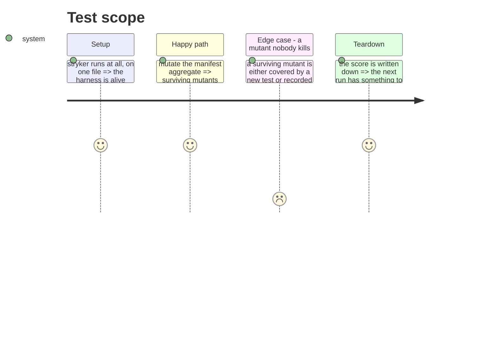

# Instruction: Make the tests prove they test something

Every net in this refactor answers "did the behaviour change?". None answers "would the tests notice
if it did?". Mutation testing is that second question, and it is the only one that measures a test
suite rather than the code.

It is placed last on purpose: it is worth running against the structure the refactor produces, not
against the one it replaces.

## Ce que cette phase n'est pas

La réparation de Stryker appartient à la phase 9, et son premier usage à la phase 14, qui a besoin
d'une mesure avant et après le découpage du Manifest. Ici, la campagne est large : elle mesure la
suite entière contre la structure que le refactor a produite.

## What is in the way

Stryker is installed and broken. It was already broken before this refactor, silently, which is part
of how the drift went unnoticed. Two failures were met, in order:

1. `ts.parseConfigFileTextToJson is not a function` — a TypeScript upgrade broke Stryker's config
   reader. Fixed with `tsconfigFile: ""`.
2. Its runner picks up `vitest.workspace.ts`, so it runs the e2e project, and the build golden fails
   inside Stryker's sandbox. `vitest.dir`, `vitest.related` and a dedicated config were each tried;
   none narrowed the initial run.

The second may have changed since: the e2e helper now strips drivable tool binaries from `PATH` and
reaches node through `process.execPath`, so the golden no longer depends on what the machine has
installed — which was part of why it could not survive a sandbox. Re-measure before re-diagnosing.

## Architecture projection

> Tree of the final files. ✅ create · ✏️ modify · ❌ delete

```txt
.
└── cli/
    ├── stryker.config.json          ✏️ modify (a runner that sees unit tests only)
    └── .github/workflows/           ✏️ modify (a scored run, not a gate that blocks a merge)
```

## Test Scope



## Ce que « large » doit vouloir dire, chiffré (2026-09-02)

Muter tout le code n'a pas de sens : un adaptateur et un câblage ne portent pas de règles, et un
mutant qui y survit ne dit rien sur la conception. Ce qui mérite d'être muté, c'est le domaine de
chaque contexte plus le noyau.

| cible | fichiers | lignes |
|---|---|---|
| `contexts/tools/domain` | 45 | 4431 |
| `contexts/framework/domain` | 19 | 1100 |
| `contexts/translate/domain` | 9 | 653 |
| `contexts/distribution/domain` | 11 | 423 |
| `kernel` | 17 | 1449 |

Environ 8000 lignes. À l'échelle du run du manifest — 660 lignes, 386 mutants, trois minutes — cela
donne un ordre de grandeur de plusieurs milliers de mutants et quelques dizaines de minutes,
`ignoreStatic` activé pour écarter les quatre mutants statiques qui consommaient 90 % du temps.

### La conséquence sur la tâche 3

« Chaque mutant survivant est tué ou accepté par écrit » tient pour 109 survivants. Pour plusieurs
centaines, c'est une promesse qu'on ne tiendra pas, et une promesse non tenue est pire qu'une
absence de promesse. La forme honnête :

1. Un run par contexte, nommé, pour qu'un chiffre désigne un responsable plutôt qu'une moyenne.
2. Le contexte au plus mauvais score est le seul dont les survivants sont traités un par un.
3. Le reste devient une base : un score par contexte, écrit, qui ne peut que monter.

Un score global unique serait le plus facile à produire et le moins actionnable.

## Tasks to do

### `1)` Bring the runner back to life

1. Point Stryker at the unit project only. The e2e and golden suites spawn a built binary and are
   worthless as mutation oracles anyway: they would be slow, and a surviving mutant there would say
   nothing about a unit's design.

### `2)` Mutate what carries the rules

1. Start with the manifest aggregate and the tool profiles: they hold the invariants everything else
   assumes, and they are pure, so a mutant that survives there is a real gap and not a wiring
   artefact.

### `3)` Turn the survivors into a decision

1. Each surviving mutant is either killed by a test that was missing, or written down as accepted
   with the reason. No silent list.
2. Record the score so the next run compares rather than restarts.

## Test acceptance criteria

| Task | Acceptance criteria |
| ---- | ------------------- |
| 1    | `stryker run` completes on the unit project without touching the golden or e2e suites |
| 2    | The manifest aggregate and the tool profiles are mutated, with a score recorded |
| 3    | Every surviving mutant is killed or accepted in writing; the score is committed so the next run has a baseline |
| all  | Mutation is scored, never a gate: it reports on the suite, it does not block a merge |
