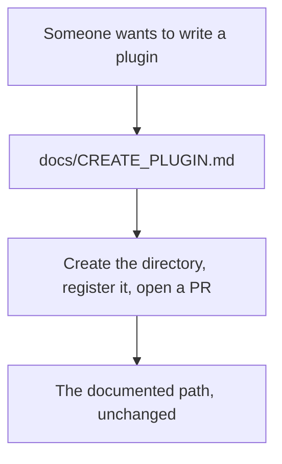
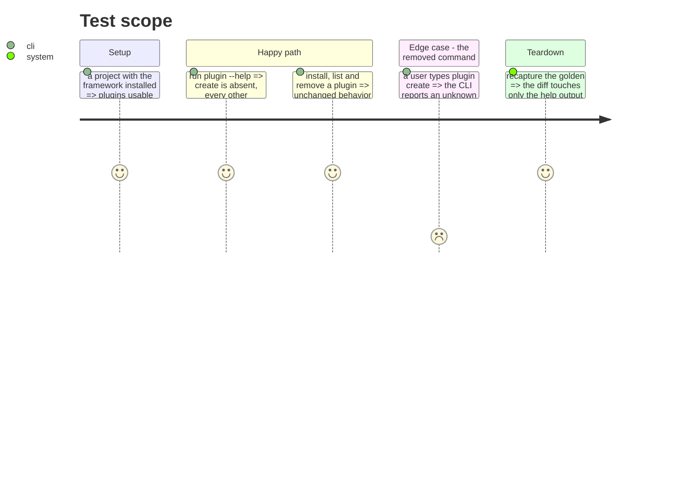

# Instruction: Drop plugin scaffolding

`aidd plugin create` is exposed in `--help` and documented nowhere: zero mentions across `docs/`,
`README.md` and `cli/README.md`. `docs/CREATE_PLUGIN.md`, the contribution guide, describes an
entirely manual flow — create the directory, register it in `marketplace.json`, test, open a PR.

Nobody writes third-party plugins today, and the command was never on a contributor's path.

## Architecture projection

> Tree of the final files. ✅ create · ✏️ modify · ❌ delete

```txt
.
└── cli/
    ├── src/
    │   ├── application/
    │   │   ├── commands/plugin.ts                     ✏️ modify (drop the create subcommand)
    │   │   └── use-cases/plugin/plugin-create-use-case.ts  ❌ delete
    │   └── domain/models/plugin-scaffold.ts           ❌ delete
    └── tests/
        ├── e2e/plugin-create.e2e.test.ts              ❌ delete
        └── golden/snapshots/phase0/snapshot.json      ✏️ modify (help output loses one line)
```

## User Journey



## Test Scope



## Tasks to do

### `1)` Remove the command and its use case

1. Drop the `create` subcommand from `commands/plugin.ts` and its wiring in `deps.ts`.
2. Delete `plugin-create-use-case.ts` and `domain/models/plugin-scaffold.ts`.
3. Delete `tests/e2e/plugin-create.e2e.test.ts`.

### `2)` Recapture the baseline

1. Run the capture. The only expected change is the help output.
2. Review the diff: any other change means the removal reached further than intended.

## Test acceptance criteria

| Task | Acceptance criteria |
| ---- | ------------------- |
| 1    | `plugin --help` no longer lists `create`; install, list, remove, update and search behave as before |
| 2    | The golden diff touches the help output and nothing else |
| all  | `docs/CREATE_PLUGIN.md` needs no edit: it never mentioned the command |
