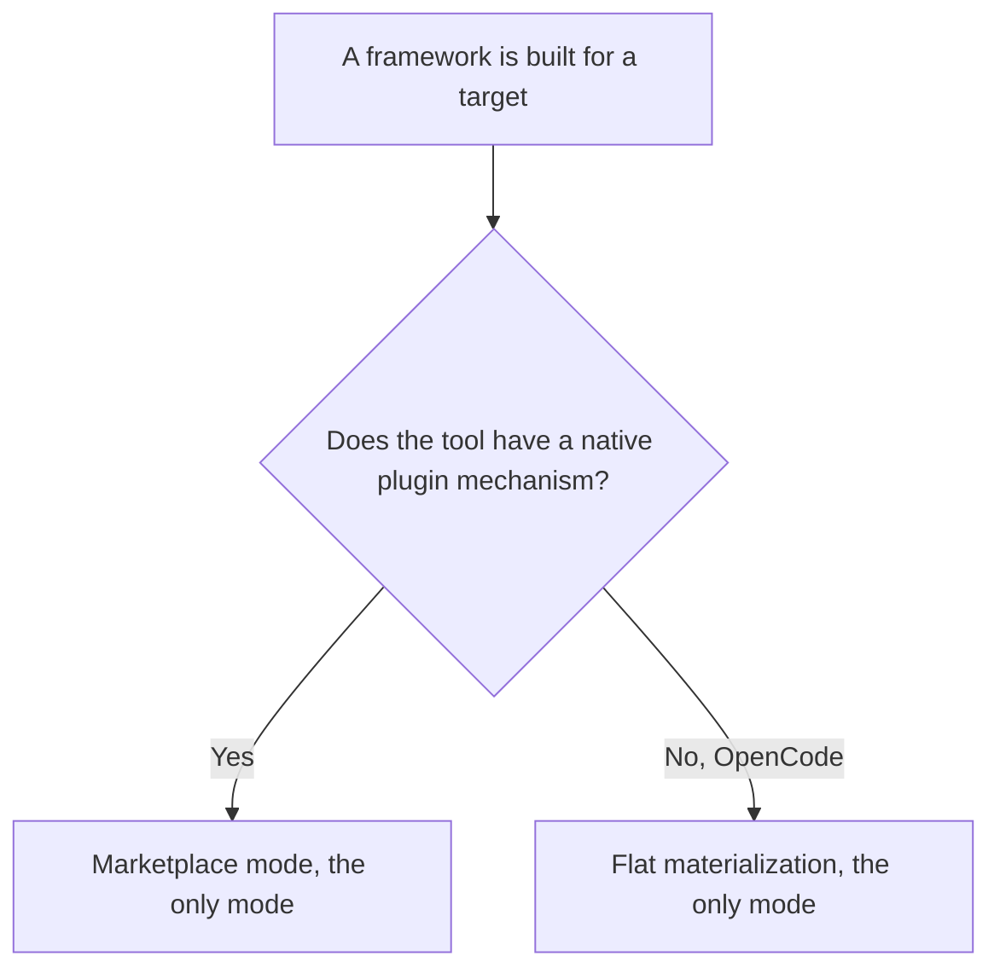
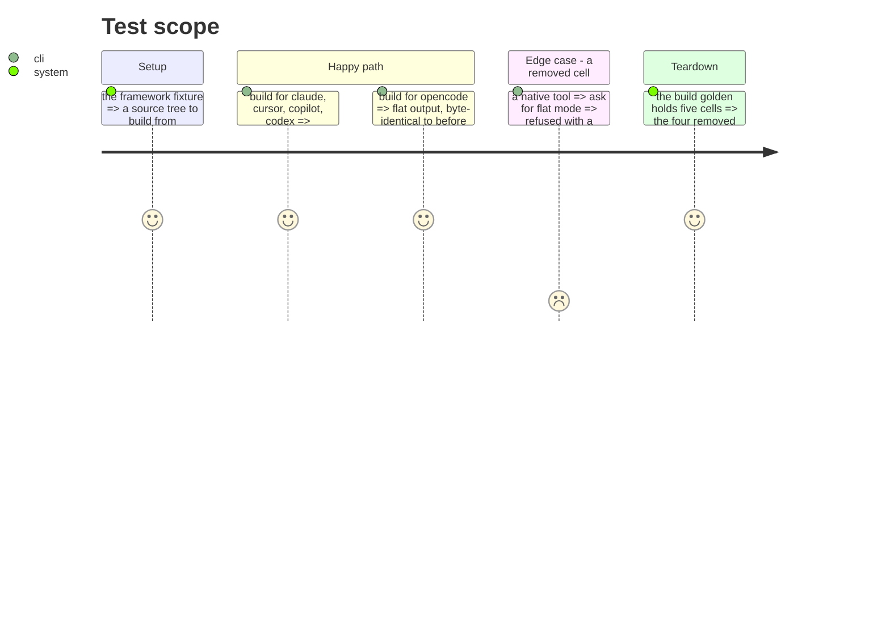

# Instruction: One build mode per tool

`ARCHITECTURE.md` documents five targets by two modes, nine cells since OpenCode is flat-only. But
four of five tools already declare `mode: "native"`, and three of them `translationMode:
"marketplace"` — they point at a locally built marketplace instead of copying. Their flat cells
duplicate what their native mode already does, at the cost of 831 lines.

The mode a tool uses is a property of the tool, not a user option.

## Architecture projection

> Tree of the final files. ✅ create · ✏️ modify · ❌ delete

```txt
.
└── cli/
    ├── src/
    │   ├── application/
    │   │   ├── commands/framework.ts    ✏️ modify (drop --flat for tools that declare native)
    │   │   └── use-cases/framework/strategies/
    │   │       └── flat-build-strategy.ts  ✏️ modify (opencode only)
    │   ├── domain/formats/
    │   │   ├── flat-paths.ts            ✏️ modify (opencode only)
    │   │   └── flat-hooks-merge.ts      ✏️ modify (opencode only)
    │   └── infrastructure/deps.ts       ✏️ modify (4 build registry entries removed)
    └── tests/golden/snapshots/framework-build/golden.json  ✏️ modify (9 cells become 5)
```

## User Journey



## Test Scope



## Tasks to do

### `1)` Make the mode a property of the tool

1. Read the mode from the tool profile instead of accepting it as an option for tools that declare
   `native`.
2. `--flat` on a native tool fails with a message naming the mode that tool uses.

### `2)` Remove the four redundant cells

1. Drop the four flat build contracts for claude, cursor, copilot and codex.
2. Drop their entries from the build registry in `deps.ts`.
3. Narrow `flat-build-strategy`, `flat-paths` and `flat-hooks-merge` to what OpenCode needs.

### `3)` Recapture the build golden

1. Recapture with `UPDATE_FRAMEWORK_GOLDEN=1`.
2. Review: the five surviving cells must be **byte-identical** to before. Only the four removed
   cells may disappear. Any other change means the narrowing went too far.

## Test acceptance criteria

| Task | Acceptance criteria |
| ---- | ------------------- |
| 1    | Asking for flat mode on a native tool fails with a message naming that tool's mode |
| 2    | Building for each of the five surviving target/mode pairs produces the same tree as before |
| 3    | The build golden diff is pure removal: five cells unchanged, four gone |
| all  | `ARCHITECTURE.md` no longer claims nine cells |
