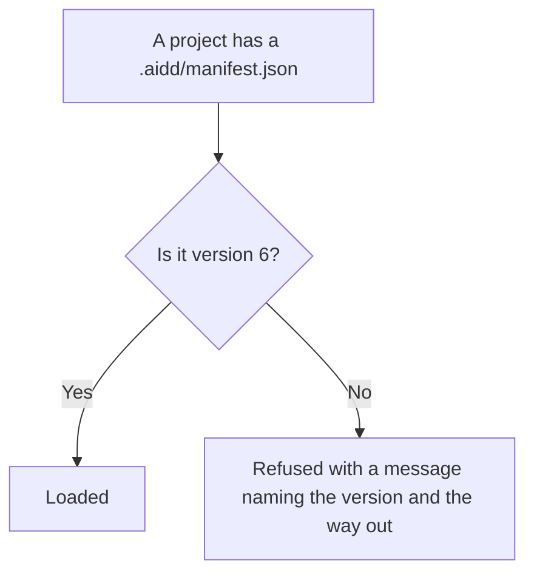
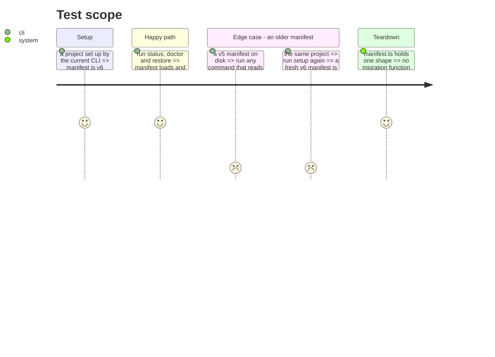

# Instruction: Drop the manifest version migrations

`manifest.ts` carries five migration functions, `migrateV1toV2` through `migrateV5toV6`, plus fields
kept only so a legacy manifest round-trips. A comment at line 89 says the block must stay "until all
users have upgraded past v1".

A domain entity that knows every past shape of its own JSON is carrying a persistence concern. The
decision is to remove them, not relocate them: the reachable versions are behind us.

This is the one deletion that changes what the CLI accepts, so it is its own batch and it needs a
check before it starts.

## Architecture projection

> Tree of the final files. ✅ create · ✏️ modify · ❌ delete

```txt
.
└── cli/
    ├── src/domain/models/manifest.ts   ✏️ modify (drop 5 migrations, legacy fields, VSCODE_MIGRATION_PATHS)
    ├── tests/domain/models/manifest.unit.test.ts  ✏️ modify (drop the legacy round-trip cases)
    └── README.md                        ✏️ modify (state the minimum manifest version accepted)
```

## User Journey



## Test Scope



## Tasks to do

### `0)` Check before removing

> The only task in this plan that can lose user data if skipped.

1. Confirm no manifest below v6 is still in circulation: the release that introduced v6, and how
   long ago it shipped.
2. If any doubt remains, stop and report. This phase is safe to postpone; every other phase is
   independent of it.

### `1)` Remove the migrations

1. Delete `migrateV1toV2` through `migrateV5toV6`, `VSCODE_MIGRATION_PATHS`, and the fields retained
   only for legacy round-trip.
2. Keep the version guard: an unsupported version must still fail with a clear message.
3. Drop the legacy round-trip cases from the manifest unit test, keep the version-guard ones.

### `2)` Say it in the README

1. One line: the minimum manifest version the CLI reads, and what to run when an older one is found.

## Test acceptance criteria

| Task | Acceptance criteria |
| ---- | ------------------- |
| 0    | The check is recorded in the phase or the phase is postponed with a reason |
| 1    | A v6 manifest loads and every command behaves as before; a v5 manifest is refused with a message naming the version |
| 1    | `manifest.ts` contains no function whose name starts with `migrate` |
| 2    | The README states the minimum version and the way out |
| all  | Golden and e2e pass unmodified: no fixture carries a manifest below v6 |
