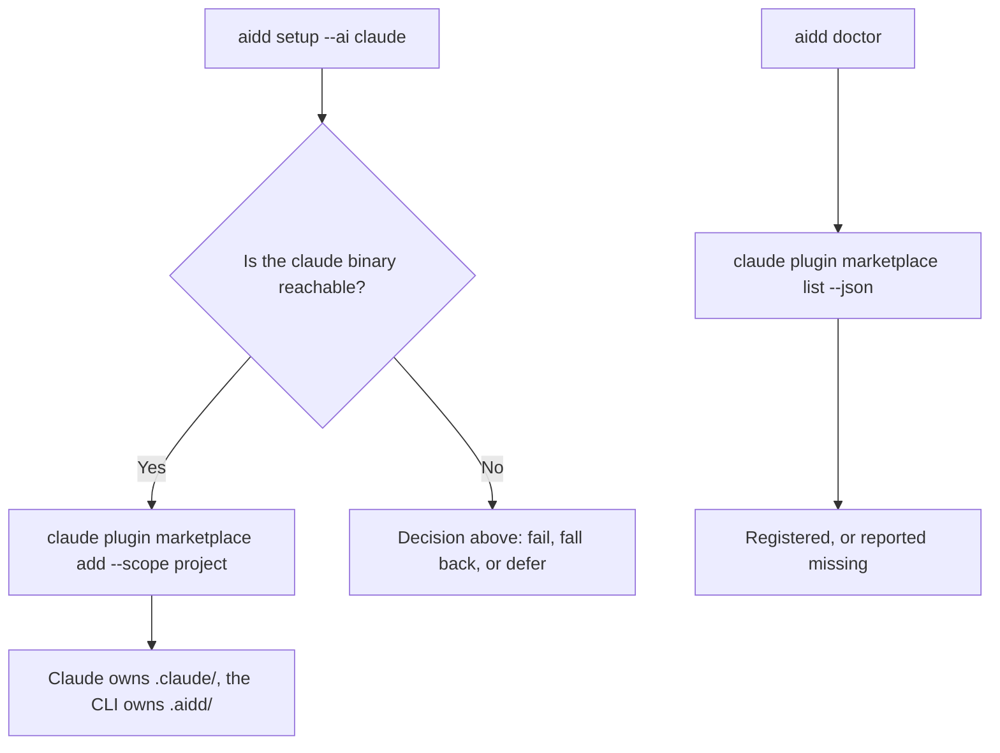
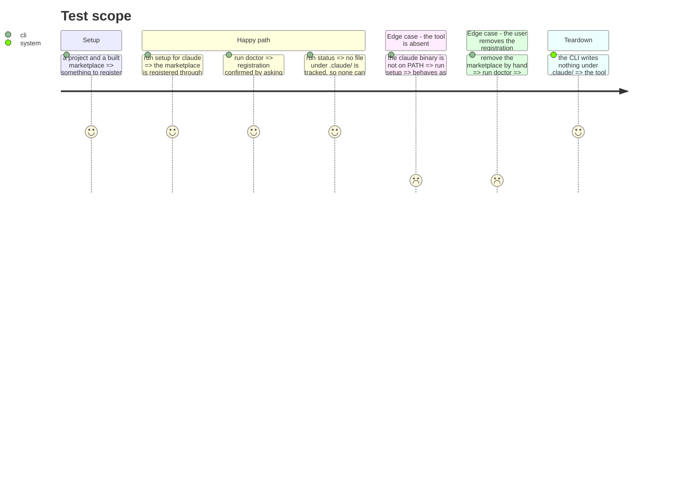

# Instruction: Let each tool own its own configuration

## What this slot first held, and why it was cancelled

It was going to remove flat build mode for the four native tools, believing their flat cells
duplicated their native mode. The premise was wrong: two axes were conflated. `PluginsCapability.mode`
describes how a *plugin* is installed into a tool; `FrameworkBuildMode` describes how the *framework*
is built for a target. The build golden settles it — for claude, marketplace mode produces 198 files
under `.claude-plugin/` and `plugins/`, flat mode 189 under `.claude/agents/`, `.claude/skills/` and
`.claude/hooks/`. Two deliverables, and `cli/README.md` documents the second. The nine build cells
stay.

## What replaces it

Today the CLI hand-writes `.claude/settings.json` — another tool's private configuration — and then
records that file's hash in its own manifest.

A first attempt drove `claude plugin marketplace add` **in addition** to writing the file. Measured:
two writers and one recorder, so `status` reports the file modified forever after. That attempt was
reverted. The fix is not to add a second writer, it is to stop being one.

So: **write through the tool's command, verify through the tool's command, track nothing the tool
owns.**

| | today | target |
|---|---|---|
| register | this CLI writes `extraKnownMarketplaces` into `.claude/settings.json` | `claude plugin marketplace add <built> --scope project` |
| verify | compare the file's hash to the manifest | `claude plugin marketplace list --json` |
| track | `.claude/settings.json`, the tool's only tracked file | nothing under `.claude/` |

`--scope project` is not optional: the command defaults to **user** scope and would otherwise
register the marketplace globally, for every project on the machine.

## The decision this phase needs

Setup currently works when Claude Code is **not installed**: writing the settings file leaves a
registration that takes effect when the tool arrives. Driving the CLI cannot do that.

Three ways out, and this phase should not start before one is chosen.

1. **Require the binary.** Registration fails with a clear message when `claude` is absent. Simplest,
   and it drops a case that may not matter.
2. **Write the file only as a fallback.** When the binary is absent, write `.claude/settings.json`
   and track it; when it is present, drive the command and track nothing. Preserves both, at the cost
   of two code paths and a manifest whose content depends on what was installed at setup time.
3. **Defer to the remote marketplace.** Once the per-tool built marketplaces are hosted rather than
   local, `add` takes a URL and there is nothing local to point at. See below.

## Why the remote direction changes this

The built marketplaces live in `.aidd/cache/built/<name>/<target>` — local paths. That is the only
reason Cursor cannot be driven at all: `cursor-agent plugin marketplace add` takes a **git URL** and
indexes per account, verified against the installed CLI.

Host the generated per-tool marketplaces and the same three commands work everywhere: claude, codex,
copilot and cursor all accept a URL. The plan's four tool profiles would then differ by paths and
formats only, not by how registration happens — which is the shape phase 10's acceptance test is
asking for.

That is a product direction, not a refactor step. This phase should be sized once it is settled.

## Architecture projection

> Tree of the final files. ✅ create · ✏️ modify · ❌ delete

```txt
.
└── cli/src/
    ├── domain/tools/ai/claude.ts        ✏️ modify (nativeActivation, marketplaceSettings dropped)
    ├── domain/capabilities/plugins-capability.ts  ✏️ modify (claude joins the driven binaries)
    ├── domain/ports/native-plugin-activator.ts    ✏️ modify (a read: list registered marketplaces)
    ├── infrastructure/adapters/native-plugin-cli-adapter.ts  ✏️ modify (implement the read)
    └── application/use-cases/                     ✏️ modify (doctor asks the tool, not the file)
```

## User Journey



## Test Scope



## Tasks to do

### `0)` Settle the offline decision

> The phase cannot be sized before this is answered. It is a product decision, not a technical one.

1. Choose between requiring the binary, falling back to the file, or waiting for hosted marketplaces.

### `1)` Register through the command

1. Add `nativeActivation` to the claude profile, with `marketplaceAddArgs: ["--scope", "project"]`
   or its equivalent — the command's default scope is `user`.
2. Drop `marketplaceSettings` from the profile so nothing writes the file any more.

### `2)` Verify through the command

1. Add a read to the activator port: list the registered marketplaces.
2. `doctor` uses it instead of comparing a tracked hash.

### `3)` Stop tracking what the tool owns

1. `.claude/settings.json` leaves the manifest. Claude then tracks no file, and `status`, `doctor`
   and `restore` say so plainly rather than reporting an empty check.

## Test acceptance criteria

| Task | Acceptance criteria |
| ---- | ------------------- |
| 0    | The decision is recorded here before any code changes |
| 1    | After setup, `claude plugin marketplace list` shows the marketplace at project scope, and the user's global configuration is untouched |
| 2    | Removing the registration by hand makes `doctor` report it, with the command that fixes it |
| 3    | No file under `.claude/` appears in the manifest, and no `status` run reports drift on one |
| all  | The golden diff shows the settings file no longer written and no longer tracked, and nothing else |
