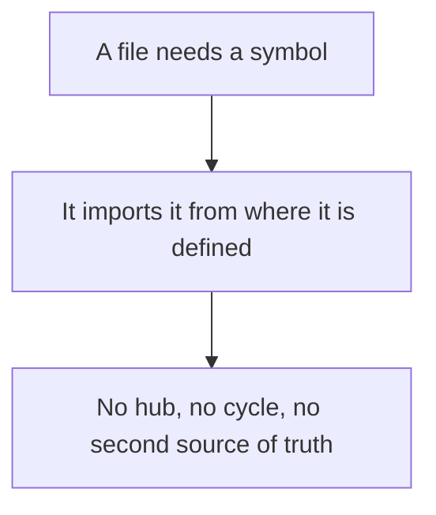
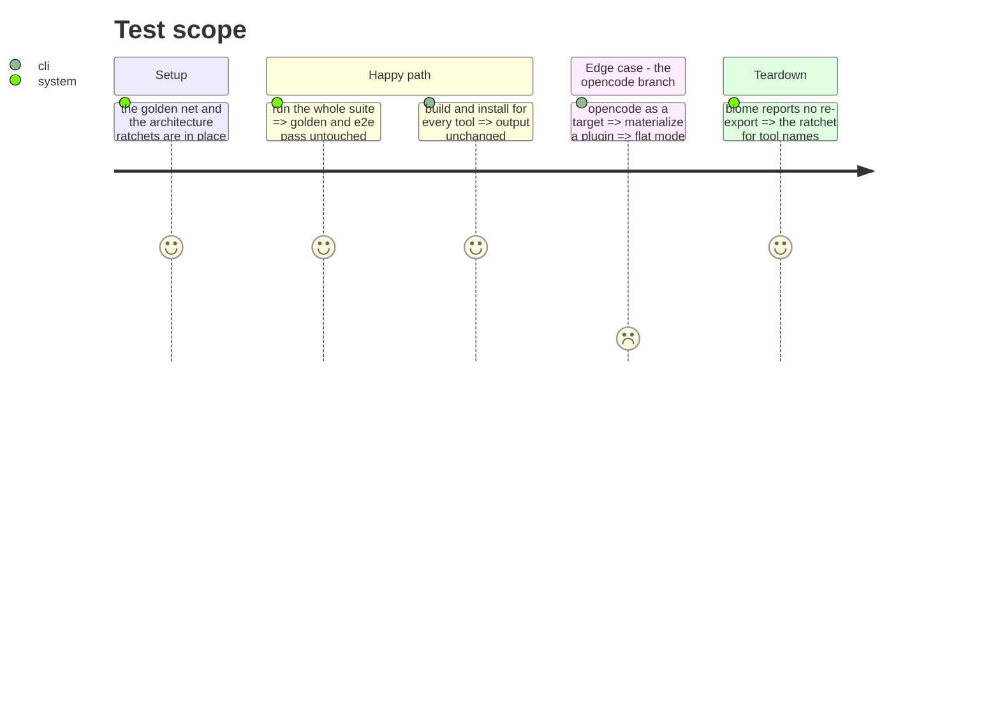

# Instruction: Untangle without moving anything

Four small changes that make every later extraction possible, none of which moves a file. Each was
measured: two design cycles closing through `import type`, six re-export sites, one capability file
mixing two concerns, and one branch re-deriving by name what a profile already declares.

## Architecture projection

> Tree of the final files. ✅ create · ✏️ modify · ❌ delete

```txt
.
└── cli/src/
    ├── domain/
    │   ├── formats/command.ts             ✏️ modify (own the two section types)
    │   ├── tools/contracts.ts             ✏️ modify (import them instead of defining them)
    │   ├── tools/registry.ts              ✏️ modify (stop re-exporting 8 symbols)
    │   ├── capabilities/{rules,commands,skills}-capability.ts  ✏️ modify (import AI_TOOL_IDS from its source)
    │   ├── capabilities/plugins-capability.ts  ✏️ modify (keep PluginsCapability only)
    │   └── capabilities/marketplace-settings.ts  ✅ create (the MarketplaceSettings half)
    └── application/use-cases/
        ├── setup-use-case.ts              ✏️ modify (stop re-exporting SetupToolsResult)
        ├── global/update-all-use-case.ts  ✏️ modify (stop re-exporting GlobalExecutionError)
        └── plugin/translator/built-tree-materialization-translator.ts  ✏️ modify (read mode from the profile)
```

## User Journey



## Test Scope



## Tasks to do

### `1)` Break the two design cycles

> Neither is a runtime cycle: both close through `import type`, which is why `noImportCycles` stays
> silent. They are still two modules that cannot be separated.

1. Move `UserFileSection` and `UserFileSectionKey` out of `tools/contracts.ts` into
   `formats/command.ts`, and have `contracts.ts` import them.
2. Point the three `AI_TOOL_IDS` imports in `capabilities/` at `models/tool-ids.ts`, their source.

### `2)` Remove the six re-exports

1. `registry.ts` re-exports eight symbols it imported from `models/tool-ids.ts`. Delete the
   re-export; consumers import the source.
2. Same for `setup-use-case.ts` and `global/update-all-use-case.ts`.

### `3)` Split the capability that carries two concerns

1. `plugins-capability.ts` holds `PluginsCapability`, used by the five tool profiles, and
   `MarketplaceSettings*`, used only by marketplace settings synchronisation. Move the second half
   to its own file.

### `4)` Read the mode, do not re-derive it

1. Replace `toolId === "opencode" ? "flat" : "marketplace"` in
   `built-tree-materialization-translator.ts` with a read of `mode` on the tool profile.

## Test acceptance criteria

| Task | Acceptance criteria |
| ---- | ------------------- |
| 1    | `formats/` no longer imports `tools/`, and `capabilities/` no longer imports `tools/registry` |
| 2    | Biome reports no re-export anywhere under `src/` |
| 3    | The five tool profiles import `PluginsCapability` without pulling marketplace settings |
| 4    | Materializing for OpenCode still produces flat output, chosen from the profile; adding a sixth flat tool needs no edit here |
| all  | Golden and e2e pass **unmodified**. This batch moves no file and changes no behavior |
