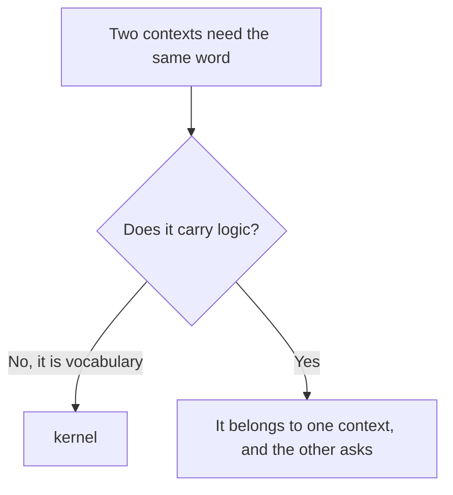
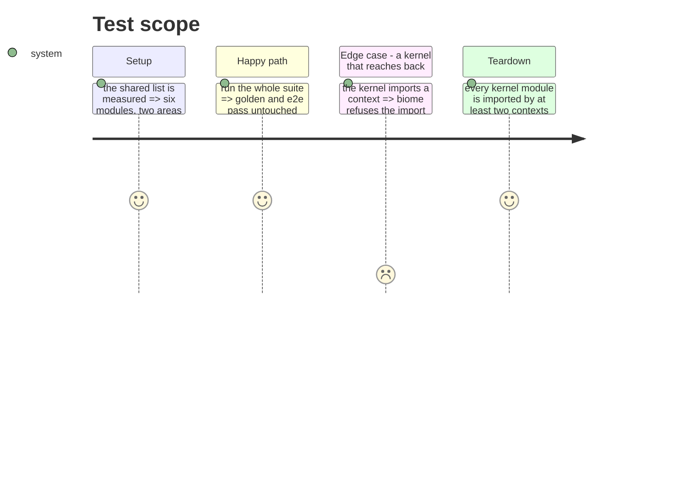

# Instruction: Extract the kernel

Six modules pass the two-area rule and are the shared vocabulary of every context: tool identity,
where content comes from, project paths, files and their hashes, merge strategies, and errors.

They get a home and a name, and their names move up from mechanism to concept — the project's own
naming rule.

## Architecture projection

> Tree of the final files. ✅ create · ✏️ modify · ❌ delete

```txt
.
└── cli/src/kernel/                  ✅ create
    ├── tool.ts                      ✏️ modify (from domain/models/tool-ids.ts)
    ├── source.ts                    ✏️ modify (from domain/models/plugin-source.ts)
    ├── paths.ts                     ✏️ modify (from domain/models/paths.ts)
    ├── file.ts                      ✏️ modify (from domain/models/file.ts)
    ├── merge.ts                     ✏️ modify (from domain/models/merge.ts)
    ├── errors.ts                    ✏️ modify (from domain/errors.ts)
    └── ports/                       ✅ create (file-reader, file-writer, hasher, logger, asset-provider)
```

## User Journey



## Test Scope



## Tasks to do

### `1)` Move the six, renamed to the concept

1. `tool-ids.ts` becomes `tool.ts`, `plugin-source.ts` becomes `source.ts`. The others keep their
   names, which already say the concept.
2. No directory per module: six files, six directories would be structure for its own sake.

### `2)` Move the shared ports

1. `file-reader`, `file-writer`, `hasher`, `logger` and `asset-provider` serve at least two
   contexts. The rest stay with the context that owns them.

### `3)` Forbid the reverse edge

1. Add a biome `override`: the kernel may not import from any context. Verify it refuses a
   deliberate violation.

## Test acceptance criteria

| Task | Acceptance criteria |
| ---- | ------------------- |
| 1    | Every consumer imports the kernel; no duplicate of a moved module remains |
| 2    | A port in the kernel is used by two contexts or more; a port used by one moved with it |
| 3    | An import from the kernel to a context fails the lint, verified by introducing one |
| all  | Golden and e2e pass **unmodified** |
